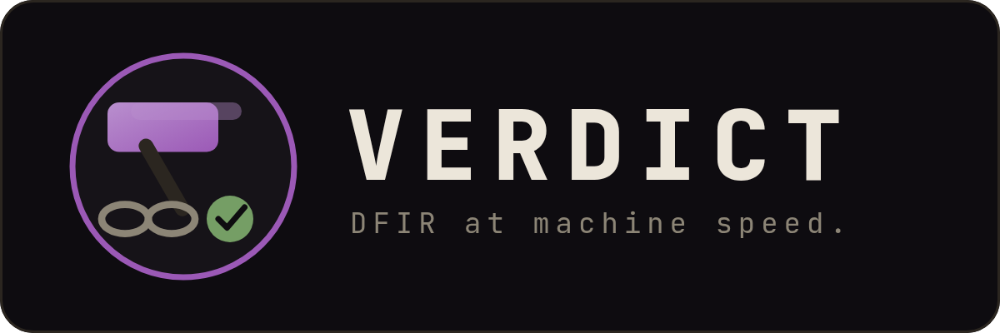
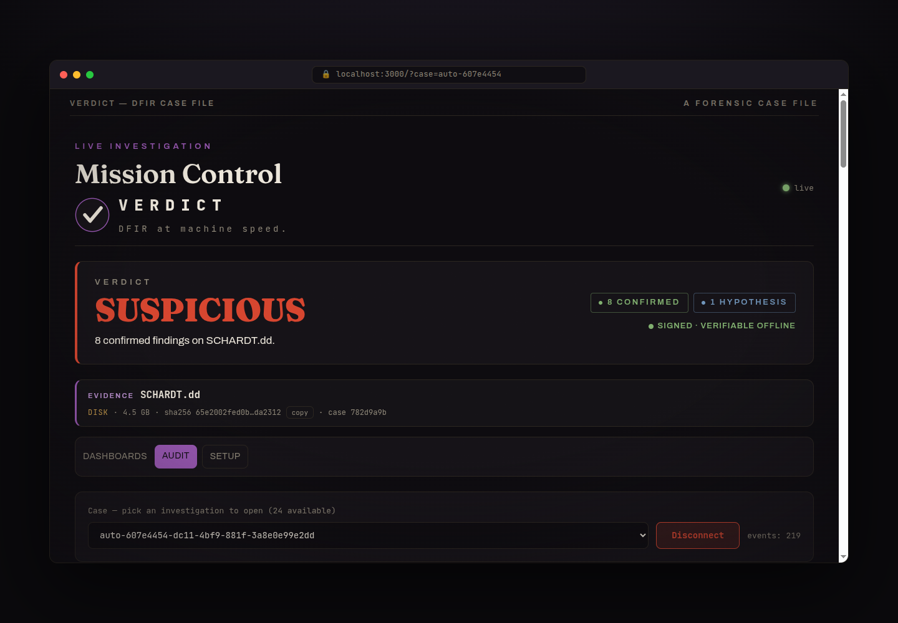
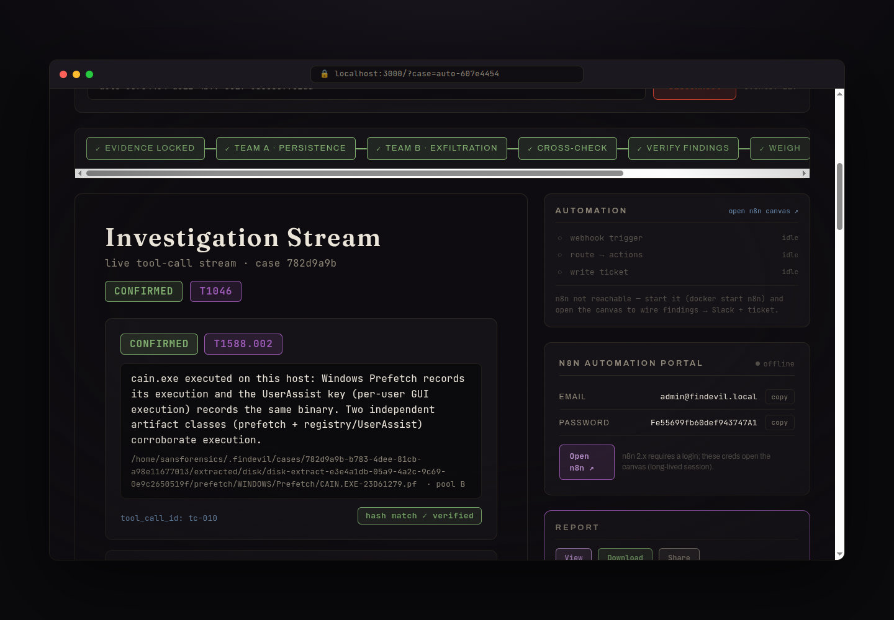
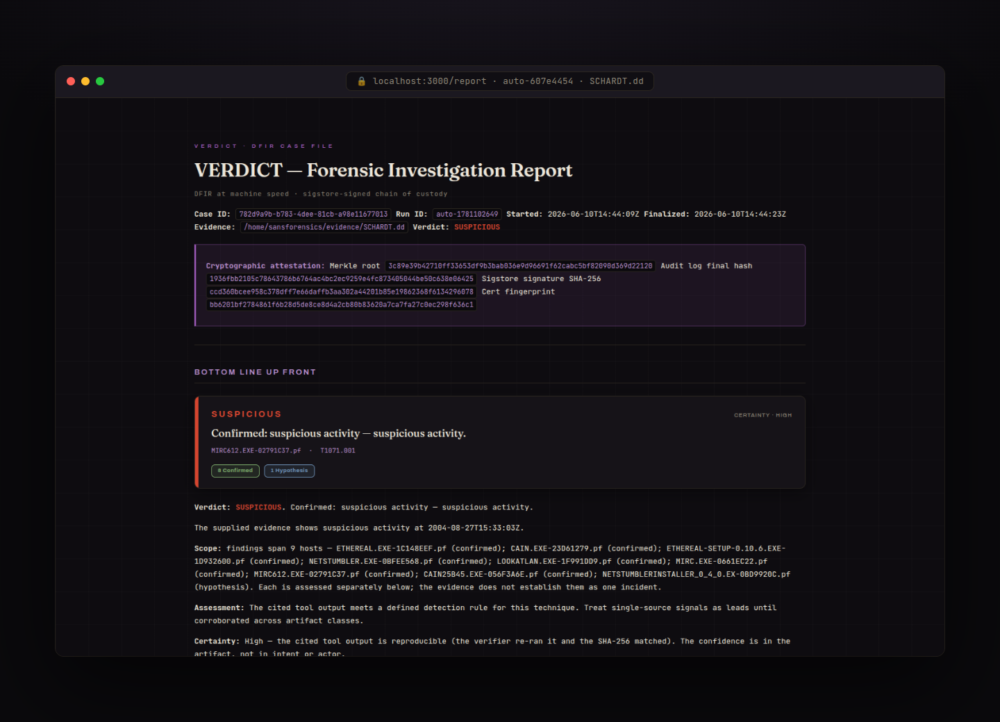
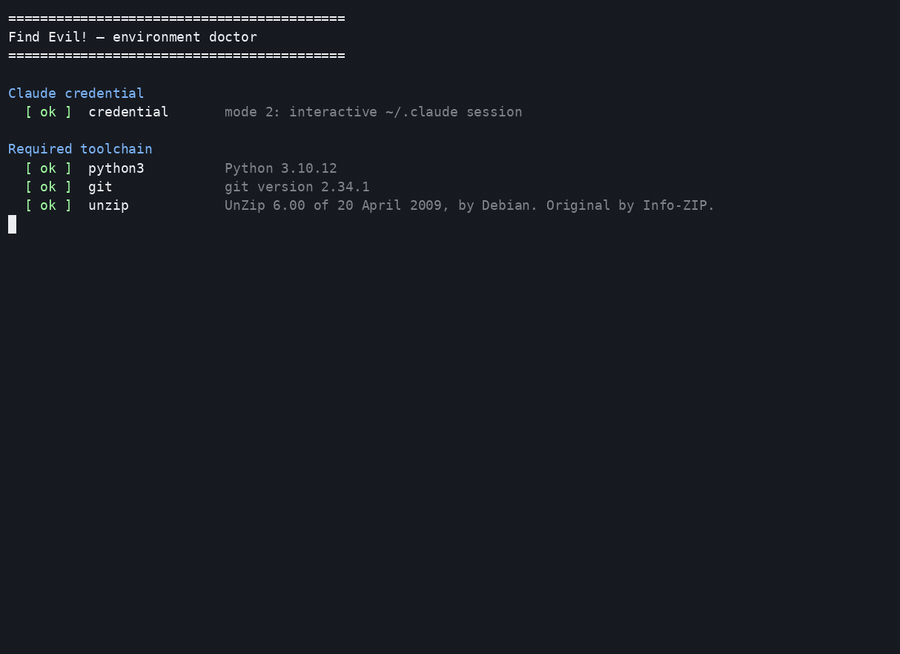
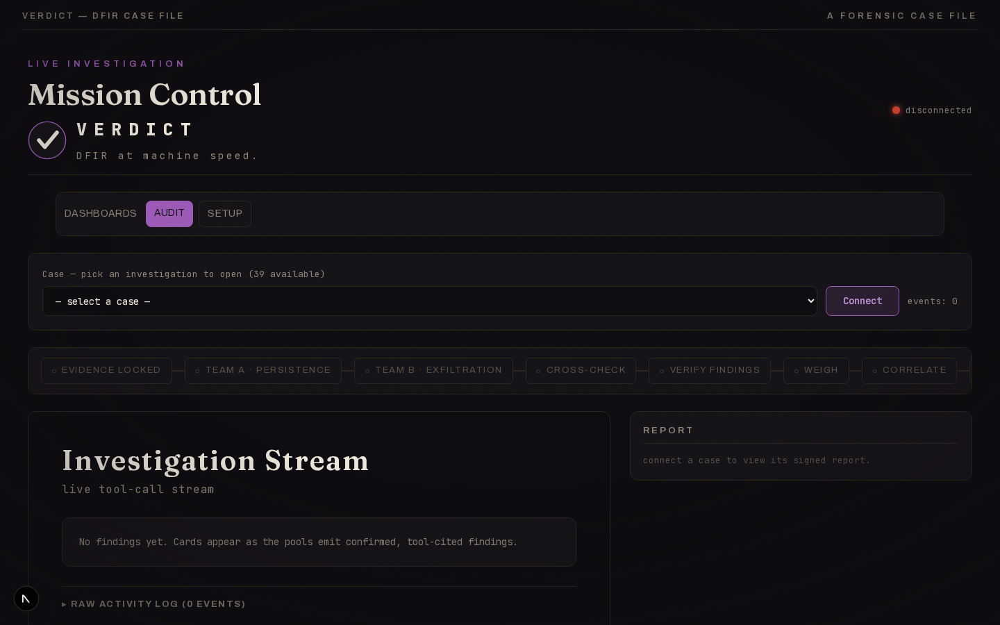

<p align="center">
  
</p>

<p align="center">
  <a href="LICENSE"></a>
  <a href="https://timothyvang.github.io/verdict-dfir/"></a>
  
  
  
</p>

<p align="center"><b>Digital forensics &amp; incident response at machine speed — with a verdict you can prove.</b></p>

<p align="center"><sub>Every finding cites the exact tool call that produced it, sealed into a hash-chained, Merkle-rooted audit log a third party can verify offline — strong enough to back an <a href="docs/cryptographic-attestation.md">FRE&nbsp;902(14)</a> self-authentication claim. VERDICT is an <b>orchestrator that reduces the friction</b> of repeatable DFIR mechanics, <b>not an autonomous responder</b>: the analyst approves the plan, and the verifier re-runs every cited tool before any finding reaches the report.</sub></p>

---

**VERDICT** automates the repeatable mechanics of a Windows-host DFIR investigation — memory
images, EVTX logs, disk artifacts, and network captures — and produces an evidence-bound verdict
(`SUSPICIOUS` / `INDETERMINATE` / `NO_EVIL`) backed by a **cryptographic chain of custody any third
party can verify offline**. It runs as a [Claude Code](https://claude.com/claude-code) agent over a
narrow, typed tool surface, so every conclusion cites the exact tool call that produced it.

> **There is no separate app server — Claude Code _is_ the engine.** Run `scripts/verdict <evidence>`
> (or `claude`) in this repo and *this session* becomes the forensic analyst: it opens the case,
> drives the 43 typed read-only product tools, runs the verifier, and signs the verdict. The product *is*
> the agent loop — not a service it calls.

The canonical public release repository is
[`TimothyVang/verdict-dfir`](https://github.com/TimothyVang/verdict-dfir). The older
[`TimothyVang/sans-hackathon`](https://github.com/TimothyVang/sans-hackathon) repository is the
historical development remote for the SANS Find Evil! entry, not a second product release channel.
Semver tags (`v0.1.0`, `v0.1.1`, ...) are the forward release line; `v-submit` is retained as the
historical hackathon submission tag.

## Run it against supported evidence

VERDICT is a Claude Code skill. Point it at supported evidence — a memory image, EVTX log, disk
image (`.E01` / `.dd`), packet capture, Velociraptor collection, or a whole multi-host case folder —
and it opens the case, drives the typed read-only DFIR tools, verifies every finding, and produces a
signed verdict + report. Unsupported formats degrade to custody/limitation records instead of a
broad clearance claim.

```bash
# First run — install/check prerequisites, attempt SIFT VM setup, then run:
bash scripts/setup --with-sift --run

# Any time after — point it at supported evidence:
/verdict <evidence>                 # in Claude Code: the turnkey skill (recommended)
bash scripts/verdict <evidence>     # the same pipeline, headless from a shell
#  …or in an interactive `claude` session just say:  investigate <evidence>
```

**It can drive the SIFT VM dynamically.** `/verdict` attempts to discover the SANS SIFT VM, boot it
when the implemented VMware path is available, resolve its IP (VMware Tools or the DHCP lease), and
route supported forensic tools into it over SSH so disk images can mount/extract. No reachable VM?
It falls back to host-local tools with the same hash-chained, offline-verifiable audit trail; local
disk parsing requires Sleuth Kit/libewf and supported extracted artifacts, while raw disk with no
mounted/extracted content stays custody-only. The SIFT VM remains the recommended parity path for
disk images.

## What VERDICT can miss

If no parser/tool extracts an artifact class, VERDICT cannot reason over it. That is the trust
boundary, not a footnote. Every run now writes a `coverage_manifest.json` sidecar and embeds the
same object in `verdict.json`, with one row per artifact class: `available`, `attempted`, `parsed`,
`failed`, `unsupported`, `not_supplied`, `parse_errors`, `records_seen`, and `rows_returned`.

The strongest claim is not "the AI reviewed the whole image." It is: **VERDICT never pretends it
did.** A finding must trace `Finding -> tool_call_id -> tool output hash -> verifier replay ->
audit hash chain -> signed manifest`. Pool A / Pool B disagreement is useful because it preserves
contradictions; it is not proof. Disputed or unsupported leads stay visible as contradictions,
`HYPOTHESIS`, or `analysis_limitations`.

<p align="center">
  
</p>
<p align="center"><sub>The hardest case — SANS <b>SRL-2018</b>, a 198&nbsp;GB / 22-host compromised enterprise — run host-by-host with the forensic toolchain executing inside the SANS SIFT VM over SSH. <a href="https://youtu.be/4RQnVden6L8">Watch the full walkthrough on YouTube (4:35) →</a> · <a href="https://github.com/TimothyVang/verdict-dfir/releases/download/v-submit/find-evil-demo.mp4">historical v-submit mp4 mirror</a></sub></p>

<p align="center">
  
  &nbsp;
  
</p>
<p align="center"><sub>22-host fleet rollup · the <b>base-file</b> file server flagged <b>SUSPICIOUS</b> — a <b>confirmed</b> Windows Security-log wipe (EID&nbsp;1102), with PowerShell-LOLBin and service-install leads held at HYPOTHESIS · every finding cites a <code>tool_call_id</code>, signed and verifiable offline.</sub></p>

### A single-disk run, end to end

<p align="center">
  
  &nbsp;
  
  &nbsp;
  
</p>
<p align="center"><sub>SCHARDT.dd (the NIST hacking case) through SIFT → <b>SUSPICIOUS</b>, 8 confirmed executions (cain.exe, mirc, ethereal, netstumbler…) with the full <b>signed report</b>. Verdict &amp; evidence · tool-cited findings · the signed analyst report.</sub></p>

## What you get

Every run writes a self-contained case directory:

| Artifact | What it is |
|---|---|
| `audit.jsonl` | Append-only, **hash-chained** log of every tool call and finding (`prev_hash` per record) |
| `verdict.json` | The evidence-bound verdict + findings, each citing a `tool_call_id` and a confidence tier |
| `coverage_manifest.json` | Explicit anti-overclaim sidecar: available / attempted / parsed / failed / unsupported / not supplied per artifact class |
| `run.manifest.json` | Merkle root over canonical tool outputs + signature metadata — verifiable offline |
| `REPORT.md` / `REPORT.html` / `REPORT.pdf` | Analyst report: findings, ATT&CK coverage, normalized timeline, next analyst actions |

<p align="center">
  
</p>
<p align="center"><sub>Every run seals into a hash-chained audit log, a Merkle root over canonical tool outputs, and a signed manifest — verifiable offline with <code>manifest_verify</code>.</sub></p>

## See it run

From install to signed verdict — every capture below is a real run (NIST/EVTX evidence), not a
mockup. Full walkthrough gallery: **[`docs/showcase/`](docs/showcase/)**.

<p align="center">
  
</p>
<p align="center"><sub>One command → the typed DFIR pipeline → a signed <code>SUSPICIOUS</code> verdict with <code>manifest_verify = PASS</code>.</sub></p>

<p align="center">
  
</p>
<p align="center"><sub><code>scripts/doctor.sh</code> — one preflight, an honest green/amber summary, then you're ready to run.</sub></p>

## How it works

Point VERDICT at evidence and it runs the same nine-stage pipeline every time — each stage lands
live on the dashboard as it completes:

<p align="center">
  
</p>

1. **Evidence locked** — `case_open` SHA-256s the evidence and opens a **read-only** Case.
2. **Team A · persistence** — the first analysis pool forks as a subagent and hunts persistence with the typed DFIR tools; every Finding cites the `tool_call_id` that produced it.
3. **Team B · exfiltration** — a second pool works the same evidence in parallel with an exfil-biased prior, so competing hypotheses surface instead of hiding in consensus.
4. **Cross-check** — `detect_contradictions` flags Findings that disagree, *before* anything merges.
5. **Verify findings** — the verifier re-runs each cited tool and compares output hashes; a Finding whose tool output drifted is **rejected**.
6. **Weigh** — `judge_findings` merges by claim with credibility weighting (execution claims need ≥2 artifact classes or they stay HYPOTHESIS).
7. **Correlate** — `correlate_findings` stitches the survivors into one attack story.
8. **Sign** — `manifest_finalize` seals the run into a hash-chained, Merkle-rooted, signed manifest.
9. **Report** — the analyst report and the Verdict.

<p align="center">
  
</p>
<p align="center"><sub>The dashboard's Audit view streams every tool call as it lands; the whole chain verifies offline with <code>manifest_verify</code>.</sub></p>

Underneath, three ideas covered by the smoke/CI gates, with the core DFIR path exercised by
committed live runs:

1. **A typed MCP tool surface — no `execute_shell`.** 43 narrow, schema-validated product tools:
   31 Rust DFIR tools (`case_open`, `vol_pslist`/`psscan`/`psxview`, `vol_run`, `ez_parse`,
   `plaso_parse`, `mac_triage`, `cloud_audit`, `mft_timeline`, `evtx_query`, `hayabusa_scan`,
   `yara_scan`, `registry_query`, `prefetch_parse`, `pcap_triage`, …) + 12 Python crypto/analysis
   tools. Copyleft / source-available engines (Hayabusa, pandoc, tshark) and the
   permissively licensed Volatility 3 and Velociraptor are invoked as subprocesses only, so the
   Apache-2.0 tree stays license-clean.

   **Maturity note.** The long-tail verbs `vol_run`, `ez_parse`, `plaso_parse`, `mac_triage`,
   `cloud_audit`, `journalctl_query`, `login_accounting`, `ausearch`, `nfdump_query`,
   `suricata_eve`, and `indx_parse` are implemented as typed, allow-listed, shell-free tools and
   unit-tested against synthetic fixtures, but they have not yet been exercised on real evidence in
   a committed case run. The committed sample runs prove the core disk/registry/EVTX/MFT/Prefetch/
   YARA/USN/Hayabusa/Sysmon/Zeek/PCAP, `vol_*`, `vel_collect`, and `browser_history` paths.

2. **A cryptographic chain of custody.** Hash-chained audit log → `rs_merkle` Merkle root over
   canonical-JSON tool outputs → a manifest signature. The default signer is a real local Ed25519
   key that verifies offline; Sigstore/Rekor is the identity + transparency-log tier; the stub
   signer is explicit dev-only fallback. `manifest_verify` checks the chain + root offline. Framed
   for FRE 902(14) self-authenticating evidence — see [`docs/cryptographic-attestation.md`](docs/cryptographic-attestation.md).

3. **Analysis of Competing Hypotheses as agent topology.** Two pools investigate the same evidence
   with opposing priors (persistence-biased vs. exfil-biased). Their disagreements are emitted as
   first-class `kind=contradiction` records *before* a credibility-weighted **judge** merges them —
   surfaced, not hidden in consensus. Heuer's intelligence-analysis method as live architecture.
   Two pools do not prove truth; the replayable tool-output chain does.

Findings follow a strict epistemic hierarchy — **CONFIRMED** (≥2 corroborating artifact classes,
verifier-passed) > **INFERRED** (derived from confirmed facts) > **HYPOTHESIS** — and execution
claims require at least two artifact classes. Evidence is opened read-only.

## Capabilities

Beyond the three ideas above, a single case run also:

- **Works disk *and* memory when the required evidence access exists.** With local Sleuth Kit/libewf
  support or in SIFT mode, it opens raw/E01 images read-only and extracts `$MFT`, registry hives,
  EVTX, and Prefetch (`disk_mount` / `disk_extract_artifacts` / `disk_unmount`), then analyzes memory
  in the same case. Raw disk with no supported mounted/extracted content remains custody-only and
  honestly `INDETERMINATE`. ([tool inventory](docs/reference/mcp-and-tools.md))
- **Re-verifies its own findings.** `verify_finding` re-runs each cited tool call and confirms the
  output SHA-256 still matches, and `detect_contradictions` raises Pool A vs Pool B conflicts as
  first-class records before the judge merges — so a third party can independently replay the chain.
  ([tools](agent-config/TOOLS.md))
- **Scales to a fleet.** Run a whole compromised estate, not one box: the 3-stage investigate →
  correlate → render pipeline produces a single cross-host `FLEET_REPORT` surfacing the signals that
  only appear *across* machines — the same uncommon process on many hosts, near-simultaneous
  process-creation waves, MITRE-technique spread. (On a 22-host SANS estate it pinned one implant
  image to 20 of 22 hosts.) Runs in the SANS SIFT VM ([fleet analysis](docs/using/fleet-analysis.md)),
  or per-host locally with no VM ([whole-case local run](docs/using/whole-case-local-run.md)).
- **Acts on the verdict (optional).** When the operator deploys an n8n workflow, post-verdict automation
  can turn a verdict into a notification, ticket, or containment step; out of the box no workflow is
  deployed, so the step records as skipped. Either way it sits *outside* the audit chain — never
  evidence, never a Finding. ([servers](docs/reference/mcp-and-tools.md))

## Accuracy — measured, and honest about the gap

VERDICT is graded against published answer keys, not vibes — and the numbers below are
reproducible from committed runs, not asserted. On the **nitroba** network case it finds **5 of 5
expected findings — 100% recall**, which you can re-run yourself:
`scripts/score-recall.py docs/sample-run/nitroba --golden goldens/nitroba`. (Recall measures
whether the golden *facts* were surfaced; the run verdict stays `INDETERMINATE` because network
metadata attributes activity to a host, not a person — full recall and a scoped verdict are
consistent, not a contradiction.) **Every finding across committed runs cites a `tool_call_id`.** On the **NIST hacking case** it reaches **50% recall (7 of
14, up from 7%)**: it surfaces real hacking-tool execution, shellbag/MRU traces, removable-media
LNKs, recycle-bin staging artifacts, and the suspicious SAM account, but not the ACMru search,
USB-history, deleted-email, browser-history, XP `.evt`, thumbcache, and named-pipe artifacts the
answer key also expects — so it scopes to `SUSPICIOUS` rather than overclaim, and we publish the gap
rather than hide it. Full method, the recall table, the
false-positive controls, and the honest limits: **[`docs/accuracy-report.md`](docs/accuracy-report.md)**.
The adversarial "break VERDICT" challenge is in
[`docs/red-team-challenge.md`](docs/red-team-challenge.md).

## Hi, I'm new — start here

**One command installs the product prerequisites.** From a fresh clone:

```bash
bash scripts/setup
```

That command installs the toolchain (Rust, uv, Node, pnpm), the supported local DFIR binaries it can
manage (Volatility 3, Hayabusa, Chainsaw, Velociraptor, Sleuth Kit, tshark, pandoc — YARA is built
into the Rust binary), browser automation helpers, builds and verifies **both MCP servers**,
pre-fetches helper MCPs, runs the preflight **`doctor`**, and prints an honest green/red summary.
Optional or gated tools can still show as warnings with exact follow-up steps.

**The simplest path — install and run in one command:**

```bash
bash scripts/setup --run     # installs/checks prerequisites, then watches evidence/ and investigates on drop
```

Drop a case file into **`evidence/`** (a memory image, `.evtx`, disk image, `.pcap`, `.zip`, or a
case folder) and it runs automatically — no further commands.

**Prefer to drive it in Claude Code interactively?** Run `bash scripts/setup`, then open `claude`
and type **`investigate evidence/`**.

> **Setup flags (you may not know these):**
> - **`bash scripts/setup --with-sift`** — install local prerequisites **and** attempt SANS SIFT VM
>   setup (recommended): fetches the OVA headlessly via Playwright when the gated page permits it,
>   then builds the VM. Falls back to local if it can't fetch.
> - **`bash scripts/setup --run`** — install **and** immediately investigate (watches `evidence/` and
>   runs on the first drop, or uses the newest file already there). The one-command install-and-go.
> - **`bash scripts/setup`** — install only, then print an honest green/red summary of what (if
>   anything) is still missing.
> - **`bash scripts/setup --json`** — machine-readable status (for scripts/CI).
>
> Run `bash scripts/setup --help` to see them all.

**Recommended: set up the SANS SIFT VM too.** It's the SANS-blessed environment the judges run in
and it provides the expected forensic workstation baseline — one command installs the local
prerequisites **and** fetches + builds the VM:

```bash
bash scripts/setup --with-sift
```

That fetches the gated 9.3 GB SIFT OVA headlessly via the Playwright it just installed, then builds
the VM. (In a `claude` session, typing `setup` does the same and can adapt if the SANS page layout
changes.) On any failure it falls back cleanly — and **local-host mode still works**: local is the
fast, no-VM default, and it's what the committed sample runs (`docs/sample-run/`) were produced with.

Full step-by-step (prerequisites, the container path) is in **[INSTALL.md](INSTALL.md)**;
per-environment detail (local vs. SIFT VM) is in **[QUICKSTART.md](QUICKSTART.md)**; what the
in-agent `setup` trigger does is in [docs/onboarding.md](docs/onboarding.md).

## Quickstart

```bash
git clone --depth 1 https://github.com/TimothyVang/verdict-dfir.git verdict   # --depth 1 keeps the clone small + fast
cd verdict
bash scripts/setup          # one-shot: preflight + build (or fetch prebuilt) + DFIR tools + honest summary
# or, just the build step:
bash scripts/install.sh     # preflight + build (Rust MCP server + Python env)
```

**One command, one workflow.** `verdict` runs the whole thing — preflight → investigate → opens the
live dashboard at the case → signed verdict + report:

```bash
scripts/verdict <path-to-evidence>
#   --sift          run the DFIR tools inside the SANS SIFT VM (default: local host)
#   --no-dashboard  don't auto-open the browser
```

Point it at a single image or a mixed case directory (memory + EVTX + disk + network +
Velociraptor). Output lands in `tmp/auto-runs/<case-id>/`, and the dashboard
(`http://localhost:3000`) streams the run live as it happens.

**Zero setup, zero flags — the `/verdict` skill.** In a Claude Code session (`claude` in the
repo), just type:

```
/verdict <path-to-evidence>
```

The skill checks and bootstraps the product pieces it can control — builds the MCP servers
(`install.sh` if needed), prepares the SANS SIFT VM when the gated OVA and hypervisor are available,
then runs the whole pipeline. It attempts optional post-verdict n8n + grounding automation only when
n8n is already up or `FINDEVIL_ENABLE_N8N=1`, prints the Verdict plus workflow status, and opens the
dashboard + report. Full reference:
[docs/using/running-verdict.md §`/verdict` skill](docs/using/running-verdict.md).

**Prefer to drive it yourself?** Open Claude Code in the repo (`claude`) and prompt
`investigate <path>` — same tools, interactive.

<p align="center">
  
</p>
<p align="center"><sub>Agent mode: one prompt — VERDICT scopes the evidence (four EVTX samples: lateral movement, defense evasion, credential access) and bootstraps the pipeline.</sub></p>

**No evidence yet?** Evidence files are never committed (they're gitignored), so a fresh clone
ships with none. Stage public test datasets with `bash scripts/fetch-fixtures.sh` (sources +
SHA-256 in [docs/DATASET.md](docs/DATASET.md)), or drop your own image into `evidence/` and run
`scripts/verdict --watch`. Every run is a **live test**: confirm `tmp/auto-runs/<case-id>/verdict.json`
carries a real verdict and `manifest_verify.json` reports `overall: true`.

Per-environment setup (local DFIR binaries vs. the SANS SIFT VM) and evidence placement live in
[QUICKSTART.md](QUICKSTART.md). Trust-boundary diagrams are in [docs/architecture.md](docs/architecture.md).

## Repository layout

```
.
├── agent-config/        — runtime agent identity (SOUL / AGENTS / PLAYBOOK / TOOLS / MEMORY)
├── services/mcp/        — Rust MCP server (31 typed DFIR tools)
├── services/agent_mcp/  — Python MCP server (12 crypto / ACH / memory tools)
├── services/agent/      — findevil_agent package (crypto chain + ACH primitives)
├── apps/web/            — Next.js dashboard (live audit-stream viewer + design system)
├── scripts/             — verdict launcher (find-evil/-auto shims), report renderer, CI smoke runners
├── docs/                — reference/ (tools+deps+env), using/ (how to run), architecture, crypto attestation
└── .mcp.json            — Claude Code auto-spawn registry: 6 MCP servers (2 product + 4 non-product incl. qmd memory)
```

## Documentation

- [Published docs](https://timothyvang.github.io/verdict-dfir/) — GitHub Pages documentation site
- [docs/README.md](docs/README.md) — canonical documentation index
- [docs/using/running-verdict.md](docs/using/running-verdict.md) — how to run it (every flag, run modes, output layout)
- [docs/reference/mcp-and-tools.md](docs/reference/mcp-and-tools.md) — full MCP-server + tool inventory, and [dependencies.md](docs/reference/dependencies.md)
- [docs/architecture.md](docs/architecture.md) — the six trust boundaries
- [docs/cryptographic-attestation.md](docs/cryptographic-attestation.md) — the chain of custody + FRE 902(14)
- [docs/verdict-semantics.md](docs/verdict-semantics.md) — what `SUSPICIOUS` / `INDETERMINATE` / `NO_EVIL` mean
- [docs/false-positives.md](docs/false-positives.md) — how VERDICT avoids over-claiming
- [docs/release-surface.md](docs/release-surface.md) — canonical release channel, archive exclusions, and public-source boundaries

> **For coding agents:** read [CLAUDE.md](CLAUDE.md) first — it encodes the document hierarchy, the
> non-negotiable invariants, and the coding principles for this repo.

## License

Apache-2.0. See [LICENSE](LICENSE). Vendored reference clones (`openclaw/`, `hermes-agent/`, …) are
research-only and gitignored — they do not ship.

<sub>VERDICT began as an entry in the SANS <i>Find Evil!</i> 2026 hackathon; internal identifiers
(<code>findevil-mcp</code>, <code>@findevil/web</code>, <code>scripts/find-evil</code>) retain that
name, while the canonical one-shot operator command is <code>scripts/verdict</code>. Public releases live
at <code>TimothyVang/verdict-dfir</code>; the original <code>sans-hackathon</code> repository is historical
development context.</sub>
