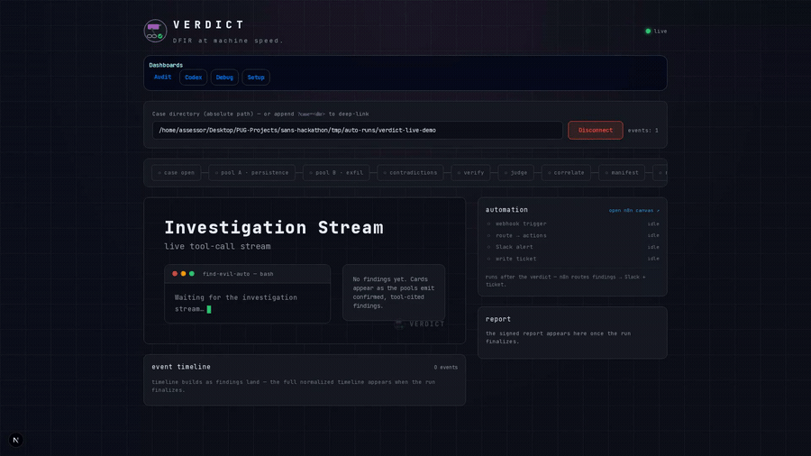
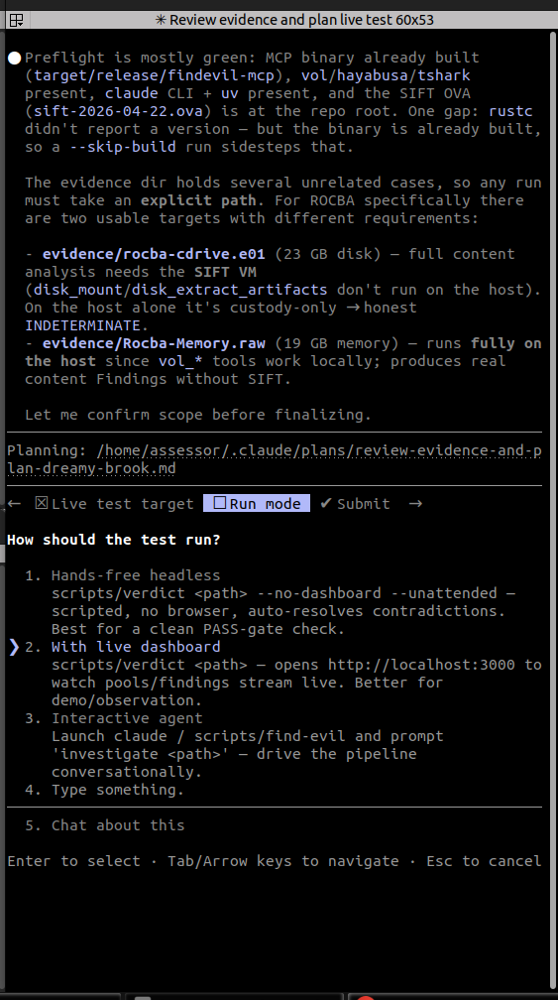

<p align="center">
  
</p>

<p align="center">
  <a href="LICENSE"></a>
  
  
  
</p>

<p align="center"><b>Digital forensics &amp; incident response at machine speed — with a verdict you can prove.</b></p>

---

**VERDICT** automates the repeatable mechanics of a Windows-host DFIR investigation — memory
images, EVTX logs, disk artifacts, and network captures — and produces an evidence-bound verdict
(`SUSPICIOUS` / `INDETERMINATE` / `NO_EVIL`) backed by a **cryptographic chain of custody any third
party can verify offline**. It runs as a [Claude Code](https://claude.com/claude-code) agent over a
narrow, typed tool surface, so every conclusion cites the exact tool call that produced it.

<p align="center">
  <a href="docs/find-evil-demo.mp4"></a>
</p>
<p align="center"><sub>The live dashboard streams every tool call and finding as the case runs. <a href="docs/find-evil-demo.mp4">Watch the full walkthrough →</a></sub></p>

## What you get

Every run writes a self-contained case directory:

| Artifact | What it is |
|---|---|
| `audit.jsonl` | Append-only, **hash-chained** log of every tool call and finding (`prev_hash` per record) |
| `verdict.json` | The evidence-bound verdict + findings, each citing a `tool_call_id` and a confidence tier |
| `run.manifest.json` | Merkle root over canonical tool outputs + signature metadata — verifiable offline |
| `report.html` | Analyst report: findings, ATT&CK coverage, normalized timeline, next analyst actions |

<p align="center">
  
</p>
<p align="center"><sub>Every run seals into a hash-chained audit log, a Merkle root over canonical tool outputs, and a signed manifest — verifiable offline with <code>manifest_verify</code>.</sub></p>

## How it works

Three ideas, exercised end-to-end on every CI run:

1. **A typed MCP tool surface — no `execute_shell`.** 32 narrow, schema-validated tools: 20 Rust
   DFIR tools (`case_open`, `vol_pslist`/`psscan`/`psxview`, `mft_timeline`, `evtx_query`,
   `hayabusa_scan`, `yara_scan`, `registry_query`, `prefetch_parse`, `pcap_triage`, …) + 12 Python
   crypto/analysis tools. AGPL/GPL engines (Volatility, Hayabusa, Velociraptor) are invoked as
   subprocesses only, so the Apache-2.0 tree stays license-clean.

2. **A cryptographic chain of custody.** Hash-chained audit log → `rs_merkle` Merkle root over
   canonical-JSON tool outputs → a manifest signature (Sigstore/Rekor in production; a clearly
   labeled stub signer for offline runs). `manifest_verify` checks the chain + root offline. Framed
   for FRE 902(14) self-authenticating evidence — see [`docs/cryptographic-attestation.md`](docs/cryptographic-attestation.md).

3. **Analysis of Competing Hypotheses as agent topology.** Two pools investigate the same evidence
   with opposing priors (persistence-biased vs. exfil-biased). Their disagreements are emitted as
   first-class `kind=contradiction` records *before* a credibility-weighted **judge** merges them —
   surfaced, not hidden in consensus. Heuer's intelligence-analysis method as live architecture.

Findings follow a strict epistemic hierarchy — **CONFIRMED** (≥2 corroborating artifact classes,
verifier-passed) > **INFERRED** (derived from confirmed facts) > **HYPOTHESIS** — and execution
claims require at least two artifact classes. Evidence is opened read-only.

## Capabilities

Beyond the three ideas above, a single case run also:

- **Works disk *and* memory end-to-end.** Mounts raw/E01 images read-only and extracts `$MFT`,
  registry hives, EVTX, and Prefetch (`disk_mount` / `disk_extract_artifacts` / `disk_unmount`),
  then analyzes memory in the same case — no manual carving. ([tool inventory](docs/reference/mcp-and-tools.md))
- **Re-verifies its own findings.** `verify_finding` re-runs each cited tool call and confirms the
  output SHA-256 still matches, and `detect_contradictions` raises Pool A vs Pool B conflicts as
  first-class records before the judge merges — so a third party can independently replay the chain.
  ([tools](agent-config/TOOLS.md))
- **Scales to a fleet.** Run a whole compromised estate, not one box: the 3-stage investigate →
  correlate → render pipeline produces a single cross-host `FLEET_REPORT` surfacing the signals that
  only appear *across* machines — the same uncommon process on many hosts, near-simultaneous
  process-creation waves, MITRE-technique spread. (On a 22-host SANS estate it pinned one implant
  image to 20 of 22 hosts.) Runs in the SANS SIFT VM ([fleet analysis](docs/using/fleet-analysis.md)),
  or per-host locally with no VM ([whole-case local run](docs/using/whole-case-local-run.md)).
- **Acts on the verdict (optional).** Post-verdict n8n workflows turn a verdict into a notification,
  ticket, or containment step. This automation sits *outside* the audit chain — never evidence, never
  a Finding. ([servers](docs/reference/mcp-and-tools.md))

## Hi, I'm new

New here? **Install with one command — `bash scripts/setup`.** It checks the toolchain, builds the
`findevil-mcp` server, syncs the Python agent-mcp venv, installs the host DFIR tools, re-checks
what's still missing, and prints a green/red summary. Safe to re-run. The full step-by-step —
prerequisites, how to verify, and the container path — is in **[INSTALL.md](INSTALL.md)**.

**Power option — install from inside Claude Code.** Open the repo with `claude` and type `setup`
(or `i'm new`). It runs the *same* install, and additionally — for any asset behind a registration
form, EULA, or login (the SANS SIFT VM in particular) — drives a browser to fetch it and move it
into place for you. If the download can't be automated, the agent opens the page and walks you
through it.

When setup is green, point VERDICT at evidence: `scripts/verdict <path-to-evidence>`, or open
`claude` and prompt `investigate <path>`. Per-environment setup (local DFIR tools vs. the SANS
SIFT VM) is in [QUICKSTART.md](QUICKSTART.md); what the in-agent `setup` trigger does is in
[docs/onboarding.md](docs/onboarding.md).

## Quickstart

```bash
git clone https://github.com/TimothyVang/sans-hackathon.git verdict
cd verdict
bash scripts/setup          # one-shot: preflight + build + DFIR tools + honest summary
# or, just the build step:
bash scripts/install.sh     # preflight + build (Rust MCP server + Python env)
```

**One command, one workflow.** `verdict` runs the whole thing — preflight → investigate → opens the
live dashboard at the case → signed verdict + report:

```bash
scripts/verdict <path-to-evidence>
#   --sift          run the DFIR tools inside the SANS SIFT VM (default: local host)
#   --no-dashboard  don't auto-open the browser
```

Point it at a single image or a mixed case directory (memory + EVTX + disk + network +
Velociraptor). Output lands in `tmp/auto-runs/<case-id>/`, and the dashboard
(`http://localhost:3000`) streams the run live as it happens.

**Prefer a container?** `bash scripts/verdict-docker <evidence> --headless` runs the whole pipeline
in a reproducible image — no host toolchain beyond Docker, and no Claude token (it runs the
deterministic engine). Details + limits: [docs/runbooks/docker-runner.md](docs/runbooks/docker-runner.md).

**Zero setup, zero flags — the `/verdict` skill.** In a Claude Code session (`claude` in the
repo), just type:

```
/verdict <path-to-evidence>
```

The skill **bootstraps everything for you** — builds the MCP servers (`install.sh` if needed),
brings up n8n, and prepares the SANS SIFT VM so disk images fully extract — then runs the whole
pipeline, fires the n8n automation + grounding workflows, and prints the Verdict plus every
workflow that ran (and opens the dashboard + report). You never run `install.sh`/`doctor.sh` or
pass `--sift`/`--parallel` — the skill adds them. Full reference:
[docs/using/running-verdict.md §`/verdict` skill](docs/using/running-verdict.md).

**Prefer to drive it yourself?** Open Claude Code in the repo (`claude`) and prompt
`investigate <path>` — same tools, interactive.

<p align="center">
  
</p>
<p align="center"><sub>Agent mode: VERDICT scopes the evidence, plans the live test, and confirms run mode before it touches a byte.</sub></p>

**No evidence yet?** Evidence files are never committed (they're gitignored), so a fresh clone
ships with none. Stage public test datasets with `bash scripts/fetch-fixtures.sh` (sources +
SHA-256 in [docs/DATASET.md](docs/DATASET.md)), or drop your own image into `evidence/` and run
`scripts/verdict --watch`. Every run is a **live test**: confirm `tmp/auto-runs/<case-id>/verdict.json`
carries a real verdict and `manifest_verify.json` reports `overall: true`.

Per-environment setup (local DFIR binaries vs. the SANS SIFT VM) and evidence placement live in
[QUICKSTART.md](QUICKSTART.md). Trust-boundary diagrams are in [docs/architecture.md](docs/architecture.md).

## Repository layout

```
.
├── agent-config/        — runtime agent identity (SOUL / AGENTS / PLAYBOOK / TOOLS / MEMORY)
├── services/mcp/        — Rust MCP server (20 typed DFIR tools)
├── services/agent_mcp/  — Python MCP server (12 crypto / ACH / memory tools)
├── services/agent/      — findevil_agent package (crypto chain + ACH primitives)
├── apps/web/            — Next.js dashboard (live audit-stream viewer + design system)
├── scripts/             — verdict launcher (find-evil/-auto shims), report renderer, CI smoke runners
├── docs/                — reference/ (tools+deps+env), using/ (how to run), architecture, crypto attestation
└── .mcp.json            — Claude Code auto-spawn registry: 6 MCP servers (2 product + 4 non-product incl. qmd memory)
```

## Documentation

- [docs/README.md](docs/README.md) — canonical documentation index
- [docs/using/running-verdict.md](docs/using/running-verdict.md) — how to run it (every flag, run modes, output layout)
- [docs/reference/mcp-and-tools.md](docs/reference/mcp-and-tools.md) — full MCP-server + tool inventory, and [dependencies.md](docs/reference/dependencies.md)
- [docs/architecture.md](docs/architecture.md) — the five trust boundaries
- [docs/cryptographic-attestation.md](docs/cryptographic-attestation.md) — the chain of custody + FRE 902(14)
- [docs/verdict-semantics.md](docs/verdict-semantics.md) — what `SUSPICIOUS` / `INDETERMINATE` / `NO_EVIL` mean
- [docs/false-positives.md](docs/false-positives.md) — how VERDICT avoids over-claiming

> **For coding agents:** read [CLAUDE.md](CLAUDE.md) first — it encodes the document hierarchy, the
> non-negotiable invariants, and the coding principles for this repo.

## License

Apache-2.0. See [LICENSE](LICENSE). Vendored reference clones (`openclaw/`, `hermes-agent/`, …) are
research-only and gitignored — they do not ship.

<sub>VERDICT began as an entry in the SANS <i>Find Evil!</i> 2026 hackathon; internal identifiers
(<code>findevil-mcp</code>, <code>@findevil/web</code>, <code>scripts/find-evil</code>) retain that
name.</sub>
