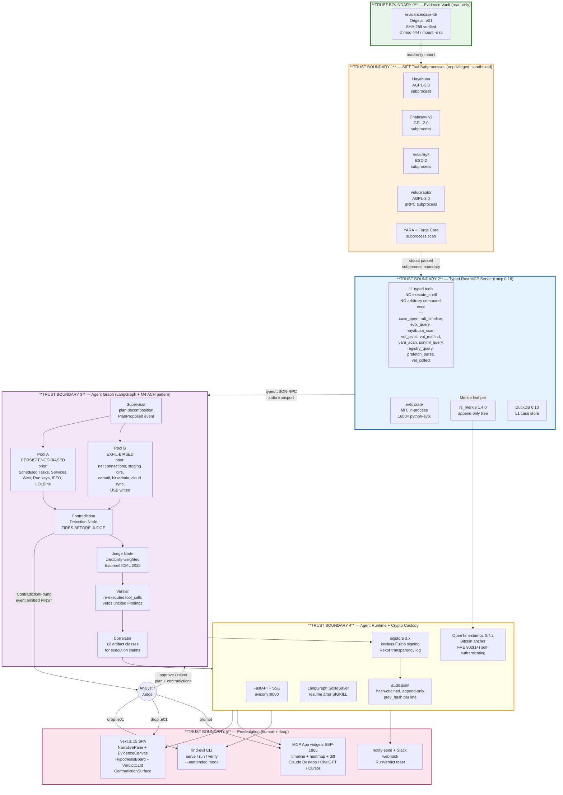
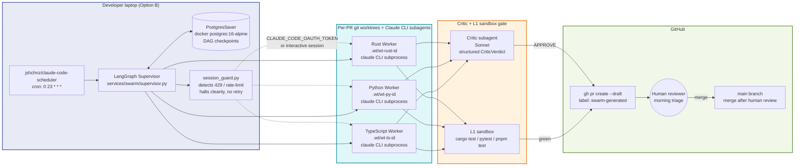

# Find Evil! — Architecture

**Devpost Required Component #3** — architecture diagram with trust boundaries, distinguishing prompt-based guardrails from architectural guardrails.

This document is the single-page visual summary judges reach first. Full detail lives in `docs/superpowers/specs/2026-04-25-the-product-design.md` (seven-layer product), `docs/superpowers/specs/2026-04-24-autonomous-build-swarm-design.md` (build swarm), and `docs/superpowers/specs/2026-04-23-amendment-option-b-claude-code-mode.md` (three credential modes).

---

## Architectural pattern claimed

Per SANS Find Evil! rules, submissions declare which of four supported patterns they implement. Our submission uses **two** primary patterns:

1. **Custom MCP Server** (rules §2) — a purpose-built Rust MCP server exposing 11 typed functions. The agent physically cannot run destructive commands because the server does not expose them. No `execute_shell` tool exists anywhere in the MCP surface.
2. **Multi-Agent Framework (LangGraph)** (rules §3) — the agent graph is decomposed into a supervisor, two competing-hypothesis worker pools, a judge node, a verifier, and a correlator. Each specialist has its own context window.

Both patterns are implemented together. The typed MCP server is called by every specialist agent in the LangGraph graph; no agent ever reaches a raw shell.

---

## Runtime architecture (the Product that judges run)

### Trust boundary legend

| # | Boundary | Enforcement mechanism | Type |
|---|---|---|---|
| 0 | Evidence vault | **Architectural:** `mount -o ro` + `chmod 444`; `inotifywait` in L3 asserts zero writes to `/evidence` | Filesystem-enforced |
| 1 | SIFT tool subprocesses | **Architectural:** unprivileged user (no root, no CAP_SYS_ADMIN), 120s wall-clock budget per call, cpulimit 50%, tmpfs `/tmp/case-<id>-work/`, binary allowlist (no curl/wget/nc) | OS-enforced |
| 2 | Typed Rust MCP Server | **Architectural:** type system forbids `execute_shell`; tool surface is fixed at compile time in `services/mcp/src/tools/mod.rs`; adding a shell passthrough would require a code change + PR + review | Compiler-enforced |
| 3 | Agent Graph | **Mixed:** agent system prompts (`agent-config/SOUL.md` — epistemic hierarchy, AGENTS.md — roles) are **prompt-based guardrails**; verifier veto (no Finding without `tool_call_id`) is **architectural** (Pydantic schema-level) | Mixed — prompt guards behavior, Pydantic guards data |
| 4 | Crypto Custody | **Architectural:** sigstore signing and Merkle root computation happen server-side before any finding is user-visible; OpenTimestamps anchoring is a subprocess call outside the agent's reach | Cryptographic |
| 5 | Presentation | **Architectural:** Next.js SSE bus is read-only from the frontend; analyst approval requires POST to `/cases/{id}/plan/approve` with session auth; `--unattended` mode auto-approves with `approved_by: "auto"` label in the audit log | Auth-enforced |

### Prompt-based vs architectural guardrails — explicit distinction

**Prompt-based guardrails (prompts that GUIDE behavior):**
- `agent-config/SOUL.md` epistemic hierarchy (CONFIRMED > INFERRED > HYPOTHESIS)
- `agent-config/AGENTS.md` specialist roles and tool scope
- `agent-config/MEMORY.md` DFIR artifact semantics (Amcache ≠ execution time, etc.)
- `agent-config/HEARTBEAT.md` canary string self-check every turn

These are **testable for bypass** in L3 golden runs — a prompt-injection fixture is included in `tests/acceptance/AC13_no_execute_shell.sh`. Prompt guardrails can fail; when they do, the architectural guardrails below must catch the fallout.

**Architectural guardrails (structural controls that PHYSICALLY PREVENT bad outcomes):**
- Read-only evidence mount (filesystem-enforced; even root can't mutate original .e01)
- Typed Rust MCP server with no `execute_shell` (compiler-enforced; adding shell passthrough requires a code change and PR review)
- Pydantic schema on `Finding` events requires `tool_call_id` (schema-enforced; unvalidated Findings can't exit the graph)
- LangGraph SqliteSaver checkpoints before every node (durability-enforced)
- sigstore signing of tool calls at the Rust MCP layer (agent cannot forge signatures)
- Merkle tree append-only at the Rust MCP layer (agent cannot backdate audit entries)
- OpenTimestamps subprocess anchoring (agent does not own the OTS calendar or the Bitcoin blockchain)
- FastAPI session auth on approval endpoints (agent cannot self-approve its own plan)

**Cisco `mcp-scanner` run pre-submission** asserts zero findings for `execute_shell` or equivalent arbitrary-execution patterns in `services/mcp/` — the architectural claim is machine-verified.

---

## Build-time architecture (Autonomous Build Swarm — INVISIBLE to judges)

**Budget control (Option B, Amendment A1):**
- NO LiteLLM proxy, NO Anthropic API key required for the swarm
- Workers use the developer's Claude Code subscription via the local `claude` CLI
- `session_guard.py` detects rate-limit signals (HTTP 429, stderr patterns) and halts the supervisor cleanly
- Postgres checkpoint preserves state across halts — the next night's run resumes without re-dispatching already-completed PRs
- Per-subagent `--max-turns 40` and no-progress detector (3 zero-diff tool calls → kill) prevent individual workers from burning budget in loops

---

## Credential modes (Amendment A1)

The Product (what judges run) detects three credentials in priority order via `scripts/install.sh` and `services/agent/config.py resolve_credentials()`:

All three modes are **judge-valid**. Judges pick whichever they already have — none is required to build or submit.

---

## Data flow — a single investigation from `.e01` to verdict

1. Analyst drops `case.e01` into the Next.js SPA (or runs `find-evil run --case case.e01 --unattended`)
2. FastAPI creates a new `case_id` UUID, returns it, redirects browser to `/case/{id}`
3. Rust MCP `case_open` tool SHA-256-verifies the image; opens it via libewf in read-only mode; initializes DuckDB at `~/.findevil/cases/<id>/evidence.ddb`
4. LangGraph supervisor emits `PlanProposed` event; analyst approves (or auto-approves in unattended)
5. Supervisor scatters identical plan to Pool A (persistence) and Pool B (exfil) in parallel
6. Each pool's specialists (disk/memory/log analysts) invoke MCP tools via stdio JSON-RPC; each call is sigstore-signed and its SHA-256 output hash is appended to the Merkle tree
7. Pool findings merged into `contradiction.py` node — emits `ContradictionFound` events to the UI **before** reconciliation
8. Analyst resolves contradictions (Trust A / Trust B / Flag) in the SPA, or `--unattended` auto-passes them to the judge
9. Judge node credibility-weighted-merges into final finding set
10. Verifier re-executes tool calls behind every Finding; vetos any without `tool_call_id`
11. Correlator enforces SOUL.md cross-artifact rule (≥2 artifact classes for execution claims)
12. Supervisor assembles `RunVerdict`; Rust MCP finalizes the Merkle root; `opentimestamps-client` stamps the root to Bitcoin asynchronously
13. `run.manifest.json` written; `audit.jsonl` hash-chain finalized; OTS receipt saved
14. `notify-send` + optional Slack webhook fires
15. `find-evil verify run.manifest.json` on any machine with internet validates the entire run offline, citing FRE 902(14)

---

## What we differ from the reference bar (Valhuntir)

| Dimension | Valhuntir (reference) | Us |
|---|---|---|
| MCP server | Python, 8 servers via sift-gateway, 100+ tools | Rust rmcp, 1 server, 11 typed tools, no execute_shell |
| Chain-of-custody | Password-gated HMAC (PBKDF2 2M iter) | sigstore + Merkle + OpenTimestamps Bitcoin anchor (FRE 902(14)) |
| Agent pattern | Single agent + human approval | ACH dual-agent (persistence vs exfil) + judge + contradiction surface |
| Benchmarks published | **None** (their README: "no performance metrics disclosed") | DFIR-Metric + public leaderboard |
| UI | Browser Examiner Portal | Next.js SPA + MCP Apps widgets (SEP-1865) |
| Install pattern | `curl ... | bash` one-liner | `curl ... | bash` one-liner (same pattern, our repo) |
| Credential mode | 1 (their gateway config) | 3 (CLAUDE_CODE_OAUTH_TOKEN / interactive / API key) |

We match Valhuntir's architectural discipline and exceed it on three dimensions that are documented, measurable, and legally framed.

---

## References

- `docs/superpowers/specs/2026-04-23-find-evil-automation-master-design.md` — master design
- `docs/superpowers/specs/2026-04-25-the-product-design.md` — product spec (detailed 7-layer architecture)
- `docs/superpowers/specs/2026-04-24-autonomous-build-swarm-design.md` — swarm spec
- `docs/superpowers/specs/2026-04-23-amendment-option-b-claude-code-mode.md` — credential modes
- `agent-config/SOUL.md` + `AGENTS.md` + `TOOLS.md` + `MEMORY.md` + `HEARTBEAT.md` — runtime agent identity
