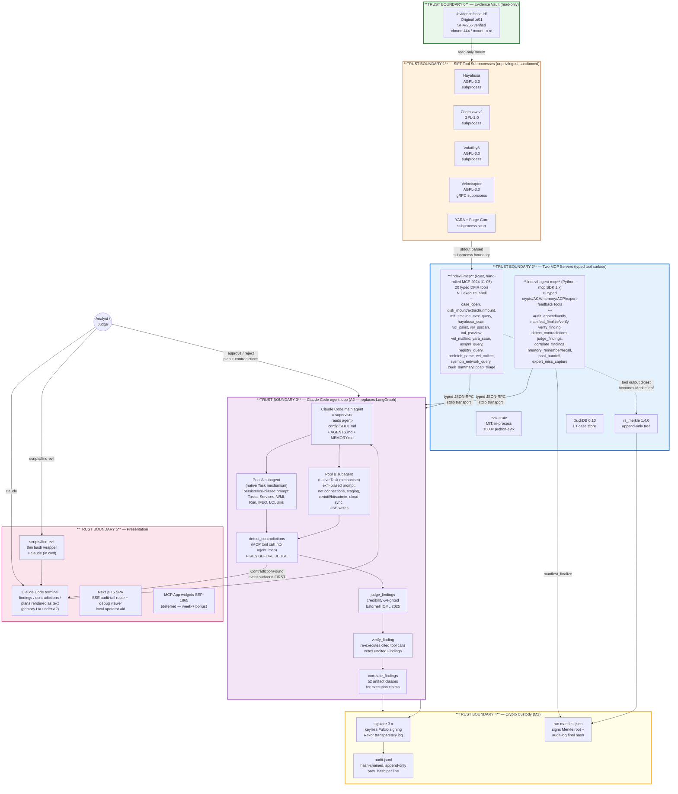
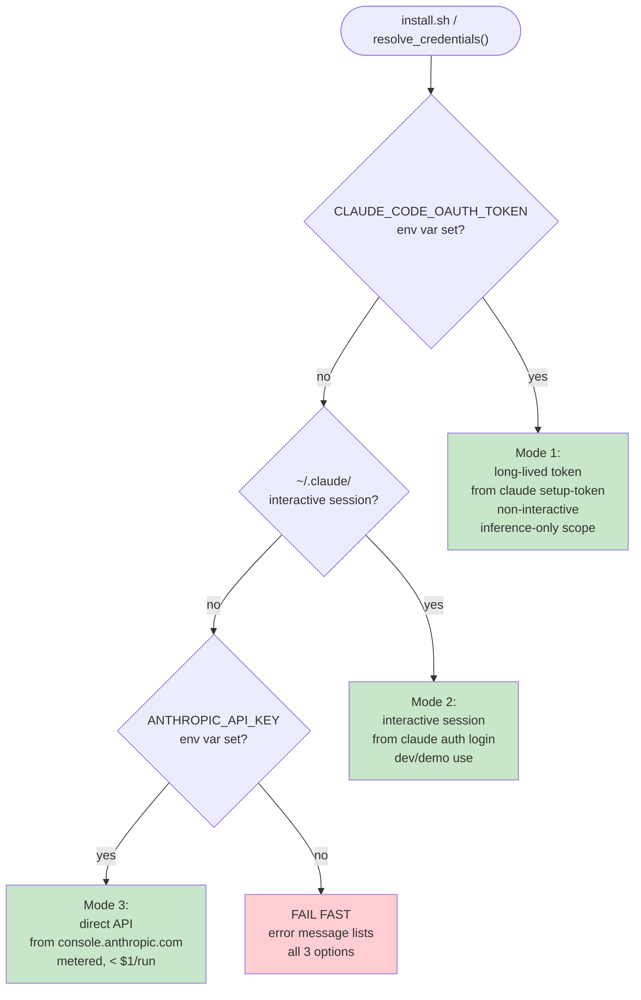

# Find Evil! — Architecture

**Devpost Required Component #3** — architecture diagram with trust boundaries, distinguishing prompt-based guardrails from architectural guardrails.

This document is the single-page visual summary judges reach first. Full detail lives in `docs/specs/2026-04-25-the-product-design.md` (seven-layer product), `docs/specs/2026-04-23-amendment-option-b-claude-code-mode.md` (Amendment A1, three credential modes), and `docs/specs/2026-04-25-amendment-a2-claude-code-primary-interface.md` (**Amendment A2, active**, Claude Code as primary interface).

---

## Architectural pattern claimed (under Amendment A2)

Per SANS Find Evil! rules, submissions declare which of four supported patterns they implement. Our submission combines **two** patterns:

1. **Direct Agent Extension** (rules §1) — Claude Code IS the agent. The judge runs `scripts/find-evil` (or `claude`) at the repo root; `.mcp.json` auto-spawns both MCP servers; Claude Code drives the investigation as supervisor + Pool A/B subagents (native Task mechanism — not `CLAUDE_CODE_FORK_SUBAGENT`, which is a build-time internal and is not used in this product). The SANS rules call this "the fastest path to a working submission."
2. **Custom MCP Server** (rules §2) — two purpose-built MCP servers expose the typed tool surface:
   - `findevil-mcp` (Rust) — 20 DFIR primitives (case_open, disk_mount/extract/unmount, evtx_query, mft_timeline, hayabusa_scan, vol_pslist, vol_psscan, vol_psxview, vol_malfind, yara_scan, usnjrnl_query, registry_query, prefetch_parse, vel_collect, browser_history, sysmon_network_query, zeek_summary, pcap_triage). Read-only on evidence; SHA-256 every output. **NO `execute_shell`.**
   - `findevil-agent-mcp` (Python) — 12 crypto + ACH + memory + ACP + expert-feedback tools (audit_append/verify, manifest_finalize/verify, verify_finding, detect_contradictions, judge_findings, correlate_findings, memory_remember/recall, pool_handoff, expert_miss_capture). The pre-A5 `ots_stamp`/`ots_verify` pair was removed.

The combination is the architectural claim: Claude Code's agent loop never touches a raw shell because the only verbs it has are MCP-typed function calls into one of the two servers.

---

## Relationship to Protocol SIFT

Find Evil! runs on the same SANS-blessed SIFT VM (`sift-2026.03.24.ova`) that Protocol SIFT operates on — they are not in conflict.

**Deliberate divergence in the MCP surface:**

| Aspect | Find Evil! | Protocol SIFT gateway |
|---|---|---|
| MCP servers | 2 typed servers (findevil-mcp, findevil-agent-mcp) | 1 gateway (200+ shell-backed tools) |
| Tool count | 32 (20 Rust DFIR + 12 Python crypto/ACH/memory/ACP) | 200+ (dynamic, shell coverage) |
| Shell surface | None — NO `execute_shell` | Broad — gateway is a shell pass-through |
| Use case | Repeatable DFIR mechanics for SANS investigation | General-purpose bot connectivity |
| Installation | No conflicts — separate MCP registrations | `protocol-sift install` installs the gateway independently |

After `protocol-sift install` on a SIFT VM, both Find Evil!'s narrow typed surface and Protocol SIFT's broad shell-backed gateway coexist. Judges or operators choose which agent interface to use per investigation; neither requires nor conflicts with the other.

The narrow surface is intentional: it reduces the attack surface from "full shell access" to "20 named DFIR operations" and "12 cryptographic/ACH/memory operations," enabling an architectural argument that the agent loop never touches shell primitives directly — all actions flow through typed JSON-RPC schema validation.

---

## Runtime architecture (the Product that judges run)

### Trust boundary legend

| # | Boundary | Enforcement mechanism | Type |
|---|---|---|---|
| 0 | Evidence vault | **Architectural:** `mount -o ro` + `chmod 444`; `inotifywait` in L3 asserts zero writes to `/evidence` | Filesystem-enforced |
| 1 | SIFT tool subprocesses | **Architectural:** unprivileged user (no root, no CAP_SYS_ADMIN), 120s wall-clock budget per call, cpulimit 50%, tmpfs `/tmp/case-<id>-work/`, binary allowlist (no curl/wget/nc) | OS-enforced |
| 2 | Two typed MCP servers | **Architectural:** Rust `findevil-mcp` type system forbids `execute_shell`; Python `findevil-agent-mcp` Pydantic input models use `extra="forbid"`; tool surfaces fixed at compile/build time. Adding a shell passthrough would require a code change + PR + review | Compiler/schema-enforced |
| 3 | Claude Code agent loop | **Mixed:** agent system prompts (`agent-config/SOUL.md` — epistemic hierarchy, AGENTS.md — roles) are **prompt-based guardrails**; verifier veto (no Finding without `tool_call_id`) is **architectural** (Pydantic schema-level enforced at the `findevil-agent-mcp` boundary) | Mixed — prompt guards behavior, Pydantic guards data |
| 4 | Crypto Custody | **Architectural:** sigstore signing and Merkle root computation happen inside `findevil-agent-mcp` before any finding is user-visible; the pre-A5 OpenTimestamps/Bitcoin tier was removed so `manifest_finalize` is the terminal custody step | Cryptographic |
| 5 | Presentation | **DEFERRED to bonus (A2 §2.1).** The terminal IS the primary UX. Optional Next.js SSE bus (when shipped) is read-only from the frontend; `--unattended` mode logs `approved_by: "auto"` to the audit chain. | Auth-enforced (when present) |

### Prompt-based vs architectural guardrails — explicit distinction

**Prompt-based guardrails (prompts that GUIDE behavior):**
- `agent-config/SOUL.md` epistemic hierarchy (CONFIRMED > INFERRED > HYPOTHESIS)
- `agent-config/AGENTS.md` specialist roles and tool scope
- `agent-config/MEMORY.md` DFIR artifact semantics (Amcache ≠ execution time, etc.)
- `agent-config/HEARTBEAT.md` canary string self-check every turn

These are **testable for bypass** in L3 golden runs — prompt-injection fixtures live alongside the standard golden cases in `goldens/`. Prompt guardrails can fail; when they do, the architectural guardrails below must catch the fallout.

**Architectural guardrails (structural controls that PHYSICALLY PREVENT bad outcomes):**
- Read-only evidence mount (filesystem-enforced; even root can't mutate original .e01)
- Typed Rust MCP server (`findevil-mcp`) with no `execute_shell` (compiler-enforced; adding shell passthrough requires a code change and PR review)
- Typed Python MCP server (`findevil-agent-mcp`) with Pydantic `extra="forbid"` on every input model (boundary-enforced; unknown fields surface as validation errors)
- Pydantic schema on `Finding` events requires `tool_call_id` (schema-enforced; unvalidated Findings can't exit the agent_mcp boundary)
- Hash-chained `audit.jsonl` (`prev_hash` per line; chain replay catches any backdated/mutated entry)
- sigstore signing of the run manifest at the `findevil-agent-mcp` layer (agent cannot forge signatures)
- Merkle tree append-only at the `findevil-agent-mcp` layer (agent cannot rebuild the tree to favor a different leaf set)
- Sigstore/Rekor transparency-log inclusion proof (agent cannot forge the signed manifest provenance)

**Cisco `mcp-scanner` run pre-submission** asserts zero findings for `execute_shell` or equivalent arbitrary-execution patterns in `services/mcp/` — the architectural claim is machine-verified.

---

## Credential modes (Amendment A1)

The Product (what judges run) detects three credentials in priority order via `scripts/install.sh` and `services/agent/config.py resolve_credentials()`:

All three modes are **judge-valid**. Judges pick whichever they already have — none is required to build or submit.

---

## Data flow — a single investigation from `.e01` to verdict (under A2)

1. Judge runs `scripts/find-evil` (or `claude`) at the repo root. Claude Code reads `.mcp.json`, spawns both MCP servers, ingests `CLAUDE.md` + `agent-config/*` as system context.
2. Judge prompts: "investigate fixtures/nist-hacking-case/SCHARDT.001". Claude Code (acting as supervisor) calls `case_open` (Rust MCP) — SHA-256 verifies the image, opens via libewf read-only, initializes DuckDB at `~/.findevil/cases/<id>/evidence.ddb`, calls `audit_append` (Python MCP) for the open event.
3. Claude Code emits a plan as text (no `PlanProposed` event needed — the terminal IS the channel) and forks two subagents via the native Task mechanism: one with the Pool A persistence prompt, one with Pool B exfil.
4. Each pool subagent invokes Rust MCP DFIR tools (`evtx_query`, `mft_timeline`, `hayabusa_scan`, etc.); each call's SHA-256 output digest is `audit_append`-ed and contributes a Merkle leaf at `manifest_finalize` time.
5. Both subagents return Findings (each citing a `tool_call_id`). Supervisor calls `detect_contradictions` (Python MCP) which surfaces Pool A vs Pool B disagreements **before** the judge fires.
6. Analyst resolves contradictions (Trust A / Trust B / Flag) in the terminal, or `--unattended` mode auto-passes them.
7. Supervisor calls `verify_finding` (Python MCP) for each candidate Finding — the wrapper spawns its own short-lived `findevil-mcp` subprocess and re-runs the cited tool call. Drift downgrades the Finding by one tier.
8. Supervisor calls `judge_findings` (Python MCP) — credibility-weighted merge per Estornell ICML 2025.
9. Supervisor calls `correlate_findings` (Python MCP) — SOUL.md cross-artifact rule downgrades execution claims that lack ≥2 artifact-class corroboration; Amcache-only execution gets the hard-coded downgrade.
10. Supervisor calls `manifest_finalize` (Python MCP) — builds Merkle root, signs the canonicalized body via sigstore (or StubSigner for offline demo), writes `run.manifest.json`, and finalizes the audit chain. This is the terminal custody step under A5.
11. Supervisor renders the `RunVerdict` to the terminal with paths to the manifest and report.
12. Offline replay: `manifest_verify` reproduces the proof end-to-end, citing FRE 902(14) with the post-A5 Rekor timestamp trade-off.

---

## What we differ from the reference bar (Valhuntir)

| Dimension | Valhuntir (reference) | Us |
|---|---|---|
| MCP server | Python, 8 servers via sift-gateway, 100+ tools | **Two** typed MCP servers — Rust `findevil-mcp` (20 DFIR tools, including the deliberately-redundant `vol_pslist` + `vol_psscan` pair plus `vol_psxview` for DKOM cross-validation, disk mount/extract helpers, and network/log triage) + Python `findevil-agent-mcp` (12 crypto/ACH/memory/ACP/expert-feedback tools); no execute_shell |
| Agent runtime | Custom Python harness | **Claude Code** itself (SANS rules §1 "Direct Agent Extension") — no custom orchestrator to maintain |
| Chain-of-custody | Password-gated HMAC (PBKDF2 2M iter) | sigstore/Rekor + Merkle + audit hash chain (FRE 902(14) self-authenticating, with the A5 timestamp trade-off documented) |
| Agent pattern | Single agent + human approval | ACH dual-agent (persistence vs exfil) via Claude Code forked subagents + judge + contradiction surface |
| Benchmarks published | **None** (their README: "no performance metrics disclosed") | DFIR-Metric + public leaderboard |
| UI | Browser Examiner Portal | Claude Code terminal (primary); Next.js SPA + MCP Apps widgets (week-7 polish bonus, deferred) |
| Install pattern | `curl ... \| bash` one-liner | `curl ... \| bash` one-liner (same pattern, our repo) |
| Credential mode | 1 (their gateway config) | 3 (CLAUDE_CODE_OAUTH_TOKEN / interactive / API key) |

We match Valhuntir's architectural discipline and exceed it on three dimensions that are documented, measurable, and legally framed.

---

## References

- `docs/specs/2026-04-23-find-evil-automation-master-design.md` — master design
- `docs/specs/2026-04-25-the-product-design.md` — product spec (detailed 7-layer architecture)
- `docs/specs/2026-04-23-amendment-option-b-claude-code-mode.md` — credential modes
- `agent-config/SOUL.md` + `AGENTS.md` + `TOOLS.md` + `MEMORY.md` + `HEARTBEAT.md` — runtime agent identity
