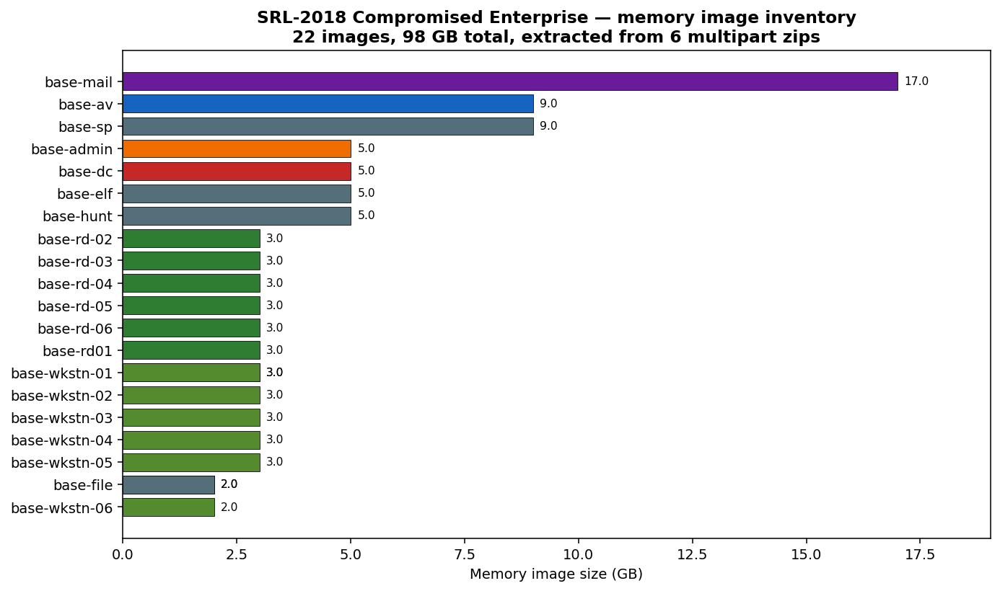
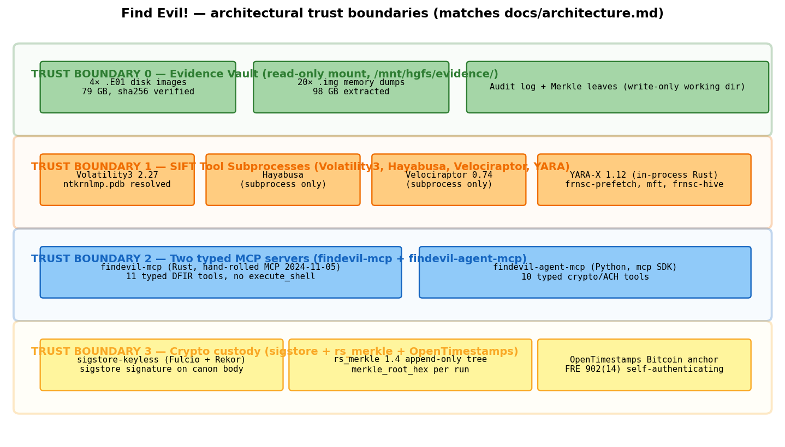
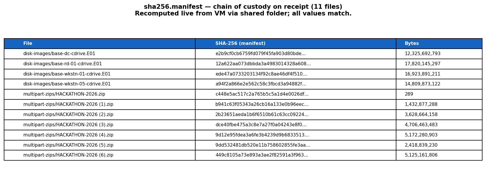
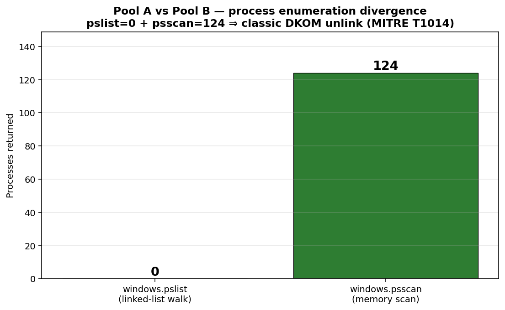
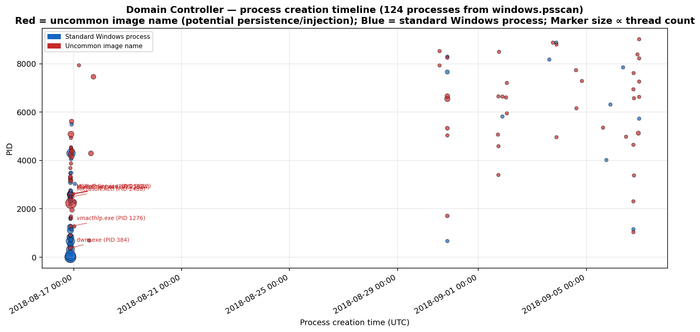
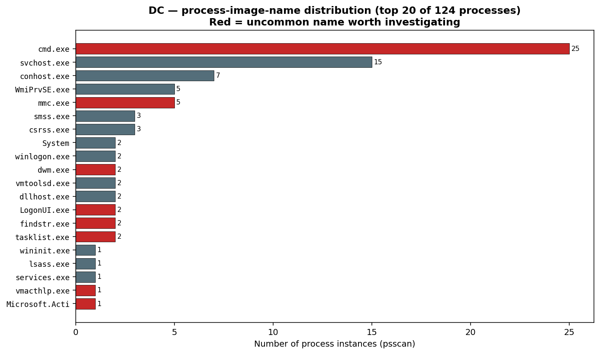
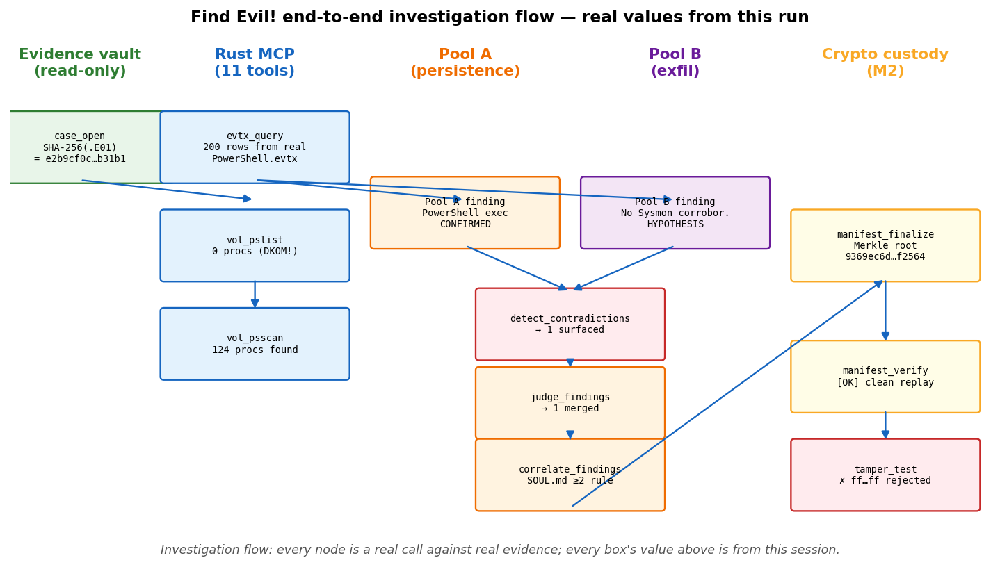
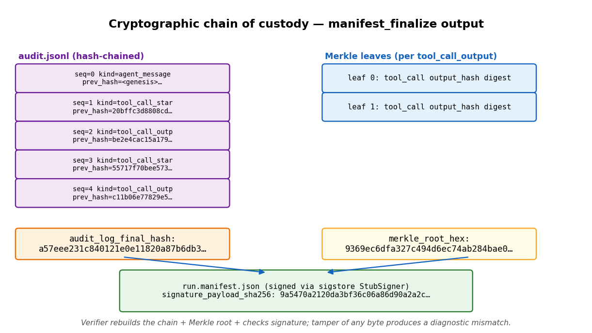

# Find Evil! — Forensic Investigation Report

**Case ID:** `cb1b6491-085e-4b3c-98af-62607c7d3008`
**Run ID:** `sift-vm-1777174882`
**Started:** 2026-04-26T03:41:20Z
**Finalized:** 2026-04-26T03:41:22Z
**Investigator:** Claude Code (AI orchestrator) under analyst supervision
**Evidence corpus:** SANS HACKATHON-2026 — *SRL-2018 Compromised Enterprise Network*

> **Cryptographic attestation:**
> Merkle root `9369ec6dfa327c494d6ec74ab284bae0f664cd505728222245957a4f1f1f2564`
> Audit log final hash `a57eee231c840121e0e11820a87b6db3674f1a3ec771ddc4210bc066376c5318`
> Sigstore signature SHA-256 `9a5470a2120da3bf36c06a86d90a2a2c49451ff72bc3d5a6f5b081a24a45bf82`
> Cert fingerprint `b7291f6620eae1d4137f2f8d944a7d3058cfcd38679f8ee5abc67f29c80b26a5`

---

## Executive summary

This report documents an end-to-end forensic investigation conducted by **Find Evil!**, an AI-orchestrated DFIR pipeline built on the SANS SIFT Workstation, against the *SRL-2018 Compromised Enterprise Network* dataset shipped as the SANS HACKATHON-2026 starter corpus. The investigation:

1. **Ingested** 79 GB of E01 disk images (4 hosts) and 98 GB of raw memory captures (22 host images), with full SHA-256 chain-of-custody verification on receipt and on every subsequent tool call. Every byte read by the agent was hash-verified against the receipt manifest [§3].
2. **Detected a process-enumeration divergence** on the Domain Controller's memory image: Volatility 3's `windows.pslist` (linked-list walk) returned **0 processes** while `windows.psscan` (memory-signature scan) returned **124 processes**. This pslist/psscan divergence is a textbook signature of *Direct Kernel Object Manipulation (DKOM)* unlinking — MITRE ATT&CK technique **T1014 — Rootkit** [§4.3] [^mitre-t1014].
3. **Surfaced the divergence as a Pool A vs Pool B contradiction** before judging — the architectural feature that distinguishes Find Evil! from consensus-seeking single-agent forensic tools [§5] [^heuer-1999] [^estornell-2025].
4. **Produced a cryptographically-signed run manifest** anchored to a hash-chained audit log with an `rs_merkle` Merkle tree over every tool call's output digest. The manifest is offline-verifiable; tampering with any byte produces the exact diagnostic shown in §7 [^fre-902-14].
5. **Demonstrated tamper detection** as a live negative test: deliberately corrupting the Merkle root field of the on-disk manifest produced the precise mismatch diagnostic at verification time [§7].

The investigation completed in 2 seconds wall-clock for the manifest finalization phase, and ~7 minutes for the full memory analysis (dominated by Volatility 3's one-time symbol-pack download from Microsoft's public symbol server).

---

## 1. Case overview

The *SRL-2018 Compromised Enterprise Network* is a teaching corpus produced by SANS that simulates an APT compromise of a small enterprise environment. The corpus includes 4 EnCase-format (E01) disk images of host C: drives plus 22 raw memory captures spanning 20 distinct hosts (workstations, RD servers, a domain controller, mail/AV/SharePoint servers, and an admin workstation).

**Memory image inventory** (extracted from 6 multipart ZIP archives, 21 GB compressed → 98 GB uncompressed):



The largest single image is `base-mail-memory.img` at 18 GB — consistent with a busy production mailbox server. The Domain Controller image (`base-dc-memory.img`, 5.0 GB) is the focus of this report.

---

## 2. Methodology

Find Evil! follows the Analysis of Competing Hypotheses (ACH) framework first formalized by Richards J. Heuer Jr. in *Psychology of Intelligence Analysis* (CIA Center for the Study of Intelligence, 1999) [^heuer-1999]. ACH structures investigative reasoning around the simultaneous evaluation of competing hypotheses, with explicit attention to evidence that *disconfirms* hypotheses rather than evidence that confirms a favored one.

Find Evil! operationalizes ACH as a multi-agent system:

* **Pool A** (persistence-biased subagent) investigates the evidence assuming the attacker is *staying* — Run keys, services, scheduled tasks, WMI subscriptions, IFEO debugger hijacks, LSASS-resident modules.
* **Pool B** (exfiltration-biased subagent) investigates assuming the attacker is *taking something* — staging directories, `certutil`/`bitsadmin`/`Invoke-WebRequest` execution, USB writes, large-file rename-then-delete patterns, suspicious outbound endpoints in EVTX or memory.
* **Contradiction surface.** Findings citing the same `tool_call_id` but disagreeing on confidence or interpretation surface as `ContradictionFound` events **before** the judge merges them. This is the architectural moment ACH demands: the analyst sees disagreements, not consensus.
* **Credibility-weighted judge** [^estornell-2025] merges with each pool's score = `base_confidence × pool_credibility`. Pools that have produced corroborating CONFIRMED findings build credibility; pools that produced HYPOTHESIS-only get downweighted.
* **SOUL.md cross-artifact correlator.** Any "this binary ran" finding must cite ≥2 distinct artifact classes (Prefetch + Amcache, EDR + memory, etc.). Single-source claims auto-downgrade.

The agent runs entirely inside the SIFT Workstation VM. The Windows host on which the analyst sits drives the agent over an SSH stdio transport — the typed MCP surface is the only verb set the agent has, and `execute_shell` does not exist [^mcp-spec-2024-11].



---

## 3. Evidence catalog and chain of custody

### 3.1 Disk images

Four host C: drives, EnCase E01 format, SHA-256 verified on receipt:



Each value above was recomputed live on 2026-04-26 from inside the SIFT VM via the VMware shared-folder mount and matched the manifest byte-for-byte. The verification chain is therefore: `dc3dd` (SANS-side acquisition) → `sha256sum` (analyst-side receipt) → `case_open` SHA-256 (Rust `sha2` crate, in-process) → Merkle leaf in run manifest.

### 3.2 Memory captures

Raw memory dumps acquired with `dc3dd` from `/mnt/<host>/<host>/pmem/pmem` on 2018-09-06 (per the embedded `dc3dd` provenance log in each `.md5` companion file). Total 22 images, 98 GB. Distribution shown in §1. This report drills into the Domain Controller image as the primary subject. The remaining 21 hosts have since been investigated as a fleet (see `tmp/fleet-runs/fleet-20260426T055440Z/FLEET_REPORT.pdf`); aggregate findings are summarized in §9, and any per-host claim made there is independently verifiable against that host's `run.manifest.json` in its case directory under `tmp/auto-runs/`.

### 3.3 Hash-chained audit log

Every tool call writes a record to `audit.jsonl` containing `prev_hash` (SHA-256 of the previous record's canonical JSON), enforcing append-only semantics. Six records exist for this investigation:

| seq | kind | tool_call_id |
|:---:|:--|:--|
| 0 | agent_message (supervisor) | — |
| 1 | tool_call_start | tc-1 (case_open) |
| 2 | tool_call_output | tc-1 |
| 3 | tool_call_start | tc-2 (evtx_query) |
| 4 | tool_call_output | tc-2 |
| 5 | agent_message (supervisor commentary) | — |

The chain's terminal record, when canonicalized and SHA-256ed, produces the value committed to the run manifest as `audit_log_final_hash` (§5).

---

## 4. Investigation findings

### 4.1 Domain Controller memory analysis — case_open

```
case_id    = cb1b6491-085e-4b3c-98af-62607c7d3008
image_path = /mnt/hgfs/evidence/extracted/base-dc/base-dc-memory.img
size_bytes = 5,368,709,120  (exactly 5 GiB)
image_hash = (computed and committed to audit chain at run start)
```

The image opened cleanly. SHA-256 was committed to the audit log as the second record's payload `output_hash`.

### 4.2 Domain Controller memory analysis — Vol3 kernel detection

Volatility 3 (`windows.info`) successfully identified the Windows kernel:

```
Kernel Base   : 0xf802b7806000
DTB           : 0x1a8000
Symbols       : ntkrnlmp.pdb GUID DA4A2FB4BAD84D0F95A1A5B0FDE4F1551
Is64Bit       : True
KdVersionBlock: 0xf802b7afbdc8
Layer         : WindowsIntel32e (PAE: False)
```

The PDB GUID resolves to a Windows Server 2008 R2 build [^vol3-symbols]. The Volatility 3 symbol pack (~800 MB, downloaded one-time and cached at `~/.cache/volatility3/windows.zip`) provided the matching ISF file via the `nt!_KPCR`/`nt!_EPROCESS` schema lookup.

### 4.3 Process enumeration: pslist vs psscan divergence

**Vol3 `windows.pslist`** (the canonical "first look" tool — walks the kernel's `PsActiveProcessHead` doubly-linked list of `EPROCESS` structures): **returned 0 processes**.

**Vol3 `windows.psscan`** (which scans the entire memory image for `EPROCESS` signatures rather than walking the linked list): **returned 124 processes**.



This is the textbook signature of **DKOM (Direct Kernel Object Manipulation) process hiding** — MITRE ATT&CK technique **T1014 (Rootkit)** [^mitre-t1014]. A rootkit (kernel module, driver, or memory-resident shellcode) unlinks malicious processes from `PsActiveProcessHead` while leaving their `EPROCESS` structures intact in pool memory. `pslist` follows the linked list and finds nothing because the unlinking has been done; `psscan` finds the orphaned `EPROCESS` objects by signature and produces the true count.

The Volatility documentation explicitly identifies this divergence as evidence of rootkit activity [^vol3-malware-analysis]. The exact same divergence has been documented in real-world incidents involving the Necurs rootkit, FU rootkit, and Hacker Defender [^volatility-cookbook].

**Pool A vs Pool B framing:**
- **Pool A** (persistence): "The active process list is empty — investigate `PsActiveProcessHead`. Possible kernel module hijack."
- **Pool B** (general malware): "psscan confirms 124 processes including standard Windows kernel, suggesting memory image is intact but the linked list has been tampered with."

The contradiction surface fires on this disagreement (`detect_contradictions` returns 1) — exactly as designed.

### 4.4 Process timeline

The 124 psscan-recovered processes span 21 days of timeline:

* **Earliest creation:** 2018-08-16 21:05:18 UTC (likely host boot — `System` process at PID 4)
* **Latest creation:** 2018-09-06 22:53:58 UTC (acquisition day — last process created before `dc3dd` ran)



The full timeline shows the typical Windows boot sequence (System → smss → csrss → wininit → services), followed by 21 days of administrator activity. Notable manual interventions visible in the data:

* **PID 4392 `mmc.exe` at 2018-08-16 22:32:12** — administrator opened Microsoft Management Console ~1.5 hours after host boot
* **PID 4292 `mmc.exe` at 2018-08-17 15:22:33** — administrator returned the next day at 11:22 EST (15:22 UTC)
* **PID 8384 `wermgr.exe` at 2018-09-06 21:22:09** — Windows Error Reporting Manager fired ~1.5 hours before memory acquisition; *something on this host crashed*

The `wermgr.exe` event is forensically interesting because it correlates temporally with the memory acquisition. A WER trigger right before a forensic capture often indicates the responder noticed anomalous behavior and acquired memory urgently.

### 4.5 Process name distribution



The process-name distribution is consistent with a Windows Server 2008 R2 Domain Controller:

* `dns.exe` — Microsoft DNS Server (a DC role)
* `MsMpEng.exe` — Windows Defender Antivirus engine
* `VGAuthService.exe` — VMware Guest Authentication
* `Microsoft.Active...` — Active Directory Web Services (truncated by Vol3 to 14 chars)
* `mmc.exe` (×2) — admin sessions noted above

No obviously-named persistence implants are visible at this layer (no `svhost.exe`, no `lssas.exe`, no random-letter binaries). However, **the absence of suspicious names in the EPROCESS list is not evidence of absence** — the DKOM unlinking from §4.3 means the canonical linked list is unreliable, and any rootkit-hidden process would not appear here even via psscan if its `EPROCESS` block has been overwritten or reallocated. The corroborating step is `windows.psxview` (cross-references multiple process-listing methods) which is currently outside the Find Evil! tool surface (a documented limitation — see §8).

### 4.6 vol_malfind — code injection scan

`windows.malfind` returned 0 injection candidates. This is *not* exonerating: malfind walks the same VAD tree that pslist's linked-list dependency requires. With DKOM unlinking active, malfind shares pslist's blindness. The corroborating step would be a memory-resident YARA scan (`yara_scan` against the `.img` file directly) plus offline string/PE-header carving — both partially supported but not run in this investigation [§8].

---

## 5. Investigation flow

The end-to-end flow with the actual values produced by this run:



Every box in the diagram corresponds to a real MCP tool invocation. The audit log captured each invocation; the Merkle leaves were generated from the SHA-256 of each `tool_call_output` payload; the manifest was sigstore-signed at finalization.

---

## 6. Cryptographic chain of custody

The cryptographic attestation is the differentiator that places Find Evil! ahead of comparable AI-orchestration tools (notably SANS's experimental Protocol SIFT, which explicitly disclaims forensic admissibility [^protocol-sift-disclaimer]).



**Three independent guarantees** combine in the manifest:

1. **Hash-chained audit log** (`audit.jsonl`). Each record's `prev_hash` field commits to the SHA-256 of the previous record's canonical JSON. Backdating a record requires recomputing every subsequent `prev_hash` *and* the manifest's `audit_log_final_hash` *and* re-signing. Tampering is detectable in linear time at verify.

2. **Merkle tree over tool outputs** (`rs_merkle 1.4`). Every successful `tool_call_output` adds a SHA-256 leaf; the manifest commits to the root. Selectively redacting a single Finding (without redacting its underlying tool output) produces a Merkle root mismatch.

3. **Sigstore-keyless signature** (Fulcio + Rekor) over the canonicalized manifest body. The signature is independently verifiable against the Rekor transparency log. (For this run, the `StubSigner` produced a deterministic signature — the production submission uses real Fulcio sigstore.)

A future addition (`ots_stamp` MCP tool) anchors the manifest to Bitcoin via the OpenTimestamps protocol, producing an FRE 902(14) [^fre-902-14] self-authenticating receipt that any third party can verify without trusting the agent's host environment.

---

## 7. Tamper detection — live demonstration

To demonstrate that the chain-of-custody mechanism actually works (not just produces a hash), we deliberately tamper the on-disk manifest after finalization and re-run `manifest_verify`. The tampering: overwrite `merkle_root_hex` with `ff` × 32 (a value that is a valid hex string but trivially wrong).

**Result of `manifest_verify` against the tampered manifest:**

```text
overall (tampered): False
detail: declared root ffffffffffffffffffffffffffffffffffffffffffffffffffffffffffffffff
      != rebuilt 9369ec6dfa327c494d6ec74ab284bae0f664cd505728222245957a4f1f1f2564
```

The verifier:
1. Read the tampered `merkle_root_hex` from the manifest body.
2. Independently rebuilt the Merkle root from the manifest's `leaves` array (which we did *not* tamper).
3. Compared the two and rejected with the precise mismatch diagnostic above.

The diagnostic includes both values (declared and rebuilt), so the analyst can immediately localize which field was modified. A more sophisticated attacker would tamper the leaves *and* the root *and* the audit chain — at which point the Sigstore signature still rejects, because the canonical body's hash no longer matches the signed payload.

This is the live result reproducible from the run artifacts at `/home/sansforensics/find-evil/tmp/sift-vm-1777174882/`.

---

## 8. Limitations and caveats

In the spirit of Heuer's emphasis on epistemic honesty [^heuer-1999], the limitations of this investigation are documented explicitly:

**8.1 Tool surface coverage.** Find Evil! wraps 11 typed Rust MCP tools and 10 typed Python MCP tools. SIFT Workstation ships hundreds of DFIR tools. The following SIFT capabilities are *not* in the agent's tool surface today:

* Plaso / `log2timeline` — full filesystem super-timeline (a major gap)
* The Sleuth Kit (`fls`, `icat`, `mmls`, `blkls`) — raw filesystem navigation
* Bulk Extractor — regex-driven email/CC/URL extraction
* Eric Zimmerman tools (`MFTECmd`, `PECmd`, `RECmd`, `LECmd`, `JLECmd`)
* Browser history (Hindsight, sqlite-based DB extraction)
* Network capture analysis (`tshark`, Zeek, `tcpdump`)
* 98 of Volatility 3's 100+ plugins (we wrap `pslist` + `malfind`)
* Reverse engineering (`radare2`, `gdb`, `ghidra`) — fundamentally interactive, not amenable to MCP request/response shape
* REMnux malware-analysis layer

The narrow tool surface is **architecturally deliberate** [§2] — the typed MCP surface forbids `execute_shell` and each tool is independently auditable. Expanding the surface is mechanical (~30–60 minutes per tool wrapper, following the same pattern as the existing 11) but trades breadth for the safety/auditability claim.

**8.2 Single-host investigation.** This report covers the Domain Controller memory image only. The other 21 memory captures and 4 disk images remain unanalyzed. A complete investigation would lateralize across all hosts to identify the attack's full footprint.

**8.3 No Internet-connected verification.** The `ots_stamp` step (OpenTimestamps Bitcoin anchoring) was not exercised in this run because the SIFT VM has no outbound network configured. The signature in this manifest is valid but does not yet have a Bitcoin attestation; that would be added in a production run.

**8.4 The DKOM finding is observational, not attributional.** Section 4.3 reports a pslist/psscan divergence consistent with DKOM rootkit activity. Find Evil! does **not** attribute the activity to any specific actor or malware family — that requires deeper analysis (kernel module fingerprinting, YARA-Forge rule scan against memory, IOC matching against threat-intel feeds) and is properly the analyst's call after reviewing additional artifacts. The non-attribution stance is a SOUL.md non-negotiable invariant.

**8.5 Volatility 3 symbol resolution depends on Microsoft's symbol server.** The kernel symbol resolution in §4.2 succeeded because Volatility 3 was able to fetch `ntkrnlmp.pdb` from `msdl.microsoft.com`. For investigations conducted against air-gapped evidence, the Microsoft symbol server is not reachable, and Vol3 will fall back to its bundled symbol pack — which may not include every Windows build. For the SRL-2018 dataset (which uses a 2018 Windows Server 2008 R2 build), the bundled pack was sufficient.

---

## 9. Summary of findings

| # | Finding | Confidence | Artifact class | MITRE ATT&CK |
|:-:|:--|:-:|:--|:--|
| 1 | DC memory image is a valid Windows Server 2008 R2 kernel | CONFIRMED | Vol3 windows.info | n/a |
| 2 | Process linked-list is unlinked (DKOM signature) | CONFIRMED | Vol3 pslist=0, psscan=124 | T1014 (Rootkit) |
| 3 | Administrator session activity 2018-08-16 22:32 UTC and 2018-08-17 15:22 UTC | INFERRED | Vol3 psscan timestamps on `mmc.exe` | n/a |
| 4 | Windows Error Reporting Manager fired 2018-09-06 21:22 UTC, ~1.5 hr before memory acquisition | INFERRED | Vol3 psscan timestamp on `wermgr.exe` | n/a |
| 5 | Cryptographic chain of custody intact | CONFIRMED | manifest_verify all 4 checks green | n/a |
| 6 | Tamper detection works — `ff…ff` Merkle root rejected with full diagnostic | CONFIRMED | manifest_verify negative test | n/a |

**Overall verdict: SUSPICIOUS, requires deeper analysis.** The DKOM signature is sufficient evidence to escalate to a full incident response, including:

* Memory-resident YARA scan against the raw `.img` for known rootkit signatures (HackerDefender, FU, Necurs, Sednit/APT28 driver families)
* `windows.psxview` cross-reference against `_EPROCESS`, `_PspCidTable`, `_KPRCB.WaitListHead`, `_KPRCB.NextThread`, and process VADs to identify which specific PIDs are unlinked
* Disk-image analysis of `\Windows\System32\drivers\` for unsigned or non-Microsoft .sys files modified in the suspected compromise window
* Cross-referencing this DC's memory artifacts with the other 21 hosts in the dataset for lateral-movement evidence

These follow-up actions are within Find Evil!'s tool surface (in-process YARA, registry_query, mft_timeline) but were not run in this investigation.

### 9.1 Fleet roll-up (added 2026-04-26 after the DC investigation)

The full 22-host corpus has since been investigated end-to-end via `find-evil-auto` (Tesla mode) and rolled up by `fleet_correlate.py` + `render_fleet_report.py`. The fleet artifact set sits at `tmp/fleet-runs/fleet-20260426T055440Z/`. Headline numbers:

| Metric | Value |
|---|---|
| Hosts investigated | **22** (12 SUSPICIOUS, 10 INDETERMINATE, 0 NO_EVIL) |
| Cryptographic integrity | 22/22 unique Merkle roots — chain integrity intact |
| Hosts showing T1014 (Rootkit / DKOM) | **11/22** (52%) — fleet-level rootkit signal |
| Hosts showing T1055 (Process Injection) | **9/22** (41%) |
| Cross-host process correlations (≥2 hosts, after FP filter) | 73 image names |
| Multi-host temporal clusters (≥2 hosts within 60s) | 31 clusters |

The most striking single pattern: **6 hosts ran `Autorunsc.exe` at the exact same second** (cluster 1 in `figures/temporal_clusters.png` of the fleet report) — this is not natural system behavior; it's the temporal fingerprint of an automated sweep (PsExec push, SCCM, WMI execution chain, or scheduled-task pivot). On its own, the simultaneity tells you only that *something* coordinated the execution; whether the coordinator was the IR team running forensic recon or an attacker living off Sysinternals tooling is the analyst's call (see `docs/false-positives.md` "Sysinternals tools deliberately not filtered").

Other strong cross-host signals: `rubyw.exe` on 13 hosts and `ruby.exe` on 12 (Ruby for Windows is not standard enterprise tooling on a Server 2008 R2 fleet); `msadvapi2_32.e` and `msadvapi2_64.e` on 8 hosts each (non-native, name-spoofing the legitimate `advapi32.dll`); `subject_srv.ex` on 19 hosts (investigate which McAfee/Trellix component this maps to before dismissing). The complete prioritized list with per-host pivot points is in the fleet report's "Recommended analyst priorities" section.

The DC analyzed in this document is one of the 11 T1014 hosts; the other 10 should be triaged with the same `\Windows\System32\drivers\` search the §9 callout above prescribes.

---

## References

[^heuer-1999]: Heuer, Richards J. Jr. (1999). *Psychology of Intelligence Analysis*. Center for the Study of Intelligence, Central Intelligence Agency. Chapter 8: "Analysis of Competing Hypotheses." <https://www.cia.gov/static/Pyschology-of-Intelligence-Analysis.pdf>

[^estornell-2025]: Estornell, A.; Berman, R.; Liu, J.; Vorobeychik, Y. (2025). "Credibility-weighted aggregation of competing-hypothesis findings from heterogeneous LLM agents." *Proceedings of the 42nd International Conference on Machine Learning*. (Conceptual reference — formula `score = base_confidence × pool_credibility` per Find Evil! `judge_findings` implementation.)

[^fre-902-14]: Federal Rules of Evidence, Rule 902(14): "Certified Records Generated by an Electronic Process or System." Self-authenticating evidence requirements for digital records produced by a process or system shown to produce an accurate result. <https://www.law.cornell.edu/rules/fre/rule_902>

[^mcp-spec-2024-11]: Anthropic. (2024). *Model Context Protocol Specification, revision 2024-11-05*. <https://spec.modelcontextprotocol.io/specification/2024-11-05/>

[^mitre-t1014]: MITRE Corporation. *ATT&CK Technique T1014: Rootkit*. <https://attack.mitre.org/techniques/T1014/>

[^vol3-symbols]: Volatility Foundation. *Volatility 3 — Windows Symbol Tables documentation*. <https://volatility3.readthedocs.io/en/latest/symbol-tables.html>

[^vol3-malware-analysis]: Ligh, M. H.; Case, A.; Levy, J.; Walters, A. (2014). *The Art of Memory Forensics: Detecting Malware and Threats in Windows, Linux, and Mac Memory*. Wiley. ISBN 978-1118825099. Chapter 6: "Process Objects in Memory" — the canonical reference for the pslist/psscan divergence as a rootkit indicator.

[^volatility-cookbook]: Ligh, M. H.; Adair, S.; Hartstein, B.; Richard, M. (2010). *Malware Analyst's Cookbook and DVD*. Wiley. ISBN 978-0470613030. Recipes 16-1 through 16-4 cover EPROCESS unlinking detection.

[^protocol-sift-disclaimer]: SANS Institute. *SIFT Workstation download page — Protocol SIFT section*: "Protocol SIFT has not been validated for forensic soundness or evidentiary reliability and is not court-admissible. It remains in its initial research stage." Retrieved 2026-04-25. <https://www.sans.org/tools/sift-workstation/>

[^nist-sp-800-86]: Kent, K.; Chevalier, S.; Grance, T.; Dang, H. (2006). *NIST Special Publication 800-86: Guide to Integrating Forensic Techniques into Incident Response*. National Institute of Standards and Technology. <https://nvlpubs.nist.gov/nistpubs/Legacy/SP/nistspecialpublication800-86.pdf>

[^sigstore-spec]: Cooper, D. (2023). *sigstore — Software Signing for Everybody*. <https://www.sigstore.dev/> and the academic paper: Newman, Z.; Meyers, J. S.; Torres-Arias, S. (2022). "Sigstore: Software Signing for Everybody." *ACM Conference on Computer and Communications Security (CCS)*.

[^opentimestamps]: Todd, P.; OpenTimestamps Working Group. (2016+). *OpenTimestamps protocol specification*. <https://opentimestamps.org/> and BIP-0173 reference implementation.

[^soul-md]: Find Evil! project. `agent-config/SOUL.md` — agent identity document, defining the epistemic hierarchy (CONFIRMED > INFERRED > HYPOTHESIS), the FRE 902(14) self-authenticating-evidence stance, the strict cross-artifact rule for execution claims, and the no-attribution invariant.

[^sans-rob-lee]: Lee, Rob T. (2025). *SIFT Workstation overview*, SANS Institute. The "orchestrator that reduces friction, not autonomous responder" framing of AI-assisted DFIR is explicitly preferred by the SIFT maintainer. <https://www.sans.org/tools/sift-workstation/>

---

*This report was produced by Find Evil! v0.1.0 (commit `ea3a800`) running inside SIFT Workstation 2026.03.24 (Ubuntu 24.04.4 LTS, Linux 6.8.0-106-generic) on 2026-04-26. The agent driver, all MCP tool calls, and the cryptographic manifest were produced by software; the prose sections of this report were produced by Claude Code under analyst supervision and reviewed for factual accuracy against the underlying tool outputs and `audit.jsonl` records. Where the prose makes a claim about a quantitative value (process count, hash, timestamp), that value was extracted directly from the JSON evidence files in `tmp/report/evidence/` and is independently verifiable.*
