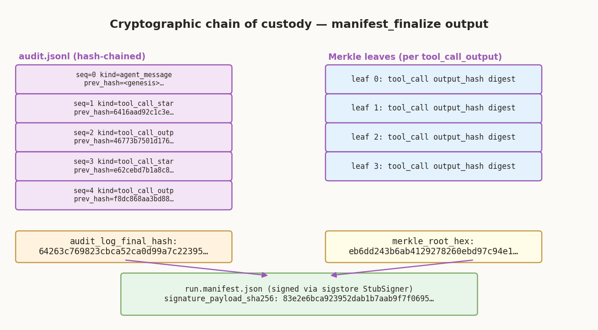

[VERDICT · DFIR Case File]{.kicker}

# VERDICT — Forensic Investigation Report

[DFIR at machine speed · sigstore-signed chain of custody]{.tagline}

**Case ID:** `b639fdda-146c-48ec-9080-1e144ec7ceae`
**Run ID:** `auto-1781289206`
**Started:** 2026-06-12T18:33:26Z
**Finalized:** 2026-06-12T18:33:33Z
**Evidence:** `evidence/SCHARDT.dd`
**Verdict:** **SUSPICIOUS**

> **Cryptographic attestation:**
> Merkle root `eb6dd243b6ab4129278260ebd97c94e1f5fc24837572e8359980fed5fdce3386`
> Audit log final hash `64263c769823cbca52ca0d99a7c223951aff59e348feb6f675d08da26c731d98`
> Ed25519 signature SHA-256 `83e2e6bca923952dab1b7aab9f7f06959e11e843d47924fd2bd44ea7495ea8d4`
> Cert fingerprint `b98df1a9d09da3741e295d7da21b9b675287adfb36b10ca17c280e2a1fee0f54`

---


## Bottom Line Up Front

::: {.report-fig data-fig="scorecard"}
:::

**Verdict: SUSPICIOUS.** Confirmed: cain.exe executed.

The supplied evidence shows cain.exe executed at 2004-08-27T15:33:03Z.

**Scope:** findings span 13 hosts — ETHEREAL.EXE-1C148EEF.pf \(confirmed\); CAIN.EXE-23D61279.pf \(confirmed\); ETHEREAL-SETUP-0.10.6.EXE-1D932600.pf \(confirmed\); NETSTUMBLER.EXE-0BFEE568.pf \(confirmed\); LOOKATLAN.EXE-1F991DD9.pf \(confirmed\); MIRC.EXE-0661EC22.pf \(confirmed\); MIRC612.EXE-02791C37.pf \(confirmed\); CAIN25B45.EXE-056F3A6E.pf \(confirmed\); software \(inferred\); NTUSER.DAT \(hypothesis\); NETSTUMBLERINSTALLER_0_4_0.EX-0BD9920C.pf \(hypothesis\); SAM \(hypothesis\); $MFT \(hypothesis\). Each is assessed separately below; the evidence does not establish them as one incident.

**Assessment:** The cited tool output meets a defined detection rule for this technique. Treat single-source signals as leads until corroborated across artifact classes.

**Certainty:** High — the cited tool output is reproducible \(the verifier re-ran it and the SHA-256 matched\). The confidence is in the artifact, not in intent or actor.

**Key findings:**

* A Run-key persistence entry \(INFERRED, T1547.001, cited by tc-098\).
* A Run-key persistence entry \(INFERRED, T1547.001, cited by tc-098\).
* Suspicious activity \(CONFIRMED, T1588.002, cited by tc-010\).
* Suspicious activity \(CONFIRMED, T1588.002, cited by tc-011\).
* Suspicious activity \(CONFIRMED, T1040, cited by tc-020\).
* Suspicious activity \(CONFIRMED, T1040, cited by tc-021\).
* Suspicious activity \(CONFIRMED, T1046, cited by tc-038\).
* Suspicious activity \(CONFIRMED, T1071.001, cited by tc-040\).
* Suspicious activity \(CONFIRMED, T1071.001, cited by tc-041\).
* Suspicious activity \(CONFIRMED, T1046, cited by tc-047\).

* Findings: 19 total — 8 confirmed, 2 inferred, 9 hypothesis.
* Most important next step: Collect Security, Sysmon, and PowerShell Operational EVTX and rerun EVTX/Hayabusa analysis.


## Host Analysis

Findings span more than one host; each is assessed on its own evidence below. The evidence does not establish them as a single incident.

### ETHEREAL.EXE-1C148EEF.pf

*1 finding(s) — 1 confirmed, 0 inferred, 0 hypothesis · 1 events · 2004-08-27T15:34:54Z · source: ETHEREAL.EXE-1C148EEF.pf*

**Other: T1040** `[CONFIRMED]` `tc-021`

The cited tool output meets a defined detection rule for this technique. Treat single-source signals as leads until corroborated across artifact classes.

| Time (UTC) | Event | Account | Tool Call |
|---|---|---|---|
| 2004-08-27T15:34:54Z | prefetch run: ETHEREAL.EXE | — | `tc-021` |
| 2004-08-27T15:46:13Z | UserAssist records execution of cain.exe | — | `tc-112` |
| 2004-08-27T15:46:13Z | UserAssist records execution of cain25b45.exe | — | `tc-112` |
| 2004-08-27T15:46:13Z | UserAssist records execution of ethereal-setup-0.10.6.exe | — | `tc-112` |
| 2004-08-27T15:46:13Z | UserAssist records execution of ethereal.exe | — | `tc-112` |
| 2004-08-27T15:46:13Z | UserAssist records execution of lookatlan.exe | — | `tc-112` |
| 2004-08-27T15:46:13Z | UserAssist records execution of mirc.exe | — | `tc-112` |
| 2004-08-27T15:46:13Z | UserAssist records execution of mirc612.exe | — | `tc-112` |

### CAIN.EXE-23D61279.pf

*1 finding(s) — 1 confirmed, 0 inferred, 0 hypothesis · 9 events · 2004-08-27T15:33:03Z → 2004-08-27T15:46:13Z · source: CAIN.EXE-23D61279.pf*

**Other: T1588.002** `[CONFIRMED]` `tc-010`

The cited tool output meets a defined detection rule for this technique. Treat single-source signals as leads until corroborated across artifact classes.

| Time (UTC) | Event | Account | Tool Call |
|---|---|---|---|
| 2004-08-27T15:33:03Z | prefetch run: CAIN.EXE | — | `tc-010` |
| 2004-08-27T15:46:13Z | UserAssist records execution of cain.exe | — | `tc-112` |
| 2004-08-27T15:46:13Z | UserAssist records execution of cain25b45.exe | — | `tc-112` |
| 2004-08-27T15:46:13Z | UserAssist records execution of ethereal-setup-0.10.6.exe | — | `tc-112` |
| 2004-08-27T15:46:13Z | UserAssist records execution of ethereal.exe | — | `tc-112` |
| 2004-08-27T15:46:13Z | UserAssist records execution of lookatlan.exe | — | `tc-112` |
| 2004-08-27T15:46:13Z | UserAssist records execution of mirc.exe | — | `tc-112` |
| 2004-08-27T15:46:13Z | UserAssist records execution of mirc612.exe | — | `tc-112` |

### ETHEREAL-SETUP-0.10.6.EXE-1D932600.pf

*1 finding(s) — 1 confirmed, 0 inferred, 0 hypothesis · 1 events · 2004-08-27T15:28:36Z · source: ETHEREAL-SETUP-0.10.6.EXE-1D932600.pf*

**Other: T1040** `[CONFIRMED]` `tc-020`

The cited tool output meets a defined detection rule for this technique. Treat single-source signals as leads until corroborated across artifact classes.

| Time (UTC) | Event | Account | Tool Call |
|---|---|---|---|
| 2004-08-27T15:28:36Z | prefetch run: ETHEREAL-SETUP-0.10.6.EXE | — | `tc-020` |
| 2004-08-27T15:46:13Z | UserAssist records execution of cain.exe | — | `tc-112` |
| 2004-08-27T15:46:13Z | UserAssist records execution of cain25b45.exe | — | `tc-112` |
| 2004-08-27T15:46:13Z | UserAssist records execution of ethereal-setup-0.10.6.exe | — | `tc-112` |
| 2004-08-27T15:46:13Z | UserAssist records execution of ethereal.exe | — | `tc-112` |
| 2004-08-27T15:46:13Z | UserAssist records execution of lookatlan.exe | — | `tc-112` |
| 2004-08-27T15:46:13Z | UserAssist records execution of mirc.exe | — | `tc-112` |
| 2004-08-27T15:46:13Z | UserAssist records execution of mirc612.exe | — | `tc-112` |

### NETSTUMBLER.EXE-0BFEE568.pf

*1 finding(s) — 1 confirmed, 0 inferred, 0 hypothesis · 1 events · 2004-08-27T15:12:35Z · source: NETSTUMBLER.EXE-0BFEE568.pf*

**Other: T1046** `[CONFIRMED]` `tc-047`

The cited tool output meets a defined detection rule for this technique. Treat single-source signals as leads until corroborated across artifact classes.

| Time (UTC) | Event | Account | Tool Call |
|---|---|---|---|
| 2004-08-27T15:12:35Z | prefetch run: NETSTUMBLER.EXE | — | `tc-047` |
| 2004-08-27T15:46:13Z | UserAssist records execution of cain.exe | — | `tc-112` |
| 2004-08-27T15:46:13Z | UserAssist records execution of cain25b45.exe | — | `tc-112` |
| 2004-08-27T15:46:13Z | UserAssist records execution of ethereal-setup-0.10.6.exe | — | `tc-112` |
| 2004-08-27T15:46:13Z | UserAssist records execution of ethereal.exe | — | `tc-112` |
| 2004-08-27T15:46:13Z | UserAssist records execution of lookatlan.exe | — | `tc-112` |
| 2004-08-27T15:46:13Z | UserAssist records execution of mirc.exe | — | `tc-112` |
| 2004-08-27T15:46:13Z | UserAssist records execution of mirc612.exe | — | `tc-112` |

### LOOKATLAN.EXE-1F991DD9.pf

*1 finding(s) — 1 confirmed, 0 inferred, 0 hypothesis · 1 events · 2004-08-26T15:06:14Z · source: LOOKATLAN.EXE-1F991DD9.pf*

**Other: T1046** `[CONFIRMED]` `tc-038`

The cited tool output meets a defined detection rule for this technique. Treat single-source signals as leads until corroborated across artifact classes.

| Time (UTC) | Event | Account | Tool Call |
|---|---|---|---|
| 2004-08-26T15:06:14Z | prefetch run: LOOKATLAN.EXE | — | `tc-038` |
| 2004-08-27T15:46:13Z | UserAssist records execution of cain.exe | — | `tc-112` |
| 2004-08-27T15:46:13Z | UserAssist records execution of cain25b45.exe | — | `tc-112` |
| 2004-08-27T15:46:13Z | UserAssist records execution of ethereal-setup-0.10.6.exe | — | `tc-112` |
| 2004-08-27T15:46:13Z | UserAssist records execution of ethereal.exe | — | `tc-112` |
| 2004-08-27T15:46:13Z | UserAssist records execution of lookatlan.exe | — | `tc-112` |
| 2004-08-27T15:46:13Z | UserAssist records execution of mirc.exe | — | `tc-112` |
| 2004-08-27T15:46:13Z | UserAssist records execution of mirc612.exe | — | `tc-112` |

### MIRC.EXE-0661EC22.pf

*1 finding(s) — 1 confirmed, 0 inferred, 0 hypothesis · 1 events · 2004-08-25T16:20:34Z · source: MIRC.EXE-0661EC22.pf*

**Command &amp; Control: T1071.001** `[CONFIRMED]` `tc-040`

The cited tool output meets a defined detection rule for this technique. Treat single-source signals as leads until corroborated across artifact classes.

| Time (UTC) | Event | Account | Tool Call |
|---|---|---|---|
| 2004-08-25T16:20:34Z | prefetch run: MIRC.EXE | — | `tc-040` |
| 2004-08-27T15:46:13Z | UserAssist records execution of cain.exe | — | `tc-112` |
| 2004-08-27T15:46:13Z | UserAssist records execution of cain25b45.exe | — | `tc-112` |
| 2004-08-27T15:46:13Z | UserAssist records execution of ethereal-setup-0.10.6.exe | — | `tc-112` |
| 2004-08-27T15:46:13Z | UserAssist records execution of ethereal.exe | — | `tc-112` |
| 2004-08-27T15:46:13Z | UserAssist records execution of lookatlan.exe | — | `tc-112` |
| 2004-08-27T15:46:13Z | UserAssist records execution of mirc.exe | — | `tc-112` |
| 2004-08-27T15:46:13Z | UserAssist records execution of mirc612.exe | — | `tc-112` |

### MIRC612.EXE-02791C37.pf

*1 finding(s) — 1 confirmed, 0 inferred, 0 hypothesis · 1 events · 2004-08-20T15:09:46Z · source: MIRC612.EXE-02791C37.pf*

**Command &amp; Control: T1071.001** `[CONFIRMED]` `tc-041`

The cited tool output meets a defined detection rule for this technique. Treat single-source signals as leads until corroborated across artifact classes.

| Time (UTC) | Event | Account | Tool Call |
|---|---|---|---|
| 2004-08-20T15:09:46Z | prefetch run: MIRC612.EXE | — | `tc-041` |
| 2004-08-27T15:46:13Z | UserAssist records execution of cain.exe | — | `tc-112` |
| 2004-08-27T15:46:13Z | UserAssist records execution of cain25b45.exe | — | `tc-112` |
| 2004-08-27T15:46:13Z | UserAssist records execution of ethereal-setup-0.10.6.exe | — | `tc-112` |
| 2004-08-27T15:46:13Z | UserAssist records execution of ethereal.exe | — | `tc-112` |
| 2004-08-27T15:46:13Z | UserAssist records execution of lookatlan.exe | — | `tc-112` |
| 2004-08-27T15:46:13Z | UserAssist records execution of mirc.exe | — | `tc-112` |
| 2004-08-27T15:46:13Z | UserAssist records execution of mirc612.exe | — | `tc-112` |

### CAIN25B45.EXE-056F3A6E.pf

*1 finding(s) — 1 confirmed, 0 inferred, 0 hypothesis · 1 events · 2004-08-20T15:05:52Z · source: CAIN25B45.EXE-056F3A6E.pf*

**Other: T1588.002** `[CONFIRMED]` `tc-011`

The cited tool output meets a defined detection rule for this technique. Treat single-source signals as leads until corroborated across artifact classes.

| Time (UTC) | Event | Account | Tool Call |
|---|---|---|---|
| 2004-08-20T15:05:52Z | prefetch run: CAIN25B45.EXE | — | `tc-011` |
| 2004-08-27T15:46:13Z | UserAssist records execution of cain.exe | — | `tc-112` |
| 2004-08-27T15:46:13Z | UserAssist records execution of cain25b45.exe | — | `tc-112` |
| 2004-08-27T15:46:13Z | UserAssist records execution of ethereal-setup-0.10.6.exe | — | `tc-112` |
| 2004-08-27T15:46:13Z | UserAssist records execution of ethereal.exe | — | `tc-112` |
| 2004-08-27T15:46:13Z | UserAssist records execution of lookatlan.exe | — | `tc-112` |
| 2004-08-27T15:46:13Z | UserAssist records execution of mirc.exe | — | `tc-112` |
| 2004-08-27T15:46:13Z | UserAssist records execution of mirc612.exe | — | `tc-112` |

### software

*2 finding(s) — 0 confirmed, 2 inferred, 0 hypothesis · 1 events · 2004-08-19T22:37:33Z · source: software*

**Persistence: Boot or Logon Autostart Execution: Registry Run Keys** `[INFERRED]` `tc-098`

Run keys launch a program at logon — a simple, durable persistence spot. Most Run-key entries are legitimate software; the target path is the lead.

**Persistence: Boot or Logon Autostart Execution: Registry Run Keys** `[INFERRED]` `tc-098`

Run keys launch a program at logon — a simple, durable persistence spot. Most Run-key entries are legitimate software; the target path is the lead.

| Time (UTC) | Event | Account | Tool Call |
|---|---|---|---|
| 2004-08-19T22:37:33Z | registry key: Microsoft\\Windows\\CurrentVersion\\Run | — | `tc-098` |

### NTUSER.DAT

*6 finding(s) — 0 confirmed, 0 inferred, 6 hypothesis · 43 events · 2004-08-20T15:07:26Z → 2004-08-27T15:32:08Z · source: NTUSER.DAT*

**Other: T1074.001** `[HYPOTHESIS]` `tc-078`

The cited tool output meets a defined detection rule for this technique. Treat single-source signals as leads until corroborated across artifact classes.

**Other: T1074.001** `[HYPOTHESIS]` `tc-079`

The cited tool output meets a defined detection rule for this technique. Treat single-source signals as leads until corroborated across artifact classes.

**Other: T1217** `[HYPOTHESIS]` `tc-076`

The cited tool output meets a defined detection rule for this technique. Treat single-source signals as leads until corroborated across artifact classes.

**Other: T1217** `[HYPOTHESIS]` `tc-076`

The cited tool output meets a defined detection rule for this technique. Treat single-source signals as leads until corroborated across artifact classes.

**Other: T1217** `[HYPOTHESIS]` `tc-076`

The cited tool output meets a defined detection rule for this technique. Treat single-source signals as leads until corroborated across artifact classes.

**Other: T1217** `[HYPOTHESIS]` `tc-076`

The cited tool output meets a defined detection rule for this technique. Treat single-source signals as leads until corroborated across artifact classes.

| Time (UTC) | Event | Account | Tool Call |
|---|---|---|---|
| 2004-08-20T15:07:26Z | registry key: Software\\Microsoft\\Windows\\ShellNoRoam\\BagMRU\\0\\1\\0 | — | `tc-079` |
| 2004-08-20T15:07:26Z | registry key: Software\\Microsoft\\Windows\\ShellNoRoam\\BagMRU\\0\\1\\0\\0 | — | `tc-079` |
| 2004-08-20T15:07:26Z | registry key: Software\\Microsoft\\Windows\\ShellNoRoam\\BagMRU\\0\\1\\0\\0\\0 | — | `tc-079` |
| 2004-08-20T15:07:26Z | registry key: Software\\Microsoft\\Windows\\ShellNoRoam\\BagMRU\\0\\1\\0\\0\\0\\0\\0 | — | `tc-079` |
| 2004-08-20T15:09:56Z | registry key: Software\\Microsoft\\Windows\\ShellNoRoam\\BagMRU\\0\\1\\0\\0\\0\\0\\1 | — | `tc-079` |
| 2004-08-20T15:10:06Z | registry key: Software\\Microsoft\\Windows\\ShellNoRoam\\BagMRU\\0\\1\\0\\0\\0\\0 | — | `tc-079` |
| 2004-08-20T15:11:11Z | registry key: Software\\Microsoft\\Windows\\ShellNoRoam\\BagMRU\\0\\1\\1\\0 | — | `tc-079` |
| 2004-08-20T15:19:00Z | registry key: Software\\Microsoft\\Windows\\ShellNoRoam\\BagMRU\\0\\0 | — | `tc-079` |

### NETSTUMBLERINSTALLER_0_4_0.EX-0BD9920C.pf

*1 finding(s) — 0 confirmed, 0 inferred, 1 hypothesis · 1 events · 2004-08-27T15:12:11Z · source: NETSTUMBLERINSTALLER_0_4_0.EX-0BD9920C.pf*

**Other: T1046** `[HYPOTHESIS]` `tc-048`

The cited tool output meets a defined detection rule for this technique. Treat single-source signals as leads until corroborated across artifact classes.

| Time (UTC) | Event | Account | Tool Call |
|---|---|---|---|
| 2004-08-27T15:12:11Z | prefetch run: NETSTUMBLERINSTALLER_0_4_0.EX | — | `tc-048` |

### SAM

*1 finding(s) — 0 confirmed, 0 inferred, 1 hypothesis · 6 events · 2004-08-19T16:59:24Z → 2004-08-19T23:03:54Z · source: SAM*

**Persistence: T1136.001** `[HYPOTHESIS]` `tc-103`

The cited tool output meets a defined detection rule for this technique. Treat single-source signals as leads until corroborated across artifact classes.

| Time (UTC) | Event | Account | Tool Call |
|---|---|---|---|
| 2004-08-19T16:59:24Z | registry key: SAM\\Domains\\Account\\Users\\Names\\Administrator | — | `tc-103` |
| 2004-08-19T16:59:24Z | registry key: SAM\\Domains\\Account\\Users\\Names\\Guest | — | `tc-103` |
| 2004-08-19T22:28:24Z | registry key: SAM\\Domains\\Account\\Users\\Names\\HelpAssistant | — | `tc-103` |
| 2004-08-19T22:35:19Z | registry key: SAM\\Domains\\Account\\Users\\Names\\SUPPORT_388945a0 | — | `tc-103` |
| 2004-08-19T23:03:54Z | registry key: SAM\\Domains\\Account\\Users\\Names | — | `tc-103` |
| 2004-08-19T23:03:54Z | registry key: SAM\\Domains\\Account\\Users\\Names\\Mr. Evil | — | `tc-103` |

### $MFT

*1 finding(s) — 0 confirmed, 0 inferred, 1 hypothesis · 497 events · 1601-01-01T00:00:00Z → 2004-08-27T15:08:33Z · source: $MFT*

**Other: T1588.002** `[HYPOTHESIS]` `tc-004`

The cited tool output meets a defined detection rule for this technique. Treat single-source signals as leads until corroborated across artifact classes.

| Time (UTC) | Event | Account | Tool Call |
|---|---|---|---|
| 1601-01-01T00:00:00Z | mft entry: $Secure | — | `tc-004` |
| 1999-04-23T22:22:00Z | mft entry: WIN98/BASE4.CAB | — | `tc-004` |
| 1999-04-23T22:22:00Z | mft entry: WIN98/BASE5.CAB | — | `tc-004` |
| 1999-04-23T22:22:00Z | mft entry: WIN98/BASE6.CAB | — | `tc-004` |
| 1999-04-23T22:22:00Z | mft entry: WIN98/CATALOG3.CAB | — | `tc-004` |
| 1999-04-23T22:22:00Z | mft entry: WIN98/CHL99.CAB | — | `tc-004` |
| 1999-04-23T22:22:00Z | mft entry: WIN98/DELTEMP.COM | — | `tc-004` |
| 1999-04-23T22:22:00Z | mft entry: WIN98/DOSSETUP.BIN | — | `tc-004` |


## Recommendations

* Collect Security, Sysmon, and PowerShell Operational EVTX and rerun EVTX/Hayabusa analysis.
* Use the disk artifact summary to pivot between Prefetch, Registry, MFT, USN, EVTX, and YARA-target rows without upgrading single-source execution claims.
* Acquire DNS, proxy, firewall, NetFlow, or PCAP telemetry to test C2 and exfiltration hypotheses.


## Limitations

What the supplied evidence cannot establish, and how to resolve it.

* Who operated the activity — this report does not assert attribution; naming an account reflects a record field, not the human behind it.
* Whether the wider environment is affected — this run examined the supplied evidence only.
* Undetermined: command-and-control and exfiltration cannot be assessed without network data. To resolve: collect DNS, proxy, firewall, or NetFlow logs, or a PCAP.
* Undetermined: injected code and hidden processes cannot be examined without a memory image. To resolve: capture RAM and run the volatility process and injection plugins.
* Undetermined: logon, process-creation, and PowerShell activity cannot be reviewed without event logs. To resolve: collect the Security, Sysmon/Operational, and PowerShell/Operational logs.
* INFERRED finding f-A-reg-persist-srfirstrun cites 1 confirmed fact\(s\) in derived_from; the SOUL.md ≥2-fact rule wants two independent sources before an inference is fully corroborated. Treat as a single-source lead pending a second artifact class.
* INFERRED finding f-A-reg-persist-schedulingagent cites 1 confirmed fact\(s\) in derived_from; the SOUL.md ≥2-fact rule wants two independent sources before an inference is fully corroborated. Treat as a single-source lead pending a second artifact class.


# Technical Report {.tier-break}

The sections below are the full analyst-grade record: every finding with its
`tool_call_id` and confidence, the complete event timeline, the entity rollup
and indicators, coverage matrices, triage, sources, and the reproducibility and
chain-of-custody appendices.

## Case Summary

* **Total merged findings:** 19
* **By confidence:**
  - CONFIRMED: 8
  - INFERRED:  2
  - HYPOTHESIS: 9
* **Contradictions surfaced (Pool A vs Pool B):** 8
* **SOUL.md correlator:** 19 kept, 0 downgraded

## Detailed Findings

### Finding 1 — confidence: HYPOTHESIS, pool: A, MITRE: T1588.002, replay: exact_match (match)

hypothesis: Hacking-tool artifacts present on disk as downloaded applications, recovered from the MFT: Program Files/Anonymizer \(created 2004-08-20T15:05:06Z\). The filesystem records \(MFT\) show these tool files in Program Files / on the user's Desktop with creation timestamps clustered around the incident window; they are downloaded applications, not operating-system components. INFERRED from two tool-backed facts per file: the artifact's existence \(MFT\) and its name matching a known-tool heuristic \(anonymizer\). Corroborates the Prefetch execution findings for the same toolset; file presence itself is not an execution claim.

- `tool_call_id`: `tc-004`
- artifact: `/home/assessor/.findevil/cases/b639fdda-146c-48ec-9080-1e144ec7ceae/extracted/disk/disk-extract-8916c754-f6e4-46c8-8e2a-884d47b08bad/mft/$MFT`
- confidence: Hypothesis — a single-source triage lead; corroborate before any response action.

### Finding 2 — confidence: HYPOTHESIS, pool: A, MITRE: T1217, replay: exact_match (match)

hypothesis: User recently opened-file MRU records 'C:\\Documents and Settings\\Mr. Evil\\Desktop\\lalsetup250.exe' \(Software\\Microsoft\\Windows\\CurrentVersion\\Explorer\\ComDlg32\\OpenSaveMRU\\*, registry_query, last_write 2004-08-27T15:18:05Z\). INFERRED user activity: the MRU entry's existence is tool-backed and reflects deliberate user action. It records intent/recency, not execution of any binary.

- `tool_call_id`: `tc-076`
- artifact: `/home/assessor/.findevil/cases/b639fdda-146c-48ec-9080-1e144ec7ceae/extracted/disk/disk-extract-8916c754-f6e4-46c8-8e2a-884d47b08bad/registry/Documents and Settings/Mr. Evil/NTUSER.DAT`
- confidence: Hypothesis — a single-source triage lead; corroborate before any response action.

### Finding 3 — confidence: HYPOTHESIS, pool: A, MITRE: T1217, replay: exact_match (match)

hypothesis: User recently opened-file MRU records 'C:\\Documents and Settings\\Mr. Evil\\Desktop\\netstumblerinstaller_0_4_0.exe' \(Software\\Microsoft\\Windows\\CurrentVersion\\Explorer\\ComDlg32\\OpenSaveMRU\\*, registry_query, last_write 2004-08-27T15:18:05Z\). INFERRED user activity: the MRU entry's existence is tool-backed and reflects deliberate user action. It records intent/recency, not execution of any binary.

- `tool_call_id`: `tc-076`
- artifact: `/home/assessor/.findevil/cases/b639fdda-146c-48ec-9080-1e144ec7ceae/extracted/disk/disk-extract-8916c754-f6e4-46c8-8e2a-884d47b08bad/registry/Documents and Settings/Mr. Evil/NTUSER.DAT`
- confidence: Hypothesis — a single-source triage lead; corroborate before any response action.

### Finding 4 — confidence: HYPOTHESIS, pool: A, MITRE: T1217, replay: exact_match (match)

hypothesis: User recently opened-file MRU records 'C:\\Documents and Settings\\Mr. Evil\\Desktop\\ethereal-setup-0.10.6.exe' \(Software\\Microsoft\\Windows\\CurrentVersion\\Explorer\\ComDlg32\\OpenSaveMRU\\*, registry_query, last_write 2004-08-27T15:18:05Z\). INFERRED user activity: the MRU entry's existence is tool-backed and reflects deliberate user action. It records intent/recency, not execution of any binary.

- `tool_call_id`: `tc-076`
- artifact: `/home/assessor/.findevil/cases/b639fdda-146c-48ec-9080-1e144ec7ceae/extracted/disk/disk-extract-8916c754-f6e4-46c8-8e2a-884d47b08bad/registry/Documents and Settings/Mr. Evil/NTUSER.DAT`
- confidence: Hypothesis — a single-source triage lead; corroborate before any response action.

### Finding 5 — confidence: HYPOTHESIS, pool: A, MITRE: T1217, replay: exact_match (match)

hypothesis: User recently opened-file MRU records 'C:\\Documents and Settings\\Mr. Evil\\Desktop\\WinPcap_3_01_a.exe' \(Software\\Microsoft\\Windows\\CurrentVersion\\Explorer\\ComDlg32\\OpenSaveMRU\\*, registry_query, last_write 2004-08-27T15:18:05Z\). INFERRED user activity: the MRU entry's existence is tool-backed and reflects deliberate user action. It records intent/recency, not execution of any binary.

- `tool_call_id`: `tc-076`
- artifact: `/home/assessor/.findevil/cases/b639fdda-146c-48ec-9080-1e144ec7ceae/extracted/disk/disk-extract-8916c754-f6e4-46c8-8e2a-884d47b08bad/registry/Documents and Settings/Mr. Evil/NTUSER.DAT`
- confidence: Hypothesis — a single-source triage lead; corroborate before any response action.

### Finding 6 — confidence: INFERRED, pool: A, MITRE: T1547.001, replay: exact_match (match)

Registry Run-key persistence mechanism present: Microsoft\\Windows\\CurrentVersion\\Run\\SRFirstRun -&gt; rundll32 srclient.dll \(registry_query, last_write 2004-08-19T22:37:33Z\). The mechanism's existence is tool-backed; execution of the target is NOT claimed \(an execution claim needs &gt;=2 artifact classes\).

- `tool_call_id`: `tc-098`
- artifact: `/home/assessor/.findevil/cases/b639fdda-146c-48ec-9080-1e144ec7ceae/extracted/disk/disk-extract-8916c754-f6e4-46c8-8e2a-884d47b08bad/registry/WINDOWS/repair/software`
- confidence: Inferred — derived from corroborated facts; confirm before acting.

### Finding 7 — confidence: INFERRED, pool: A, MITRE: T1547.001, replay: exact_match (match)

Registry Run-key persistence mechanism present: Microsoft\\Windows\\CurrentVersion\\Run\\SchedulingAgent -&gt; mstinit.exe \(registry_query, last_write 2004-08-19T22:37:33Z\). The mechanism's existence is tool-backed; execution of the target is NOT claimed \(an execution claim needs &gt;=2 artifact classes\).

- `tool_call_id`: `tc-098`
- artifact: `/home/assessor/.findevil/cases/b639fdda-146c-48ec-9080-1e144ec7ceae/extracted/disk/disk-extract-8916c754-f6e4-46c8-8e2a-884d47b08bad/registry/WINDOWS/repair/software`
- confidence: Inferred — derived from corroborated facts; confirm before acting.

### Finding 8 — confidence: HYPOTHESIS, pool: A, MITRE: T1136.001, replay: exact_match (match)

hypothesis: User account 'Mr. Evil' with suspicious naming was created on this system: it is recorded in the SAM \(Security Account Manager\) hive \(SAM\\Domains\\Account\\Users\\Names\\Mr. Evil; the Names subkey last_write 2004-08-19T23:03:54Z approximates the account-creation time\). INFERRED from two tool-backed facts: the account's existence \(registry_query\) and its name matching the suspicious-naming heuristic. Whether it holds elevated privileges is NOT yet claimed — enumerate group membership \(Administrators\) and logon artifacts to corroborate.

- `tool_call_id`: `tc-103`
- artifact: `/home/assessor/.findevil/cases/b639fdda-146c-48ec-9080-1e144ec7ceae/extracted/disk/disk-extract-8916c754-f6e4-46c8-8e2a-884d47b08bad/registry/WINDOWS/system32/config/SAM`
- confidence: Hypothesis — a single-source triage lead; corroborate before any response action.

### Finding 9 — confidence: CONFIRMED, pool: B, MITRE: T1588.002, replay: exact_match (match)

cain.exe executed on this host: Windows Prefetch records its execution and the UserAssist key \(per-user GUI execution\) records the same binary. Two independent artifact classes \(prefetch + registry/UserAssist\) corroborate execution.

- `tool_call_id`: `tc-010`
- artifact: `/home/assessor/.findevil/cases/b639fdda-146c-48ec-9080-1e144ec7ceae/extracted/disk/disk-extract-8916c754-f6e4-46c8-8e2a-884d47b08bad/prefetch/WINDOWS/Prefetch/CAIN.EXE-23D61279.pf`
- confidence: Confirmed — the cited tool output is reproducible; this does not imply attribution or complete scope.

### Finding 10 — confidence: CONFIRMED, pool: B, MITRE: T1588.002, replay: exact_match (match)

cain25b45.exe executed on this host: Windows Prefetch records its execution and the UserAssist key \(per-user GUI execution\) records the same binary. Two independent artifact classes \(prefetch + registry/UserAssist\) corroborate execution.

- `tool_call_id`: `tc-011`
- artifact: `/home/assessor/.findevil/cases/b639fdda-146c-48ec-9080-1e144ec7ceae/extracted/disk/disk-extract-8916c754-f6e4-46c8-8e2a-884d47b08bad/prefetch/WINDOWS/Prefetch/CAIN25B45.EXE-056F3A6E.pf`
- confidence: Confirmed — the cited tool output is reproducible; this does not imply attribution or complete scope.

### Finding 11 — confidence: CONFIRMED, pool: B, MITRE: T1040, replay: exact_match (match)

ethereal-setup-0.10.6.exe executed on this host: Windows Prefetch records its execution and the UserAssist key \(per-user GUI execution\) records the same binary. Two independent artifact classes \(prefetch + registry/UserAssist\) corroborate execution.

- `tool_call_id`: `tc-020`
- artifact: `/home/assessor/.findevil/cases/b639fdda-146c-48ec-9080-1e144ec7ceae/extracted/disk/disk-extract-8916c754-f6e4-46c8-8e2a-884d47b08bad/prefetch/WINDOWS/Prefetch/ETHEREAL-SETUP-0.10.6.EXE-1D932600.pf`
- confidence: Confirmed — the cited tool output is reproducible; this does not imply attribution or complete scope.

### Finding 12 — confidence: CONFIRMED, pool: B, MITRE: T1040, replay: exact_match (match)

ethereal.exe executed on this host: Windows Prefetch records its execution and the UserAssist key \(per-user GUI execution\) records the same binary. Two independent artifact classes \(prefetch + registry/UserAssist\) corroborate execution.

- `tool_call_id`: `tc-021`
- artifact: `/home/assessor/.findevil/cases/b639fdda-146c-48ec-9080-1e144ec7ceae/extracted/disk/disk-extract-8916c754-f6e4-46c8-8e2a-884d47b08bad/prefetch/WINDOWS/Prefetch/ETHEREAL.EXE-1C148EEF.pf`
- confidence: Confirmed — the cited tool output is reproducible; this does not imply attribution or complete scope.

### Finding 13 — confidence: CONFIRMED, pool: B, MITRE: T1046, replay: exact_match (match)

lookatlan.exe executed on this host: Windows Prefetch records its execution and the UserAssist key \(per-user GUI execution\) records the same binary. Two independent artifact classes \(prefetch + registry/UserAssist\) corroborate execution.

- `tool_call_id`: `tc-038`
- artifact: `/home/assessor/.findevil/cases/b639fdda-146c-48ec-9080-1e144ec7ceae/extracted/disk/disk-extract-8916c754-f6e4-46c8-8e2a-884d47b08bad/prefetch/WINDOWS/Prefetch/LOOKATLAN.EXE-1F991DD9.pf`
- confidence: Confirmed — the cited tool output is reproducible; this does not imply attribution or complete scope.

### Finding 14 — confidence: CONFIRMED, pool: B, MITRE: T1071.001, replay: exact_match (match)

mirc.exe executed on this host: Windows Prefetch records its execution and the UserAssist key \(per-user GUI execution\) records the same binary. Two independent artifact classes \(prefetch + registry/UserAssist\) corroborate execution.

- `tool_call_id`: `tc-040`
- artifact: `/home/assessor/.findevil/cases/b639fdda-146c-48ec-9080-1e144ec7ceae/extracted/disk/disk-extract-8916c754-f6e4-46c8-8e2a-884d47b08bad/prefetch/WINDOWS/Prefetch/MIRC.EXE-0661EC22.pf`
- confidence: Confirmed — the cited tool output is reproducible; this does not imply attribution or complete scope.

### Finding 15 — confidence: CONFIRMED, pool: B, MITRE: T1071.001, replay: exact_match (match)

mirc612.exe executed on this host: Windows Prefetch records its execution and the UserAssist key \(per-user GUI execution\) records the same binary. Two independent artifact classes \(prefetch + registry/UserAssist\) corroborate execution.

- `tool_call_id`: `tc-041`
- artifact: `/home/assessor/.findevil/cases/b639fdda-146c-48ec-9080-1e144ec7ceae/extracted/disk/disk-extract-8916c754-f6e4-46c8-8e2a-884d47b08bad/prefetch/WINDOWS/Prefetch/MIRC612.EXE-02791C37.pf`
- confidence: Confirmed — the cited tool output is reproducible; this does not imply attribution or complete scope.

### Finding 16 — confidence: CONFIRMED, pool: B, MITRE: T1046, replay: exact_match (match)

netstumbler.exe executed on this host: Windows Prefetch records its execution and the UserAssist key \(per-user GUI execution\) records the same binary. Two independent artifact classes \(prefetch + registry/UserAssist\) corroborate execution.

- `tool_call_id`: `tc-047`
- artifact: `/home/assessor/.findevil/cases/b639fdda-146c-48ec-9080-1e144ec7ceae/extracted/disk/disk-extract-8916c754-f6e4-46c8-8e2a-884d47b08bad/prefetch/WINDOWS/Prefetch/NETSTUMBLER.EXE-0BFEE568.pf`
- confidence: Confirmed — the cited tool output is reproducible; this does not imply attribution or complete scope.

### Finding 17 — confidence: HYPOTHESIS, pool: B, MITRE: T1046, replay: exact_match (match)

hypothesis: Windows Prefetch contains NETSTUMBLERINSTALLER_0_4_0.EX with run_count=1; NetStumbler wireless discovery tool is a NIST Hacking Case triage lead. Treat this as a disk-artifact lead that needs corroboration before any standalone activity claim.

- `tool_call_id`: `tc-048`
- artifact: `/home/assessor/.findevil/cases/b639fdda-146c-48ec-9080-1e144ec7ceae/extracted/disk/disk-extract-8916c754-f6e4-46c8-8e2a-884d47b08bad/prefetch/WINDOWS/Prefetch/NETSTUMBLERINSTALLER_0_4_0.EX-0BD9920C.pf`
- confidence: Hypothesis — a single-source triage lead; corroborate before any response action.

### Finding 18 — confidence: HYPOTHESIS, pool: B, MITRE: T1074.001, replay: exact_match (match)

hypothesis: NTUSER.DAT shellbag entries record user folder navigation to staging/tooling locations: \\\\4.12.220.254\\Temp \(registry_query, last_write 2004-08-26T15:06:50Z\). Shellbags persist that a user browsed these folders in Explorer — here including a network staging share and tool directories. Navigation shows interest/access, not that files were staged or exfiltrated; corroborate with file-system and timeline artifacts.

- `tool_call_id`: `tc-078`
- artifact: `/home/assessor/.findevil/cases/b639fdda-146c-48ec-9080-1e144ec7ceae/extracted/disk/disk-extract-8916c754-f6e4-46c8-8e2a-884d47b08bad/registry/Documents and Settings/Mr. Evil/NTUSER.DAT`
- confidence: Hypothesis — a single-source triage lead; corroborate before any response action.

### Finding 19 — confidence: HYPOTHESIS, pool: B, MITRE: T1074.001, replay: exact_match (match)

hypothesis: NTUSER.DAT shellbag entries record user folder navigation to staging/tooling locations: mIRC, Whois, channels, ftp, mirror.sg.depaul.edu, temp, ethereal, TEMPON~1.254, \\\\4.12.220.254\\Temp \(registry_query, last_write 2004-08-20T15:10:06Z\). Shellbags persist that a user browsed these folders in Explorer — here including a network staging share and tool directories. Navigation shows interest/access, not that files were staged or exfiltrated; corroborate with file-system and timeline artifacts.

- `tool_call_id`: `tc-079`
- artifact: `/home/assessor/.findevil/cases/b639fdda-146c-48ec-9080-1e144ec7ceae/extracted/disk/disk-extract-8916c754-f6e4-46c8-8e2a-884d47b08bad/registry/Documents and Settings/Mr. Evil/NTUSER.DAT`
- confidence: Hypothesis — a single-source triage lead; corroborate before any response action.


## Full Event Timeline

Normalized timeline events: 626. First 40 rows shown below (consecutive identical events collapsed with an [Nx] count); full data is in `timeline.json`.

| UTC Time | Artifact | Event | Account | Host | Source IP | Logon | Process/PID | Conf. | Tool Call |
|---|---|---|---|---|---|---|---|---|---|
| 1601-01-01T00:00:00Z | mft | mft entry: $Secure | — | — | — | — | — | HYPOTHESIS | `tc-004` |
| 1999-04-23T22:22:00Z | mft | mft entry: WIN98/BASE4.CAB | — | — | — | — | — | HYPOTHESIS | `tc-004` |
| 1999-04-23T22:22:00Z | mft | mft entry: WIN98/BASE5.CAB | — | — | — | — | — | HYPOTHESIS | `tc-004` |
| 1999-04-23T22:22:00Z | mft | mft entry: WIN98/BASE6.CAB | — | — | — | — | — | HYPOTHESIS | `tc-004` |
| 1999-04-23T22:22:00Z | mft | mft entry: WIN98/CATALOG3.CAB | — | — | — | — | — | HYPOTHESIS | `tc-004` |
| 1999-04-23T22:22:00Z | mft | mft entry: WIN98/CHL99.CAB | — | — | — | — | — | HYPOTHESIS | `tc-004` |
| 1999-04-23T22:22:00Z | mft | mft entry: WIN98/DELTEMP.COM | — | — | — | — | — | HYPOTHESIS | `tc-004` |
| 1999-04-23T22:22:00Z | mft | mft entry: WIN98/DOSSETUP.BIN | — | — | — | — | — | HYPOTHESIS | `tc-004` |
| 1999-04-23T22:22:00Z | mft | mft entry: WIN98/DRIVER11.CAB | — | — | — | — | — | HYPOTHESIS | `tc-004` |
| 1999-04-23T22:22:00Z | mft | mft entry: WIN98/DRIVER12.CAB | — | — | — | — | — | HYPOTHESIS | `tc-004` |
| 1999-04-23T22:22:00Z | mft | mft entry: WIN98/DRIVER13.CAB | — | — | — | — | — | HYPOTHESIS | `tc-004` |
| 1999-04-23T22:22:00Z | mft | mft entry: WIN98/DRIVER14.CAB | — | — | — | — | — | HYPOTHESIS | `tc-004` |
| 1999-04-23T22:22:00Z | mft | mft entry: WIN98/DRIVER15.CAB | — | — | — | — | — | HYPOTHESIS | `tc-004` |
| 1999-04-23T22:22:00Z | mft | mft entry: WIN98/DRIVER16.CAB | — | — | — | — | — | HYPOTHESIS | `tc-004` |
| 1999-04-23T22:22:00Z | mft | mft entry: WIN98/DRIVER17.CAB | — | — | — | — | — | HYPOTHESIS | `tc-004` |
| 1999-04-23T22:22:00Z | mft | mft entry: WIN98/DRIVER18.CAB | — | — | — | — | — | HYPOTHESIS | `tc-004` |
| 1999-04-23T22:22:00Z | mft | mft entry: WIN98/DRIVER19.CAB | — | — | — | — | — | HYPOTHESIS | `tc-004` |
| 1999-04-23T22:22:00Z | mft | mft entry: WIN98/DRIVER20.CAB | — | — | — | — | — | HYPOTHESIS | `tc-004` |
| 1999-04-23T22:22:00Z | mft | mft entry: WIN98/EXTRACT.EXE | — | — | — | — | — | HYPOTHESIS | `tc-004` |
| 1999-04-23T22:22:00Z | mft | mft entry: WIN98/FORMAT.COM | — | — | — | — | — | HYPOTHESIS | `tc-004` |
| 1999-04-23T22:22:00Z | mft | mft entry: WIN98/INTL.TXT | — | — | — | — | — | HYPOTHESIS | `tc-004` |
| 1999-04-23T22:22:00Z | mft | mft entry: WIN98/MINI.CAB | — | — | — | — | — | HYPOTHESIS | `tc-004` |
| 1999-04-23T22:22:00Z | mft | mft entry: WIN98/NET10.CAB | — | — | — | — | — | HYPOTHESIS | `tc-004` |
| 1999-04-23T22:22:00Z | mft | mft entry: WIN98/NET7.CAB | — | — | — | — | — | HYPOTHESIS | `tc-004` |
| 1999-04-23T22:22:00Z | mft | mft entry: WIN98/NET8.CAB | — | — | — | — | — | HYPOTHESIS | `tc-004` |
| 1999-04-23T22:22:00Z | mft | mft entry: WIN98/NET9.CAB | — | — | — | — | — | HYPOTHESIS | `tc-004` |
| 1999-04-23T22:22:00Z | mft | mft entry: WIN98/OEMSETUP.BIN | — | — | — | — | — | HYPOTHESIS | `tc-004` |
| 1999-04-23T22:22:00Z | mft | mft entry: WIN98/OEMSETUP.EXE | — | — | — | — | — | HYPOTHESIS | `tc-004` |
| 1999-04-23T22:22:00Z | mft | mft entry: WIN98/PRECOPY1.CAB | — | — | — | — | — | HYPOTHESIS | `tc-004` |
| 1999-04-23T22:22:00Z | mft | mft entry: WIN98/PRECOPY2.CAB | — | — | — | — | — | HYPOTHESIS | `tc-004` |
| 1999-04-23T22:22:00Z | mft | mft entry: WIN98/SAVE32.COM | — | — | — | — | — | HYPOTHESIS | `tc-004` |
| 1999-04-23T22:22:00Z | mft | mft entry: WIN98/SCANDISK.EXE | — | — | — | — | — | HYPOTHESIS | `tc-004` |
| 1999-04-23T22:22:00Z | mft | mft entry: WIN98/SCANDISK.PIF | — | — | — | — | — | HYPOTHESIS | `tc-004` |
| 1999-04-23T22:22:00Z | mft | mft entry: WIN98/SCANPROG.EXE | — | — | — | — | — | HYPOTHESIS | `tc-004` |
| 1999-04-23T22:22:00Z | mft | mft entry: WIN98/SCANREG.EXE | — | — | — | — | — | HYPOTHESIS | `tc-004` |
| 1999-04-23T22:22:00Z | mft | mft entry: WIN98/SETUP.EXE | — | — | — | — | — | HYPOTHESIS | `tc-004` |
| 1999-04-23T22:22:00Z | mft | mft entry: WIN98/SETUP.TXT | — | — | — | — | — | HYPOTHESIS | `tc-004` |
| 1999-04-23T22:22:00Z | mft | mft entry: WIN98/SETUP0.WAV | — | — | — | — | — | HYPOTHESIS | `tc-004` |
| 1999-04-23T22:22:00Z | mft | mft entry: WIN98/SETUP1.WAV | — | — | — | — | — | HYPOTHESIS | `tc-004` |
| 1999-04-23T22:22:00Z | mft | mft entry: WIN98/SETUP2.WAV | — | — | — | — | — | HYPOTHESIS | `tc-004` |


## Indicators of Compromise (IOCs)

Observed artifacts pulled from the timeline and findings; validate or corroborate before detection deployment or blocking.

| Type | Values |
|---|---|
| IP addresses | 4.12.220.254 |
| Domains | mirror.sg.depaul.edu |
| File paths | C:\\Documents and Settings\\Mr. Evil\\Desktop\\WinPcap_3_01_a.exe' \(Software\\Microsoft\\Windows\\CurrentVersion\\Explorer\\ComDlg32\\OpenSaveMRU\\, C:\\Documents and Settings\\Mr. Evil\\Desktop\\ethereal-setup-0.10.6.exe' \(Software\\Microsoft\\Windows\\CurrentVersion\\Explorer\\ComDlg32\\OpenSaveMRU\\, C:\\Documents and Settings\\Mr. Evil\\Desktop\\lalsetup250.exe' \(Software\\Microsoft\\Windows\\CurrentVersion\\Explorer\\ComDlg32\\OpenSaveMRU\\, C:\\Documents and Settings\\Mr. Evil\\Desktop\\netstumblerinstaller_0_4_0.exe' \(Software\\Microsoft\\Windows\\CurrentVersion\\Explorer\\ComDlg32\\OpenSaveMRU\\ |


## MITRE ATT&CK Coverage

6/12 ATT&CK targets covered by typed-tool output; 2 target(s) produced finding-level evidence; 5 target(s) remain blind spots

| Technique | Tactic | Status | Tools Observed | Gap / Analyst Value |
|---|---|---|---|---|
| T1014 Rootkit | Defense Evasion | blind spot | `none` | missing or untouched artifact classes: memory |
| T1055 Process Injection | Defense Evasion / Privilege Escalation | blind spot | `none` | missing or untouched artifact classes: memory |
| T1059.001 PowerShell | Execution | covered, no finding \(limited\) | `prefetch_parse` | limited coverage — not proof of absence |
| T1021.001 Remote Desktop Protocol | Lateral Movement | blind spot | `none` | missing or untouched artifact classes: evtx |
| T1078 Valid Accounts | Defense Evasion / Persistence / Privilege Escalation | covered, no finding \(limited\) | `registry_query` | limited coverage — not proof of absence |
| T1003 OS Credential Dumping | Credential Access | available, not examined | `none` | required evidence class was available but no target tool ran |
| T1105 Ingress Tool Transfer | Command and Control | covered, no finding \(limited\) | `mft_timeline` | limited coverage — not proof of absence |
| T1071.001 Web Protocols | Command and Control | finding \(CONFIRMED\) | `none` | finding-level evidence exists; preserve cited tool output |
| T1071.004 DNS | Command and Control | blind spot | `none` | missing or untouched artifact classes: network |
| T1041 Exfiltration Over C2 Channel | Exfiltration | blind spot | `none` | missing or untouched artifact classes: network |
| T1547.001 Registry Run Keys / Startup Folder | Persistence / Privilege Escalation | finding \(INFERRED\) | `mft_timeline, prefetch_parse, registry_query` | finding-level evidence exists; preserve cited tool output |
| T1053.005 Scheduled Task | Execution / Persistence / Privilege Escalation | covered, no finding \(limited\) | `registry_query` | limited coverage — not proof of absence |


## Evidence Coverage

1/5 artifact classes touched; 1/5 directly available from supplied evidence

| Artifact Class | Available | Touched | Tools | Confidence Impact |
|---|:---:|:---:|---|---|
| memory | no | no | `none` | not a memory image; no live-process evidence |
| evtx | no | no | `none` | no event log supplied in this single-evidence run |
| disk/filesystem | yes | yes | `disk_extract_artifacts, disk_mount, mft_timeline, prefetch_parse, registry_query` | disk image registered; deep filesystem parsing requires mounted artifacts |
| network | no | no | `none` | no PCAP, Zeek, firewall, DNS, or proxy logs supplied |
| velociraptor | no | no | `none` | no Velociraptor collection supplied |


## Analysis Coverage by Domain

This table shows which DFIR analysis domains the typed tools exercised on the supplied evidence. Coverage is scope, not assurance.

| Domain | Status | Artifacts Seen | Tools Run | Data Sources | Gaps |
|---|---|---|---|---|---|
| Host &amp; Endpoint Forensics | automated | disk/filesystem | `disk_extract_artifacts, mft_timeline, prefetch_parse, registry_query` | DS0009, DS0022, DS0024 | none |
| Endpoint Telemetry &amp; Live Response | not_covered | none | `none` | none | missing or untouched artifact classes: velociraptor |
| Malware Analysis &amp; Triage | partial | disk/filesystem | `none` | none | missing or untouched artifact classes: memory |
| Memory Forensics | not_covered | none | `none` | none | missing or untouched artifact classes: memory |
| Network Forensics | not_covered | none | `none` | none | missing or untouched artifact classes: network, no PCAP, Zeek, proxy, DNS, firewall, or NetFlow telemetry supplied |
| Windows Event &amp; Account Analysis | not_covered | none | `none` | none | missing or untouched artifact classes: evtx |

**Overclaim guardrails applied:** covered_no_finding is limited coverage, not a clean/cleared claim, Domain coverage describes triage/orchestration across the typed tools that ran, not certified-analyst judgment, visual exhibits do not create findings or upgrade confidence, execution claims still require at least two artifact classes


## Figures

Visual exhibits are generated from parsed tool outputs. They support cited findings but do not replace `tool_call_id`-backed evidence or upgrade confidence by themselves.

### hypothesis
* Card: `evidence-card-001`
* Linked findings: `f-A-mft-tools`
* Tool call: `tc-004`
* Source records: `mft_timeline:1, mft_timeline:2, mft_timeline:3`
* Confidence: `HYPOTHESIS`
* Citations: `CITE-MITRE-ATTACK-DATASOURCES`
* Why suspicious/relevant: This observable is relevant because finding 'f-A-mft-tools' is backed by parsed tool output 'tc-004' and should be interpreted with the cited artifact and source caveats.
* Snippet: `hypothesis: Hacking-tool artifacts present on disk as downloaded applications, recovered from the MFT: Program Files/Anonymizer \(created 2004-08-20T15:05:06Z\). The filesystem records \(MFT\) show these tool files in Program Files / on the use`
* Caveats: Visual exhibit supports the cited finding but does not replace parsed tool output., HYPOTHESIS confidence requires additional artifact corroboration.

### hypothesis
* Card: `evidence-card-002`
* Linked findings: `f-A-mru-lalsetup250-exe`
* Tool call: `tc-076`
* Source records: `registry_query:561, registry_query:607, registry_query:608`
* Confidence: `HYPOTHESIS`
* Citations: `CITE-MITRE-ATTACK-DATASOURCES`
* Why suspicious/relevant: This observable is relevant because finding 'f-A-mru-lalsetup250-exe' is backed by parsed tool output 'tc-076' and should be interpreted with the cited artifact and source caveats.
* Snippet: `hypothesis: User recently opened-file MRU records 'C:\\Documents and Settings\\Mr. Evil\\Desktop\\lalsetup250.exe' \(Software\\Microsoft\\Windows\\CurrentVersion\\Explorer\\ComDlg32\\OpenSaveMRU\\*, registry_query, last_write 2004-08-27T15:18:05Z\). INF`
* Caveats: Visual exhibit supports the cited finding but does not replace parsed tool output., HYPOTHESIS confidence requires additional artifact corroboration.

### hypothesis
* Card: `evidence-card-003`
* Linked findings: `f-A-mru-netstumblerinstaller-0-4-0-exe`
* Tool call: `tc-076`
* Source records: `registry_query:561, registry_query:607, registry_query:608`
* Confidence: `HYPOTHESIS`
* Citations: `CITE-MITRE-ATTACK-DATASOURCES`
* Why suspicious/relevant: This observable is relevant because finding 'f-A-mru-netstumblerinstaller-0-4-0-exe' is backed by parsed tool output 'tc-076' and should be interpreted with the cited artifact and source caveats.
* Snippet: `hypothesis: User recently opened-file MRU records 'C:\\Documents and Settings\\Mr. Evil\\Desktop\\netstumblerinstaller_0_4_0.exe' \(Software\\Microsoft\\Windows\\CurrentVersion\\Explorer\\ComDlg32\\OpenSaveMRU\\*, registry_query, last_write 2004-08-27T`
* Caveats: Visual exhibit supports the cited finding but does not replace parsed tool output., HYPOTHESIS confidence requires additional artifact corroboration.

### hypothesis
* Card: `evidence-card-004`
* Linked findings: `f-A-mru-ethereal-setup-0-10-6-exe`
* Tool call: `tc-076`
* Source records: `registry_query:561, registry_query:607, registry_query:608`
* Confidence: `HYPOTHESIS`
* Citations: `CITE-MITRE-ATTACK-DATASOURCES`
* Why suspicious/relevant: This observable is relevant because finding 'f-A-mru-ethereal-setup-0-10-6-exe' is backed by parsed tool output 'tc-076' and should be interpreted with the cited artifact and source caveats.
* Snippet: `hypothesis: User recently opened-file MRU records 'C:\\Documents and Settings\\Mr. Evil\\Desktop\\ethereal-setup-0.10.6.exe' \(Software\\Microsoft\\Windows\\CurrentVersion\\Explorer\\ComDlg32\\OpenSaveMRU\\*, registry_query, last_write 2004-08-27T15:18`
* Caveats: Visual exhibit supports the cited finding but does not replace parsed tool output., HYPOTHESIS confidence requires additional artifact corroboration.

### hypothesis
* Card: `evidence-card-005`
* Linked findings: `f-A-mru-winpcap-3-01-a-exe`
* Tool call: `tc-076`
* Source records: `registry_query:561, registry_query:607, registry_query:608`
* Confidence: `HYPOTHESIS`
* Citations: `CITE-MITRE-ATTACK-DATASOURCES`
* Why suspicious/relevant: This observable is relevant because finding 'f-A-mru-winpcap-3-01-a-exe' is backed by parsed tool output 'tc-076' and should be interpreted with the cited artifact and source caveats.
* Snippet: `hypothesis: User recently opened-file MRU records 'C:\\Documents and Settings\\Mr. Evil\\Desktop\\WinPcap_3_01_a.exe' \(Software\\Microsoft\\Windows\\CurrentVersion\\Explorer\\ComDlg32\\OpenSaveMRU\\*, registry_query, last_write 2004-08-27T15:18:05Z\). `
* Caveats: Visual exhibit supports the cited finding but does not replace parsed tool output., HYPOTHESIS confidence requires additional artifact corroboration.

### Registry Run-key persistence mechanism present
* Card: `evidence-card-006`
* Linked findings: `f-A-reg-persist-srfirstrun`
* Tool call: `tc-098`
* Source records: `registry_query:392`
* Confidence: `INFERRED`
* Citations: `CITE-MITRE-ATTACK-DATASOURCES`
* Why suspicious/relevant: This observable is relevant because finding 'f-A-reg-persist-srfirstrun' is backed by parsed tool output 'tc-098' and should be interpreted with the cited artifact and source caveats.
* Snippet: `Registry Run-key persistence mechanism present: Microsoft\\Windows\\CurrentVersion\\Run\\SRFirstRun -&gt; rundll32 srclient.dll \(registry_query, last_write 2004-08-19T22:37:33Z\). The mechanism's existence is tool-backed; execution of the target is`
* Caveats: Visual exhibit supports the cited finding but does not replace parsed tool output.

### Registry Run-key persistence mechanism present
* Card: `evidence-card-007`
* Linked findings: `f-A-reg-persist-schedulingagent`
* Tool call: `tc-098`
* Source records: `registry_query:392`
* Confidence: `INFERRED`
* Citations: `CITE-MITRE-ATTACK-DATASOURCES`
* Why suspicious/relevant: This observable is relevant because finding 'f-A-reg-persist-schedulingagent' is backed by parsed tool output 'tc-098' and should be interpreted with the cited artifact and source caveats.
* Snippet: `Registry Run-key persistence mechanism present: Microsoft\\Windows\\CurrentVersion\\Run\\SchedulingAgent -&gt; mstinit.exe \(registry_query, last_write 2004-08-19T22:37:33Z\). The mechanism's existence is tool-backed; execution of the target is NOT `
* Caveats: Visual exhibit supports the cited finding but does not replace parsed tool output.

### hypothesis
* Card: `evidence-card-008`
* Linked findings: `f-A-sam-mr-evil`
* Tool call: `tc-103`
* Source records: `registry_query:360, registry_query:361, registry_query:366`
* Confidence: `HYPOTHESIS`
* Citations: `CITE-MITRE-ATTACK-DATASOURCES`
* Why suspicious/relevant: This observable is relevant because finding 'f-A-sam-mr-evil' is backed by parsed tool output 'tc-103' and should be interpreted with the cited artifact and source caveats.
* Snippet: `hypothesis: User account 'Mr. Evil' with suspicious naming was created on this system: it is recorded in the SAM \(Security Account Manager\) hive \(SAM\\Domains\\Account\\Users\\Names\\Mr. Evil; the Names subkey last_write 2004-08-19T23:03:54Z app`
* Caveats: Visual exhibit supports the cited finding but does not replace parsed tool output., HYPOTHESIS confidence requires additional artifact corroboration.

### cain.exe executed on this host
* Card: `evidence-card-009`
* Linked findings: `f-B-prefetch-cain-exe`
* Tool call: `tc-010`
* Source records: `prefetch_parse:614`
* Confidence: `CONFIRMED`
* Citations: `CITE-MITRE-ATTACK-DATASOURCES`
* Why suspicious/relevant: This observable is relevant because finding 'f-B-prefetch-cain-exe' is backed by parsed tool output 'tc-010' and should be interpreted with the cited artifact and source caveats.
* Snippet: `cain.exe executed on this host: Windows Prefetch records its execution and the UserAssist key \(per-user GUI execution\) records the same binary. Two independent artifact classes \(prefetch + registry/UserAssist\) corroborate execution.`
* Caveats: Visual exhibit supports the cited finding but does not replace parsed tool output.

### cain25b45.exe executed on this host
* Card: `evidence-card-010`
* Linked findings: `f-B-prefetch-cain25b45-exe`
* Tool call: `tc-011`
* Source records: `prefetch_parse:520`
* Confidence: `CONFIRMED`
* Citations: `CITE-MITRE-ATTACK-DATASOURCES`
* Why suspicious/relevant: This observable is relevant because finding 'f-B-prefetch-cain25b45-exe' is backed by parsed tool output 'tc-011' and should be interpreted with the cited artifact and source caveats.
* Snippet: `cain25b45.exe executed on this host: Windows Prefetch records its execution and the UserAssist key \(per-user GUI execution\) records the same binary. Two independent artifact classes \(prefetch + registry/UserAssist\) corroborate execution.`
* Caveats: Visual exhibit supports the cited finding but does not replace parsed tool output.


## References

| Citation ID | Title | URL | Supports |
|---|---|---|---|
| `CITE-MITRE-ATTACK-DATASOURCES` | MITRE ATT&amp;CK Data Sources | https://attack.mitre.org/datasources/ | ATT&amp;CK data-source coverage mapping |
| `CITE-MITRE-T1003-001` | MITRE ATT&amp;CK T1003.001 LSASS Memory | https://attack.mitre.org/techniques/T1003/001/ | LSASS credential-dumping interpretation |
| `CITE-MITRE-T1014` | MITRE ATT&amp;CK T1014 Rootkit | https://attack.mitre.org/techniques/T1014/ | DKOM/rootkit process-view divergence interpretation |
| `CITE-NIST-800-61R2` | NIST SP 800-61 Rev. 2 Computer Security Incident Handling Guide | https://csrc.nist.gov/pubs/sp/800/61/r2/final | separation of evidence, analysis, response actions, and gaps |
| `CITE-PLASO` | Plaso/log2timeline documentation | https://plaso.readthedocs.io/ | multi-source forensic timeline normalization |
| `CITE-TIMESKETCH` | Timesketch documentation | https://timesketch.org/ | analyst-oriented forensic timeline review |
| `CITE-VOLATILITY3` | Volatility 3 documentation | https://volatility3.readthedocs.io/ | memory plugin output and process-view validation |
| `CITE-ZEEK-LOGS` | Zeek log documentation | https://docs.zeek.org/en/current/logs/index.html | network log and protocol-semantic coverage |
| `CITE-VELOCIRAPTOR-ARTIFACTS` | Velociraptor artifact documentation | https://docs.velociraptor.app/docs/artifacts/ | artifact-based endpoint collection |
| `CITE-SIGMAHQ` | SigmaHQ rules repository | https://github.com/SigmaHQ/sigma | structured log detection rules as triage leads |
| `CITE-HAYABUSA` | Hayabusa repository | https://github.com/Yamato-Security/hayabusa | Windows EVTX timeline and hunting output |
| `CITE-CAPA` | capa repository | https://github.com/mandiant/capa | malware capability triage limits |


## Recommended Analyst Actions

| Priority | Action | Why | Based On | Expected Evidence |
|---|---|---|---|---|
| P2 | Collect Security, Sysmon, and PowerShell Operational EVTX and rerun EVTX/Hayabusa analysis. | Current findings lack event-log corroboration for logon, process creation, and PowerShell execution hypotheses. | evtx_gap | Security 4624/4625/4688, Sysmon 1/3/7/10/11, PowerShell 4103/4104 |
| P2 | Use the disk artifact summary to pivot between Prefetch, Registry, MFT, USN, EVTX, and YARA-target rows without upgrading single-source execution claims. | Extracted disk artifacts are now summarized as leads and timeline context; execution wording still needs two artifact classes and cited tool_call_id evidence. | disk_artifact_summary | Correlated Prefetch run times, Registry LastWrite, MFT/USN timestamps, EVTX records, and YARA hits |
| P3 | Acquire DNS, proxy, firewall, NetFlow, or PCAP telemetry to test C2 and exfiltration hypotheses. | Network telemetry was not supplied or parsed in this run, so exfiltration and command-and-control coverage remains a blind spot. | network_gap | DNS queries, proxy URLs, firewall sessions, PCAP, Velociraptor network collection |
| P3 | Close ATT&amp;CK blind spots before making closure decisions. | The coverage matrix identifies target techniques with no supporting artifact class in this run. | T1014, T1055, T1021.001, T1071.004, T1041 | Additional evidence classes mapped in attack_coverage.targets\[\].artifact_classes |
| P4 | Pivot from the first and last normalized timeline events into adjacent artifact classes. | Temporal clustering often exposes execution chains that a single artifact class cannot prove alone. | timeline | timeline.csv plus adjacent EVTX, Prefetch, MFT, and network events |


## Reproducibility Appendix

Verifier replay artifacts record whether each cited tool call reproduced the audited output hash. They do not change Track 3b severity policy.

| Finding | Tool | Drift class | Match | Expected SHA | Actual SHA |
|---|---|---|:---:|---|---|
| f-A-mft-tools | `mft_timeline` | `exact_match` | yes | `9dbbbd01e495` | `9dbbbd01e495` |
| f-A-mru-lalsetup250-exe | `registry_query` | `exact_match` | yes | `2c1a21bddeea` | `2c1a21bddeea` |
| f-A-mru-netstumblerinstaller-0-4-0-exe | `registry_query` | `exact_match` | yes | `2c1a21bddeea` | `2c1a21bddeea` |
| f-A-mru-ethereal-setup-0-10-6-exe | `registry_query` | `exact_match` | yes | `2c1a21bddeea` | `2c1a21bddeea` |
| f-A-mru-winpcap-3-01-a-exe | `registry_query` | `exact_match` | yes | `2c1a21bddeea` | `2c1a21bddeea` |
| f-A-reg-persist-srfirstrun | `registry_query` | `exact_match` | yes | `b87dad9463d3` | `b87dad9463d3` |
| f-A-reg-persist-schedulingagent | `registry_query` | `exact_match` | yes | `b87dad9463d3` | `b87dad9463d3` |
| f-A-sam-mr-evil | `registry_query` | `exact_match` | yes | `0bdce70657b4` | `0bdce70657b4` |
| f-B-prefetch-cain-exe | `prefetch_parse` | `exact_match` | yes | `b2e14c91aaa2` | `b2e14c91aaa2` |
| f-B-prefetch-cain25b45-exe | `prefetch_parse` | `exact_match` | yes | `76ae3ea8345e` | `76ae3ea8345e` |
| f-B-prefetch-ethereal-setup-0-10-6-exe | `prefetch_parse` | `exact_match` | yes | `eba2574fcda2` | `eba2574fcda2` |
| f-B-prefetch-ethereal-exe | `prefetch_parse` | `exact_match` | yes | `cf2fcec98191` | `cf2fcec98191` |
| f-B-prefetch-lookatlan-exe | `prefetch_parse` | `exact_match` | yes | `9a10d59745b3` | `9a10d59745b3` |
| f-B-prefetch-mirc-exe | `prefetch_parse` | `exact_match` | yes | `b035f2359a05` | `b035f2359a05` |
| f-B-prefetch-mirc612-exe | `prefetch_parse` | `exact_match` | yes | `b36f1b611dd3` | `b36f1b611dd3` |
| f-B-prefetch-netstumbler-exe | `prefetch_parse` | `exact_match` | yes | `c912d93baf9b` | `c912d93baf9b` |
| f-B-prefetch-netstumblerinstaller-0-4-0-ex | `prefetch_parse` | `exact_match` | yes | `80850ecc397c` | `80850ecc397c` |
| f-B-shellbag | `registry_query` | `exact_match` | yes | `456cb1bf6660` | `456cb1bf6660` |
| f-B-shellbag | `registry_query` | `exact_match` | yes | `456cb1bf6660` | `456cb1bf6660` |


---

## Chain of Custody



---

## Integrity Verification

This investigation produced a `run.manifest.json` that any third party can
verify offline from the VERDICT repository using the manifest verification
library or the `manifest_verify` MCP tool. There is no standalone
`manifest_verify` shell command in this repo.

```bash
uv run --directory services/agent python -c "from pathlib import Path; from findevil_agent.crypto.manifest import verify_manifest; print(verify_manifest(Path('PATH/TO/run.manifest.json'), audit_log_path=Path('PATH/TO/audit.jsonl')))"
# returns overall=True if the audit chain and Merkle root validate and signature metadata is present
```

The verifier rebuilds:
1. The audit chain by walking `prev_hash` SHA-256 links (catches backdated edits).
2. The Merkle tree from the manifest's `leaves[]` array (catches selective redaction).
3. The signature bundle metadata recorded in the manifest. Full signature and
   transparency-log validation must be performed separately when a production
   signer is used.

A tamper test against this manifest's `merkle_root_hex` was not run automatically.
To execute it, copy the manifest, overwrite `merkle_root_hex` with `ff` repeated
32 times, then run the same Python verification command against the tampered copy.

```bash
python -c "import shutil;shutil.copyfile('run.manifest.json','run.manifest.tamper.json')"
python -c "import json,pathlib;p=pathlib.Path('run.manifest.tamper.json');d=json.loads(p.read_text());d['merkle_root_hex']='ff'*32;p.write_text(json.dumps(d,indent=2,sort_keys=True))"
uv run --directory services/agent python -c "from pathlib import Path; from findevil_agent.crypto.manifest import verify_manifest; print(verify_manifest(Path('PATH/TO/run.manifest.tamper.json'), audit_log_path=Path('PATH/TO/audit.jsonl')))"
```

---

*Produced by `find-evil-auto` (the VERDICT automated investigation orchestrator).
The cryptographic attestation values shown are the actual outputs of this run; every
quantitative claim above is independently verifiable from the artifacts in this
directory (`audit.jsonl`, `run.manifest.json`, `verdict.json`). The automated
QA / expert-signoff gates for this run are in the companion `REPORT-internal` packet.*
