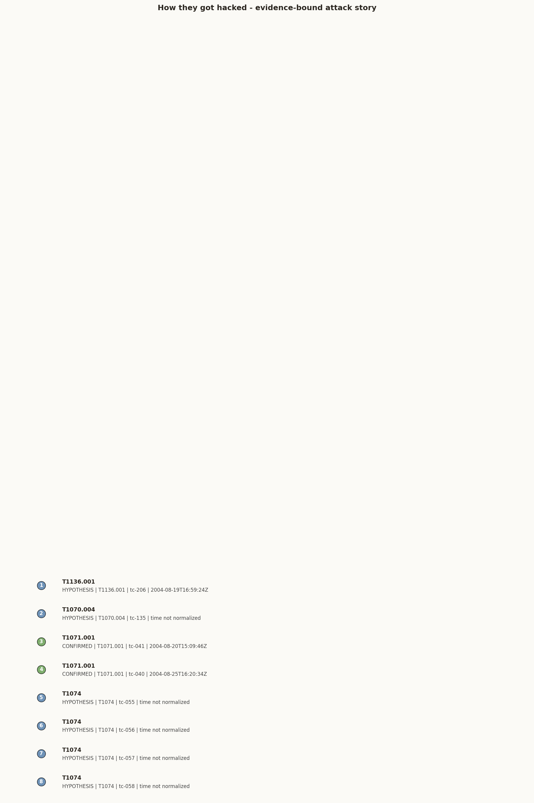

# Find Evil! — Forensic Breach Narrative and Evidence Report

**Case ID:** `0175c0a7-7c93-48ab-8401-9594024803a7`
**Run ID:** `auto-1780844650`
**Started:** 2026-06-07T15:04:10Z
**Finalized:** 2026-06-07T15:04:17Z
**Evidence:** `/home/sansforensics/SCHARDT.dd`
**Verdict:** **INDETERMINATE**

> **Cryptographic attestation:**
> Merkle root `ce8ad4ea0829ddc07e1dea3facdc0130a785aa57f8d06323a3a80f24ff1b763d`
> Audit log final hash `df5aa962cdc4ae8504ec255d2a108de31c4b2ec7d6e692dd5c36247c7fed346a`
> Sigstore signature SHA-256 `82186691a4790faf87fd2d033d32a18eea88c5d19e7a4a45a2abaf79d4a1f9e4`
> Cert fingerprint `353df90b8a89f3aa7f61bee3ca9ef0d066d321c72b14dea6709413de60e719a0`

---

## Summary

* **Total merged findings:** 9
* **By confidence:**
  - CONFIRMED: 0
  - INFERRED:  8
  - HYPOTHESIS: 1
* **Contradictions surfaced (Pool A vs Pool B):** 0
* **SOUL.md correlator:** 1 kept, 8 downgraded

---


## Executive Attack Story

**Headline:** Evidence is insufficient for a final breach story

The run produced limited or hypothesis-level evidence. Treat this as an expert-review packet, not a final incident narrative.

**How they got in:** Not established by the supplied evidence unless a cited Finding below names an initial-access mechanism.

**Root cause:** Not established by the supplied evidence; expert review required.

**Business impact:** Technical risk only; business impact requires customer context and legal review.



### What We Can Say

* The run produced limited or hypothesis-level evidence. Treat this as an expert-review packet, not a final incident narrative.
* The case touched artifact classes: disk/filesystem.
* Report QA status is WARN with packet state EXPERT_REVIEW_DRAFT; expert signoff is required before customer release.
* Expert misses captured this case: 0 \(uncaptured edits are a QA defect; see EXPERT.md Replacement metric\).

### What We Cannot Prove

* Who operated the activity; Find Evil does not assert attribution.
* That unexamined artifact classes would produce the same result.
* That this single-evidence run covers the whole environment.
* That ATT&amp;CK blind spots were evaluated; 5 target area\(s\) lacked supplied evidence.
* registry_query failed for /home/sansforensics/.findevil/cases/0175c0a7-7c93-48ab-8401-9594024803a7/extracted/disk/disk-extract-9ac1d17d-fd5e-40b1-8739-a65e397815ab/registry/Documents and Settings/Default User/NTUSER.DAT Software\\Microsoft\\Windows\\CurrentVersion\\RunOnce: rust-mcp tools/call: registry key not found: Software\\Microsoft\\Windows\\CurrentVersion\\RunOnce
* registry_query failed for /home/sansforensics/.findevil/cases/0175c0a7-7c93-48ab-8401-9594024803a7/extracted/disk/disk-extract-9ac1d17d-fd5e-40b1-8739-a65e397815ab/registry/Documents and Settings/LocalService/Local Settings/Application Data/Microsoft/Windows/UsrClass.dat Software\\Microsoft\\Windows\\CurrentVersion\\Run: rust-mcp tools/call: registry key not found: Software\\Microsoft\\Windows\\CurrentVersion\\Run
* registry_query failed for /home/sansforensics/.findevil/cases/0175c0a7-7c93-48ab-8401-9594024803a7/extracted/disk/disk-extract-9ac1d17d-fd5e-40b1-8739-a65e397815ab/registry/Documents and Settings/LocalService/Local Settings/Application Data/Microsoft/Windows/UsrClass.dat Software\\Microsoft\\Windows\\CurrentVersion\\RunOnce: rust-mcp tools/call: registry key not found: Software\\Microsoft\\Windows\\CurrentVersion\\RunOnce

### Recommended Next Decisions

* Collect Security, Sysmon, and PowerShell Operational EVTX and rerun EVTX/Hayabusa analysis.
* Use the disk artifact summary to pivot between Prefetch, Registry, MFT, USN, EVTX, and YARA-target rows without upgrading single-source execution claims.
* Acquire DNS, proxy, firewall, NetFlow, or PCAP telemetry to test C2 and exfiltration hypotheses.

### Finding-Backed Story Beats

### Beat 1: cain.exe executed on this host: Windows Prefetch records its execution and the UserAssist key \(per-user GUI ex
* Time: `2004-08-27T15:33:03Z`
* Confidence: `INFERRED`
* MITRE: `T1588.002`
* Tool call: `tc-009`
* Artifact classes: `prefetch, registry`
* Caveat: Inferred means the story beat is derived from corroborated facts and still needs expert review.

### Beat 2: cain25b45.exe executed on this host: Windows Prefetch records its execution and the UserAssist key \(per-user G
* Time: `2004-08-20T15:05:52Z`
* Confidence: `INFERRED`
* MITRE: `T1588.002`
* Tool call: `tc-010`
* Artifact classes: `prefetch, registry`
* Caveat: Inferred means the story beat is derived from corroborated facts and still needs expert review.

### Beat 3: netstumbler.exe executed on this host: Windows Prefetch records its execution and the UserAssist key \(per-user
* Time: `2004-08-27T15:12:35Z`
* Confidence: `INFERRED`
* MITRE: `T1046`
* Tool call: `tc-023`
* Artifact classes: `prefetch, registry`
* Caveat: Inferred means the story beat is derived from corroborated facts and still needs expert review.

### Beat 4: Windows Prefetch contains NETSTUMBLERINSTALLER_0_4_0.EX with run_count=1; NetStumbler wireless discovery tool 
* Time: `2004-08-27T15:12:11Z`
* Confidence: `HYPOTHESIS`
* MITRE: `T1046`
* Tool call: `tc-024`
* Artifact classes: `prefetch`
* Caveat: Hypothesis means a triage lead that should not drive response without more corroboration.

### Beat 5: lookatlan.exe executed on this host: Windows Prefetch records its execution and the UserAssist key \(per-user G
* Time: `2004-08-26T15:06:14Z`
* Confidence: `INFERRED`
* MITRE: `T1046`
* Tool call: `tc-038`
* Artifact classes: `prefetch, registry`
* Caveat: Inferred means the story beat is derived from corroborated facts and still needs expert review.

### Beat 6: mirc.exe executed on this host: Windows Prefetch records its execution and the UserAssist key \(per-user GUI ex
* Time: `2004-08-25T16:20:34Z`
* Confidence: `INFERRED`
* MITRE: `T1071.001`
* Tool call: `tc-040`
* Artifact classes: `prefetch, registry`
* Caveat: Inferred means the story beat is derived from corroborated facts and still needs expert review.

### Beat 7: mirc612.exe executed on this host: Windows Prefetch records its execution and the UserAssist key \(per-user GUI
* Time: `2004-08-20T15:09:46Z`
* Confidence: `INFERRED`
* MITRE: `T1071.001`
* Tool call: `tc-041`
* Artifact classes: `prefetch, registry`
* Caveat: Inferred means the story beat is derived from corroborated facts and still needs expert review.

### Beat 8: ethereal-setup-0.10.6.exe executed on this host: Windows Prefetch records its execution and the UserAssist key
* Time: `2004-08-27T15:28:36Z`
* Confidence: `INFERRED`
* MITRE: `T1040`
* Tool call: `tc-051`
* Artifact classes: `prefetch, registry`
* Caveat: Inferred means the story beat is derived from corroborated facts and still needs expert review.


## QA / Expert Signoff

* Overall QA status: `WARN`
* Packet state: `EXPERT_REVIEW_DRAFT`
* Ready for expert signoff: `True`
* Customer-release candidate from automated QA: `False`
* Customer releasable after expert approval: `False`
* Expert decision: `pending`
* Expert review estimate: `30-60 minutes`
* Signoff question: `Would I send this report to a company without rewriting it?`

| Check | Status | Summary |
|---|---|---|
| `finding_tool_call_required` | PASS | All 9 Finding\(s\) cite current-case tool calls. |
| `execution_requires_two_current_artifact_classes` | PASS | No unsupported execution wording detected, or current-case corroboration is broad enough for expert review. |
| `exfiltration_requires_staging_and_movement` | PASS | No unsupported exfiltration claim detected. |
| `disk_auto_mode_custody_only` | PASS | No custody-only disk overclaim detected. |
| `no_evil_is_scoped` | PASS | Verdict wording remains scoped to supplied evidence. |
| `timeline_source_refs_present` | PASS | Timeline includes 76 normalized event\(s\) with source references. |
| `verify_finding_replay_failures` | PASS | No verifier replay failures were recorded as analysis limitations. |
| `verify_finding_replay_embedded` | PASS | Every Finding carries embedded verifier replay evidence, or there are no Findings to replay. |
| `limitations_visible` | WARN | Analysis limitations must remain visible before customer release. |
| `no_forbidden_unqualified_language` | PASS | No forbidden unqualified language detected in Findings or customer-visible report text. |
| `attack_coverage_blind_spots` | WARN | ATT&amp;CK coverage includes blind spots that require expert awareness. |


## Customer Release Gate

This gate is written after `manifest_finalize` and `manifest_verify`; it is a post-finalize linkage artifact, not a replacement for the audited `verdict.json` hash committed before manifest finalization.

* QA status: `WARN`
* Packet state: `EXPERT_REVIEW_DRAFT`
* Manifest verified: `True`
* Manifest signature present: `True`
* Signer: `stub`
* Expert approved: `False`
* Customer releasable: `False`

### Release Blockers

* ATT&amp;CK coverage includes blind spots that require expert awareness.
* Analysis limitations must remain visible before customer release.
* customer release requires manifest_finalize signer=sigstore; stub signatures are dev/offline only
* explicit human expert approval is required before customer release


## Readiness State

* Packet state: `EXPERT_REVIEW_DRAFT`
* Ready for expert review/signoff: `True`
* Expert-review status: `pending`
* Ready for customer PDF: `False`
* Customer releasable: `False`

### Blockers

* ATT&amp;CK coverage includes blind spots that require expert awareness.
* Analysis limitations must remain visible before customer release.
* customer release requires manifest_finalize signer=sigstore; stub signatures are dev/offline only
* explicit human expert approval is required before customer release

### Failed Checks

* No failed checks were recorded by the QA gate.

### Warnings

* limitations_visible
* attack_coverage_blind_spots

### Why This Is Not Ready, If Applicable

* Analysis limitations must remain visible before customer release.
* ATT&amp;CK coverage includes blind spots that require expert awareness.


## Findings overview


## Next 5 Analyst Actions

| Priority | Action | Why | Based On | Expected Evidence |
|---|---|---|---|---|
| P2 | Collect Security, Sysmon, and PowerShell Operational EVTX and rerun EVTX/Hayabusa analysis. | Current findings lack event-log corroboration for logon, process creation, and PowerShell execution hypotheses. | evtx_gap | Security 4624/4625/4688, Sysmon 1/3/7/10/11, PowerShell 4103/4104 |
| P2 | Use the disk artifact summary to pivot between Prefetch, Registry, MFT, USN, EVTX, and YARA-target rows without upgrading single-source execution claims. | Extracted disk artifacts are now summarized as leads and timeline context; execution wording still needs two artifact classes and cited tool_call_id evidence. | disk_artifact_summary | Correlated Prefetch run times, Registry LastWrite, MFT/USN timestamps, EVTX records, and YARA hits |
| P3 | Acquire DNS, proxy, firewall, NetFlow, or PCAP telemetry to test C2 and exfiltration hypotheses. | Network telemetry was not supplied or parsed in this run, so exfiltration and command-and-control coverage remains a blind spot. | network_gap | DNS queries, proxy URLs, firewall sessions, PCAP, Velociraptor network collection |
| P3 | Close ATT&amp;CK blind spots before making closure decisions. | The coverage matrix identifies target techniques with no supporting artifact class in this run. | T1014, T1055, T1021.001, T1071.004, T1041 | Additional evidence classes mapped in attack_coverage.targets\[\].artifact_classes |
| P4 | Pivot from the first and last normalized timeline events into adjacent artifact classes. | Temporal clustering often exposes execution chains that a single artifact class cannot prove alone. | timeline | timeline.csv plus adjacent EVTX, Prefetch, MFT, and network events |


## Case Completeness

1/5 artifact classes touched; 1/5 directly available from supplied evidence

| Artifact Class | Available | Touched | Tools | Confidence Impact |
|---|:---:|:---:|---|---|
| memory | no | no | `none` | not a memory image; no live-process evidence |
| evtx | no | no | `none` | no event log supplied in this single-evidence run |
| disk/filesystem | yes | yes | `disk_extract_artifacts, disk_mount, prefetch_parse, registry_query` | disk image registered; deep filesystem parsing requires mounted artifacts |
| network | no | no | `none` | no PCAP, Zeek, firewall, DNS, or proxy logs supplied |
| velociraptor | no | no | `none` | no Velociraptor collection supplied |


## Evidence Scope Interpretation

This section states what the rendered coverage can and cannot prove. Limited coverage is not customer assurance about unexamined systems, techniques, or artifact classes.

### Network Evidence Summary

* Available from supplied evidence: `False`
* Parsed/touched by typed tools: `False`
* Tools: `none recorded`
* Confidence impact: no PCAP, Zeek, firewall, DNS, or proxy logs supplied
* Exfiltration coverage target status: T1041=blind_spot
* **What this proves:** Network telemetry was not parsed by typed network tools in this run.
* **What this does not prove:** It does not evaluate C2 or exfiltration from network artifacts, and it must not be read as network assurance.

### Disk Artifact Coverage Summary

* Available from supplied evidence: `True`
* Parsed/touched by typed tools: `True`
* Tools: `disk_extract_artifacts, disk_mount, prefetch_parse, registry_query`
* Confidence impact: disk image registered; deep filesystem parsing requires mounted artifacts
* **What this proves:** Disk/filesystem artifacts were parsed by the listed tools, so persistence, file, registry, Prefetch, or timeline statements can cite those outputs when Findings do so.
* **What this does not prove:** It does not by itself prove execution; execution claims still require at least two artifact classes, not Amcache/ShimCache-style presence alone.


## Analysis Coverage by Domain

This table shows which DFIR analysis domains the typed tools exercised on the supplied evidence. Coverage is scope, not assurance.


| Domain | Status | Artifacts Seen | Tools Run | Data Sources | Gaps |
|---|---|---|---|---|---|
| Host &amp; Endpoint Forensics | automated | disk/filesystem | `disk_extract_artifacts, prefetch_parse, registry_query` | DS0009, DS0022, DS0024 | none |
| Endpoint Telemetry &amp; Live Response | not_covered | none | `none` | none | missing or untouched artifact classes: velociraptor |
| Malware Analysis &amp; Triage | partial | disk/filesystem | `none` | none | missing or untouched artifact classes: memory |
| Memory Forensics | not_covered | none | `none` | none | missing or untouched artifact classes: memory |
| Network Forensics | not_covered | none | `none` | none | missing or untouched artifact classes: network, no PCAP, Zeek, proxy, DNS, firewall, or NetFlow telemetry supplied |
| Windows Event &amp; Account Analysis | not_covered | none | `none` | none | missing or untouched artifact classes: evtx |

**Overclaim guardrails applied:** covered_no_finding is limited coverage, not a clean/cleared claim, Domain coverage describes triage/orchestration across the typed tools that ran, not certified-analyst judgment, visual exhibits do not create findings or upgrade confidence, execution claims still require at least two artifact classes


## ATT&CK Coverage

5/12 ATT&CK targets covered by typed-tool output; 1 target(s) produced finding-level evidence; 5 target(s) remain blind spots

| Technique | Tactic | Status | Tools Observed | Gap / Analyst Value |
|---|---|---|---|---|
| T1014 Rootkit | Defense Evasion | blind spot | `none` | missing or untouched artifact classes: memory |
| T1055 Process Injection | Defense Evasion / Privilege Escalation | blind spot | `none` | missing or untouched artifact classes: memory |
| T1059.001 PowerShell | Execution | covered, no finding \(limited\) | `prefetch_parse` | target-specific tools ran without qualifying evidence; this is limited coverage, not proof of absence |
| T1021.001 Remote Desktop Protocol | Lateral Movement | blind spot | `none` | missing or untouched artifact classes: evtx |
| T1078 Valid Accounts | Defense Evasion / Persistence / Privilege Escalation | covered, no finding \(limited\) | `registry_query` | target-specific tools ran without qualifying evidence; this is limited coverage, not proof of absence |
| T1003 OS Credential Dumping | Credential Access | available, not examined | `none` | required evidence class was available but no target tool ran |
| T1105 Ingress Tool Transfer | Command and Control | available, not examined | `none` | required evidence class was available but no target tool ran |
| T1071.001 Web Protocols | Command and Control | finding \(INFERRED\) | `none` | finding-level evidence exists; preserve cited tool output |
| T1071.004 DNS | Command and Control | blind spot | `none` | missing or untouched artifact classes: network |
| T1041 Exfiltration Over C2 Channel | Exfiltration | blind spot | `none` | missing or untouched artifact classes: network |
| T1547.001 Registry Run Keys / Startup Folder | Persistence / Privilege Escalation | covered, no finding \(limited\) | `prefetch_parse, registry_query` | target-specific tools ran without qualifying evidence; this is limited coverage, not proof of absence |
| T1053.005 Scheduled Task | Execution / Persistence / Privilege Escalation | covered, no finding \(limited\) | `registry_query` | target-specific tools ran without qualifying evidence; this is limited coverage, not proof of absence |


## Analysis Limitations

* registry_query failed for /home/sansforensics/.findevil/cases/0175c0a7-7c93-48ab-8401-9594024803a7/extracted/disk/disk-extract-9ac1d17d-fd5e-40b1-8739-a65e397815ab/registry/Documents and Settings/Default User/NTUSER.DAT Software\\Microsoft\\Windows\\CurrentVersion\\RunOnce: rust-mcp tools/call: registry key not found: Software\\Microsoft\\Windows\\CurrentVersion\\RunOnce
* registry_query failed for /home/sansforensics/.findevil/cases/0175c0a7-7c93-48ab-8401-9594024803a7/extracted/disk/disk-extract-9ac1d17d-fd5e-40b1-8739-a65e397815ab/registry/Documents and Settings/LocalService/Local Settings/Application Data/Microsoft/Windows/UsrClass.dat Software\\Microsoft\\Windows\\CurrentVersion\\Run: rust-mcp tools/call: registry key not found: Software\\Microsoft\\Windows\\CurrentVersion\\Run
* registry_query failed for /home/sansforensics/.findevil/cases/0175c0a7-7c93-48ab-8401-9594024803a7/extracted/disk/disk-extract-9ac1d17d-fd5e-40b1-8739-a65e397815ab/registry/Documents and Settings/LocalService/Local Settings/Application Data/Microsoft/Windows/UsrClass.dat Software\\Microsoft\\Windows\\CurrentVersion\\RunOnce: rust-mcp tools/call: registry key not found: Software\\Microsoft\\Windows\\CurrentVersion\\RunOnce
* registry_query failed for /home/sansforensics/.findevil/cases/0175c0a7-7c93-48ab-8401-9594024803a7/extracted/disk/disk-extract-9ac1d17d-fd5e-40b1-8739-a65e397815ab/registry/Documents and Settings/LocalService/NTUSER.DAT Software\\Microsoft\\Windows\\CurrentVersion\\RunOnce: rust-mcp tools/call: registry key not found: Software\\Microsoft\\Windows\\CurrentVersion\\RunOnce
* registry_query failed for /home/sansforensics/.findevil/cases/0175c0a7-7c93-48ab-8401-9594024803a7/extracted/disk/disk-extract-9ac1d17d-fd5e-40b1-8739-a65e397815ab/registry/Documents and Settings/Mr. Evil/Local Settings/Application Data/Microsoft/Windows/UsrClass.dat Software\\Microsoft\\Windows\\CurrentVersion\\Run: rust-mcp tools/call: registry key not found: Software\\Microsoft\\Windows\\CurrentVersion\\Run
* registry_query failed for /home/sansforensics/.findevil/cases/0175c0a7-7c93-48ab-8401-9594024803a7/extracted/disk/disk-extract-9ac1d17d-fd5e-40b1-8739-a65e397815ab/registry/Documents and Settings/Mr. Evil/Local Settings/Application Data/Microsoft/Windows/UsrClass.dat Software\\Microsoft\\Windows\\CurrentVersion\\RunOnce: rust-mcp tools/call: registry key not found: Software\\Microsoft\\Windows\\CurrentVersion\\RunOnce
* registry_query failed for /home/sansforensics/.findevil/cases/0175c0a7-7c93-48ab-8401-9594024803a7/extracted/disk/disk-extract-9ac1d17d-fd5e-40b1-8739-a65e397815ab/registry/Documents and Settings/Mr. Evil/NTUSER.DAT Software\\Microsoft\\Windows\\CurrentVersion\\RunOnce: rust-mcp tools/call: registry key not found: Software\\Microsoft\\Windows\\CurrentVersion\\RunOnce
* registry_query failed for /home/sansforensics/.findevil/cases/0175c0a7-7c93-48ab-8401-9594024803a7/extracted/disk/disk-extract-9ac1d17d-fd5e-40b1-8739-a65e397815ab/registry/Documents and Settings/NetworkService/Local Settings/Application Data/Microsoft/Windows/UsrClass.dat Software\\Microsoft\\Windows\\CurrentVersion\\Run: rust-mcp tools/call: registry key not found: Software\\Microsoft\\Windows\\CurrentVersion\\Run
* registry_query failed for /home/sansforensics/.findevil/cases/0175c0a7-7c93-48ab-8401-9594024803a7/extracted/disk/disk-extract-9ac1d17d-fd5e-40b1-8739-a65e397815ab/registry/Documents and Settings/NetworkService/Local Settings/Application Data/Microsoft/Windows/UsrClass.dat Software\\Microsoft\\Windows\\CurrentVersion\\RunOnce: rust-mcp tools/call: registry key not found: Software\\Microsoft\\Windows\\CurrentVersion\\RunOnce
* registry_query failed for /home/sansforensics/.findevil/cases/0175c0a7-7c93-48ab-8401-9594024803a7/extracted/disk/disk-extract-9ac1d17d-fd5e-40b1-8739-a65e397815ab/registry/Documents and Settings/NetworkService/NTUSER.DAT Software\\Microsoft\\Windows\\CurrentVersion\\RunOnce: rust-mcp tools/call: registry key not found: Software\\Microsoft\\Windows\\CurrentVersion\\RunOnce
* registry_query failed for /home/sansforensics/.findevil/cases/0175c0a7-7c93-48ab-8401-9594024803a7/extracted/disk/disk-extract-9ac1d17d-fd5e-40b1-8739-a65e397815ab/registry/WINDOWS/repair/ntuser.dat Software\\Microsoft\\Windows\\CurrentVersion\\RunOnce: rust-mcp tools/call: registry key not found: Software\\Microsoft\\Windows\\CurrentVersion\\RunOnce


## Timeline

Normalized timeline events: 76. First 25 events shown below; full data is in `timeline.json` and analyst-friendly `timeline.csv`.


| UTC Time | Artifact Class | Significance | Summary | Tool Call | Source Record |
|---|---|---|---|---|---|
| 2004-08-19T16:59:09Z | registry | context | registry key:  | `tc-077` | `registry_query:1` |
| 2004-08-19T16:59:24Z | registry | context | registry key:  | `tc-068` | `registry_query:2` |
| 2004-08-19T16:59:24Z | registry | context | registry key:  | `tc-076` | `registry_query:3` |
| 2004-08-19T17:01:55Z | registry | context | registry key: Software\\Microsoft\\Windows\\CurrentVersion\\Run | `tc-054` | `registry_query:4` |
| 2004-08-19T17:01:55Z | registry | context | registry key: Software\\Microsoft\\Windows\\CurrentVersion\\Run | `tc-074` | `registry_query:5` |
| 2004-08-19T22:31:59Z | registry | context | registry key: Microsoft\\Windows NT\\CurrentVersion\\Image File Execution Options | `tc-072` | `registry_query:6` |
| 2004-08-19T22:31:59Z | registry | context | registry key: Microsoft\\Windows NT\\CurrentVersion\\Image File Execution Options | `tc-080` | `registry_query:7` |
| 2004-08-19T22:37:33Z | registry | context | registry key: Microsoft\\Windows\\CurrentVersion\\Run | `tc-078` | `registry_query:8` |
| 2004-08-19T22:37:59Z | registry | context | registry key: ControlSet001\\Services | `tc-081` | `registry_query:9` |
| 2004-08-19T22:38:20Z | registry | context | registry key: Microsoft\\Windows\\CurrentVersion\\RunOnce | `tc-071` | `registry_query:10` |
| 2004-08-19T22:38:20Z | registry | context | registry key: Microsoft\\Windows\\CurrentVersion\\RunOnce | `tc-079` | `registry_query:11` |
| 2004-08-19T22:51:56Z | registry | context | registry key: Software\\Microsoft\\Windows\\CurrentVersion\\Run | `tc-066` | `registry_query:12` |
| 2004-08-19T22:51:58Z | registry | context | registry key: Software\\Microsoft\\Windows\\CurrentVersion\\Run | `tc-058` | `registry_query:13` |
| 2004-08-19T22:52:01Z | prefetch | context | prefetch run: SPOOLSV.EXE | `tc-020` | `prefetch_parse:14` |
| 2004-08-19T22:53:05Z | prefetch | context | prefetch run: SVCHOST.EXE | `tc-021` | `prefetch_parse:15` |
| 2004-08-19T22:53:05Z | prefetch | context | prefetch run: LSASS.EXE | `tc-039` | `prefetch_parse:16` |
| 2004-08-19T22:53:19Z | prefetch | context | prefetch run: MSOOBE.EXE | `tc-045` | `prefetch_parse:17` |
| 2004-08-19T23:04:12Z | prefetch | context | prefetch run: EXPLORER.EXE | `tc-053` | `prefetch_parse:18` |
| 2004-08-19T23:04:32Z | registry | context | registry key: Software\\Microsoft\\Windows\\CurrentVersion\\Run | `tc-062` | `registry_query:19` |
| 2004-08-19T23:04:37Z | prefetch | context | prefetch run: SETUP50.EXE | `tc-019` | `prefetch_parse:20` |
| 2004-08-19T23:04:56Z | prefetch | context | prefetch run: RUNDLL32.EXE | `tc-013` | `prefetch_parse:21` |
| 2004-08-19T23:05:04Z | prefetch | context | prefetch run: MSMSGS.EXE | `tc-044` | `prefetch_parse:22` |
| 2004-08-19T23:05:04Z | registry | context | registry key: Microsoft\\Windows\\CurrentVersion\\Run | `tc-070` | `registry_query:23` |
| 2004-08-20T15:05:00Z | prefetch | context | prefetch run: SETUP.EXE | `tc-018` | `prefetch_parse:24` |
| 2004-08-20T15:05:52Z | prefetch | finding_support | prefetch run: CAIN25B45.EXE | `tc-010` | `prefetch_parse:25` |


## Visual Evidence

Visual exhibits are generated from parsed tool outputs. They support cited findings but do not replace `tool_call_id`-backed evidence or upgrade confidence by themselves.


### cain.exe executed on this host: Windows Prefetch records its execution and the UserAssist 
* Card: `evidence-card-001`
* Linked findings: `f-B-prefetch-cain-exe`
* Tool call: `tc-009`
* Source records: `prefetch_parse:64`
* Confidence: `INFERRED`
* Citations: `CITE-MITRE-ATTACK-DATASOURCES`
* Why suspicious/relevant: This observable is relevant because finding 'f-B-prefetch-cain-exe' is backed by parsed tool output 'tc-009' and should be interpreted with the cited artifact and source caveats.
* Snippet: `cain.exe executed on this host: Windows Prefetch records its execution and the UserAssist key \(per-user GUI execution\) records the same binary. Two independent artifact classes \(prefetch + registry/UserAssist\) corroborate execution.`
* Caveats: Visual exhibit supports the cited finding but does not replace parsed tool output.

### cain25b45.exe executed on this host: Windows Prefetch records its execution and the UserAs
* Card: `evidence-card-002`
* Linked findings: `f-B-prefetch-cain25b45-exe`
* Tool call: `tc-010`
* Source records: `prefetch_parse:25`
* Confidence: `INFERRED`
* Citations: `CITE-MITRE-ATTACK-DATASOURCES`
* Why suspicious/relevant: This observable is relevant because finding 'f-B-prefetch-cain25b45-exe' is backed by parsed tool output 'tc-010' and should be interpreted with the cited artifact and source caveats.
* Snippet: `cain25b45.exe executed on this host: Windows Prefetch records its execution and the UserAssist key \(per-user GUI execution\) records the same binary. Two independent artifact classes \(prefetch + registry/UserAssist\) corroborate execution.`
* Caveats: Visual exhibit supports the cited finding but does not replace parsed tool output.

### netstumbler.exe executed on this host: Windows Prefetch records its execution and the User
* Card: `evidence-card-003`
* Linked findings: `f-B-prefetch-netstumbler-exe`
* Tool call: `tc-023`
* Source records: `prefetch_parse:57`
* Confidence: `INFERRED`
* Citations: `CITE-MITRE-ATTACK-DATASOURCES`
* Why suspicious/relevant: This observable is relevant because finding 'f-B-prefetch-netstumbler-exe' is backed by parsed tool output 'tc-023' and should be interpreted with the cited artifact and source caveats.
* Snippet: `netstumbler.exe executed on this host: Windows Prefetch records its execution and the UserAssist key \(per-user GUI execution\) records the same binary. Two independent artifact classes \(prefetch + registry/UserAssist\) corroborate execution.`
* Caveats: Visual exhibit supports the cited finding but does not replace parsed tool output.

### Windows Prefetch contains NETSTUMBLERINSTALLER_0_4_0.EX with run_count=1; NetStumbler wire
* Card: `evidence-card-004`
* Linked findings: `f-B-prefetch-netstumblerinstaller-0-4-0-ex`
* Tool call: `tc-024`
* Source records: `prefetch_parse:56`
* Confidence: `HYPOTHESIS`
* Citations: `CITE-MITRE-ATTACK-DATASOURCES`
* Why suspicious/relevant: This observable is relevant because finding 'f-B-prefetch-netstumblerinstaller-0-4-0-ex' is backed by parsed tool output 'tc-024' and should be interpreted with the cited artifact and source caveats.
* Snippet: `Windows Prefetch contains NETSTUMBLERINSTALLER_0_4_0.EX with run_count=1; NetStumbler wireless discovery tool is a NIST Hacking Case triage lead. Treat this as a disk-artifact lead that needs corroboration before any standalone activity cla`
* Caveats: Visual exhibit supports the cited finding but does not replace parsed tool output., HYPOTHESIS confidence requires additional artifact corroboration.

### lookatlan.exe executed on this host: Windows Prefetch records its execution and the UserAs
* Card: `evidence-card-005`
* Linked findings: `f-B-prefetch-lookatlan-exe`
* Tool call: `tc-038`
* Source records: `prefetch_parse:50`
* Confidence: `INFERRED`
* Citations: `CITE-MITRE-ATTACK-DATASOURCES`
* Why suspicious/relevant: This observable is relevant because finding 'f-B-prefetch-lookatlan-exe' is backed by parsed tool output 'tc-038' and should be interpreted with the cited artifact and source caveats.
* Snippet: `lookatlan.exe executed on this host: Windows Prefetch records its execution and the UserAssist key \(per-user GUI execution\) records the same binary. Two independent artifact classes \(prefetch + registry/UserAssist\) corroborate execution.`
* Caveats: Visual exhibit supports the cited finding but does not replace parsed tool output.

### mirc.exe executed on this host: Windows Prefetch records its execution and the UserAssist 
* Card: `evidence-card-006`
* Linked findings: `f-B-prefetch-mirc-exe`
* Tool call: `tc-040`
* Source records: `prefetch_parse:48`
* Confidence: `INFERRED`
* Citations: `CITE-MITRE-ATTACK-DATASOURCES, CITE-ZEEK-LOGS`
* Why suspicious/relevant: This observable is relevant because finding 'f-B-prefetch-mirc-exe' is backed by parsed tool output 'tc-040' and should be interpreted with the cited artifact and source caveats.
* Snippet: `mirc.exe executed on this host: Windows Prefetch records its execution and the UserAssist key \(per-user GUI execution\) records the same binary. Two independent artifact classes \(prefetch + registry/UserAssist\) corroborate execution.`
* Caveats: Visual exhibit supports the cited finding but does not replace parsed tool output.

### mirc612.exe executed on this host: Windows Prefetch records its execution and the UserAssi
* Card: `evidence-card-007`
* Linked findings: `f-B-prefetch-mirc612-exe`
* Tool call: `tc-041`
* Source records: `prefetch_parse:30`
* Confidence: `INFERRED`
* Citations: `CITE-MITRE-ATTACK-DATASOURCES, CITE-ZEEK-LOGS`
* Why suspicious/relevant: This observable is relevant because finding 'f-B-prefetch-mirc612-exe' is backed by parsed tool output 'tc-041' and should be interpreted with the cited artifact and source caveats.
* Snippet: `mirc612.exe executed on this host: Windows Prefetch records its execution and the UserAssist key \(per-user GUI execution\) records the same binary. Two independent artifact classes \(prefetch + registry/UserAssist\) corroborate execution.`
* Caveats: Visual exhibit supports the cited finding but does not replace parsed tool output.

### ethereal-setup-0.10.6.exe executed on this host: Windows Prefetch records its execution an
* Card: `evidence-card-008`
* Linked findings: `f-B-prefetch-ethereal-setup-0-10-6-exe`
* Tool call: `tc-051`
* Source records: `prefetch_parse:62`
* Confidence: `INFERRED`
* Citations: `CITE-MITRE-ATTACK-DATASOURCES`
* Why suspicious/relevant: This observable is relevant because finding 'f-B-prefetch-ethereal-setup-0-10-6-exe' is backed by parsed tool output 'tc-051' and should be interpreted with the cited artifact and source caveats.
* Snippet: `ethereal-setup-0.10.6.exe executed on this host: Windows Prefetch records its execution and the UserAssist key \(per-user GUI execution\) records the same binary. Two independent artifact classes \(prefetch + registry/UserAssist\) corroborate e`
* Caveats: Visual exhibit supports the cited finding but does not replace parsed tool output.

### ethereal.exe executed on this host: Windows Prefetch records its execution and the UserAss
* Card: `evidence-card-009`
* Linked findings: `f-B-prefetch-ethereal-exe`
* Tool call: `tc-052`
* Source records: `prefetch_parse:65`
* Confidence: `INFERRED`
* Citations: `CITE-MITRE-ATTACK-DATASOURCES`
* Why suspicious/relevant: This observable is relevant because finding 'f-B-prefetch-ethereal-exe' is backed by parsed tool output 'tc-052' and should be interpreted with the cited artifact and source caveats.
* Snippet: `ethereal.exe executed on this host: Windows Prefetch records its execution and the UserAssist key \(per-user GUI execution\) records the same binary. Two independent artifact classes \(prefetch + registry/UserAssist\) corroborate execution.`
* Caveats: Visual exhibit supports the cited finding but does not replace parsed tool output.


## Sources

| Citation ID | Title | URL | Supports |
|---|---|---|---|
| `CITE-MITRE-ATTACK-DATASOURCES` | MITRE ATT&amp;CK Data Sources | https://attack.mitre.org/datasources/ | ATT&amp;CK data-source coverage mapping |
| `CITE-MITRE-T1003-001` | MITRE ATT&amp;CK T1003.001 LSASS Memory | https://attack.mitre.org/techniques/T1003/001/ | LSASS credential-dumping interpretation |
| `CITE-MITRE-T1014` | MITRE ATT&amp;CK T1014 Rootkit | https://attack.mitre.org/techniques/T1014/ | DKOM/rootkit process-view divergence interpretation |
| `CITE-NIST-800-61R2` | NIST SP 800-61 Rev. 2 Computer Security Incident Handling Guide | https://csrc.nist.gov/pubs/sp/800/61/r2/final | separation of evidence, analysis, response actions, and gaps |
| `CITE-PLASO` | Plaso/log2timeline documentation | https://plaso.readthedocs.io/ | multi-source forensic timeline normalization |
| `CITE-TIMESKETCH` | Timesketch documentation | https://timesketch.org/ | analyst-oriented forensic timeline review |
| `CITE-VOLATILITY3` | Volatility 3 documentation | https://volatility3.readthedocs.io/ | memory plugin output and process-view validation |
| `CITE-ZEEK-LOGS` | Zeek log documentation | https://docs.zeek.org/en/current/logs/index.html | network log and protocol-semantic coverage |
| `CITE-VELOCIRAPTOR-ARTIFACTS` | Velociraptor artifact documentation | https://docs.velociraptor.app/docs/artifacts/ | artifact-based endpoint collection |
| `CITE-SIGMAHQ` | SigmaHQ rules repository | https://github.com/SigmaHQ/sigma | structured log detection rules as triage leads |
| `CITE-HAYABUSA` | Hayabusa repository | https://github.com/Yamato-Security/hayabusa | Windows EVTX timeline and hunting output |
| `CITE-CAPA` | capa repository | https://github.com/mandiant/capa | malware capability triage limits |


## False-positive caveats

* Sigma/Hayabusa rule hits, if present, are triage leads that require raw EVTX review, tuning, and corroboration before compromise claims.
* ATT&CK `covered_no_finding` means scoped tools ran without qualifying evidence; it is not environment-wide assurance about that technique.
* Network telemetry was not touched in this run, so exfiltration and C2 cannot be assessed from these artifacts.
* HYPOTHESIS findings are single-source or speculative leads and should not drive response actions without further artifact corroboration.


## Expert Doctrine Applied

The agent prepares an evidence-bound signoff packet; the human expert remains final authority for customer release.

| Rule | Severity | Requirement |
|---|---|---|
| `finding_tool_call_required` | blocker | Every Finding must cite a non-empty tool_call_id that exists in the case tool-call list. |
| `verify_finding_replay_embedded` | blocker | Customer-ready reports must embed verifier replay evidence for each Finding and every replay must match the audited tool output. |
| `verify_finding_replay_failures` | blocker | A verifier rejection or replay failure must force INDETERMINATE or blocked customer release, never NO_EVIL. |
| `execution_requires_two_current_artifact_classes` | blocker | Execution claims require at least two current-case artifact classes. Prefetch is preferred; Amcache, ShimCache, memory-only process evidence, YARA, Hayabusa, and malfind are not standalone execution proof. |
| `exfiltration_requires_staging_and_movement` | blocker | Exfiltration claims require staging or collection evidence plus network, tool, or data-movement evidence. |
| `no_evil_is_scoped` | warning | NO_EVIL means no reportable Finding in the artifact classes examined. It must not imply environment-wide assurance. |
| `disk_auto_mode_custody_only` | blocker | Raw disk auto mode is custody-only unless mounted or extracted artifacts are supplied and parsed. |
| `visuals_do_not_upgrade_confidence` | warning | Charts, evidence cards, screenshots, and PDF exhibits support cited tool output but never create Findings or raise confidence. |


## Findings detail

### Finding 1 — confidence: INFERRED, pool: B, MITRE: T1588.002, replay: exact_match (match)

cain.exe executed on this host: Windows Prefetch records its execution and the UserAssist key \(per-user GUI execution\) records the same binary. Two independent artifact classes \(prefetch + registry/UserAssist\) corroborate execution.

- `tool_call_id`: `tc-009`
- artifact: `/home/sansforensics/.findevil/cases/0175c0a7-7c93-48ab-8401-9594024803a7/extracted/disk/disk-extract-9ac1d17d-fd5e-40b1-8739-a65e397815ab/prefetch/WINDOWS/Prefetch/CAIN.EXE-23D61279.pf`

### Finding 2 — confidence: INFERRED, pool: B, MITRE: T1588.002, replay: exact_match (match)

cain25b45.exe executed on this host: Windows Prefetch records its execution and the UserAssist key \(per-user GUI execution\) records the same binary. Two independent artifact classes \(prefetch + registry/UserAssist\) corroborate execution.

- `tool_call_id`: `tc-010`
- artifact: `/home/sansforensics/.findevil/cases/0175c0a7-7c93-48ab-8401-9594024803a7/extracted/disk/disk-extract-9ac1d17d-fd5e-40b1-8739-a65e397815ab/prefetch/WINDOWS/Prefetch/CAIN25B45.EXE-056F3A6E.pf`

### Finding 3 — confidence: INFERRED, pool: B, MITRE: T1046, replay: exact_match (match)

netstumbler.exe executed on this host: Windows Prefetch records its execution and the UserAssist key \(per-user GUI execution\) records the same binary. Two independent artifact classes \(prefetch + registry/UserAssist\) corroborate execution.

- `tool_call_id`: `tc-023`
- artifact: `/home/sansforensics/.findevil/cases/0175c0a7-7c93-48ab-8401-9594024803a7/extracted/disk/disk-extract-9ac1d17d-fd5e-40b1-8739-a65e397815ab/prefetch/WINDOWS/Prefetch/NETSTUMBLER.EXE-0BFEE568.pf`

### Finding 4 — confidence: HYPOTHESIS, pool: B, MITRE: T1046, replay: exact_match (match)

Windows Prefetch contains NETSTUMBLERINSTALLER_0_4_0.EX with run_count=1; NetStumbler wireless discovery tool is a NIST Hacking Case triage lead. Treat this as a disk-artifact lead that needs corroboration before any standalone activity claim.

- `tool_call_id`: `tc-024`
- artifact: `/home/sansforensics/.findevil/cases/0175c0a7-7c93-48ab-8401-9594024803a7/extracted/disk/disk-extract-9ac1d17d-fd5e-40b1-8739-a65e397815ab/prefetch/WINDOWS/Prefetch/NETSTUMBLERINSTALLER_0_4_0.EX-0BD9920C.pf`

### Finding 5 — confidence: INFERRED, pool: B, MITRE: T1046, replay: exact_match (match)

lookatlan.exe executed on this host: Windows Prefetch records its execution and the UserAssist key \(per-user GUI execution\) records the same binary. Two independent artifact classes \(prefetch + registry/UserAssist\) corroborate execution.

- `tool_call_id`: `tc-038`
- artifact: `/home/sansforensics/.findevil/cases/0175c0a7-7c93-48ab-8401-9594024803a7/extracted/disk/disk-extract-9ac1d17d-fd5e-40b1-8739-a65e397815ab/prefetch/WINDOWS/Prefetch/LOOKATLAN.EXE-1F991DD9.pf`

### Finding 6 — confidence: INFERRED, pool: B, MITRE: T1071.001, replay: exact_match (match)

mirc.exe executed on this host: Windows Prefetch records its execution and the UserAssist key \(per-user GUI execution\) records the same binary. Two independent artifact classes \(prefetch + registry/UserAssist\) corroborate execution.

- `tool_call_id`: `tc-040`
- artifact: `/home/sansforensics/.findevil/cases/0175c0a7-7c93-48ab-8401-9594024803a7/extracted/disk/disk-extract-9ac1d17d-fd5e-40b1-8739-a65e397815ab/prefetch/WINDOWS/Prefetch/MIRC.EXE-0661EC22.pf`

### Finding 7 — confidence: INFERRED, pool: B, MITRE: T1071.001, replay: exact_match (match)

mirc612.exe executed on this host: Windows Prefetch records its execution and the UserAssist key \(per-user GUI execution\) records the same binary. Two independent artifact classes \(prefetch + registry/UserAssist\) corroborate execution.

- `tool_call_id`: `tc-041`
- artifact: `/home/sansforensics/.findevil/cases/0175c0a7-7c93-48ab-8401-9594024803a7/extracted/disk/disk-extract-9ac1d17d-fd5e-40b1-8739-a65e397815ab/prefetch/WINDOWS/Prefetch/MIRC612.EXE-02791C37.pf`

### Finding 8 — confidence: INFERRED, pool: B, MITRE: T1040, replay: exact_match (match)

ethereal-setup-0.10.6.exe executed on this host: Windows Prefetch records its execution and the UserAssist key \(per-user GUI execution\) records the same binary. Two independent artifact classes \(prefetch + registry/UserAssist\) corroborate execution.

- `tool_call_id`: `tc-051`
- artifact: `/home/sansforensics/.findevil/cases/0175c0a7-7c93-48ab-8401-9594024803a7/extracted/disk/disk-extract-9ac1d17d-fd5e-40b1-8739-a65e397815ab/prefetch/WINDOWS/Prefetch/ETHEREAL-SETUP-0.10.6.EXE-1D932600.pf`

### Finding 9 — confidence: INFERRED, pool: B, MITRE: T1040, replay: exact_match (match)

ethereal.exe executed on this host: Windows Prefetch records its execution and the UserAssist key \(per-user GUI execution\) records the same binary. Two independent artifact classes \(prefetch + registry/UserAssist\) corroborate execution.

- `tool_call_id`: `tc-052`
- artifact: `/home/sansforensics/.findevil/cases/0175c0a7-7c93-48ab-8401-9594024803a7/extracted/disk/disk-extract-9ac1d17d-fd5e-40b1-8739-a65e397815ab/prefetch/WINDOWS/Prefetch/ETHEREAL.EXE-1C148EEF.pf`


## Replay Determinism Appendix

Verifier replay artifacts record whether each cited tool call reproduced the audited output hash. They do not change Track 3b severity policy.

| Finding | Tool | Drift class | Match | Expected SHA | Actual SHA |
|---|---|---|:---:|---|---|
| f-B-prefetch-cain-exe | `prefetch_parse` | `exact_match` | yes | `b2e14c91aaa2` | `b2e14c91aaa2` |
| f-B-prefetch-cain25b45-exe | `prefetch_parse` | `exact_match` | yes | `76ae3ea8345e` | `76ae3ea8345e` |
| f-B-prefetch-netstumbler-exe | `prefetch_parse` | `exact_match` | yes | `c912d93baf9b` | `c912d93baf9b` |
| f-B-prefetch-netstumblerinstaller-0-4-0-ex | `prefetch_parse` | `exact_match` | yes | `80850ecc397c` | `80850ecc397c` |
| f-B-prefetch-lookatlan-exe | `prefetch_parse` | `exact_match` | yes | `9a10d59745b3` | `9a10d59745b3` |
| f-B-prefetch-mirc-exe | `prefetch_parse` | `exact_match` | yes | `b035f2359a05` | `b035f2359a05` |
| f-B-prefetch-mirc612-exe | `prefetch_parse` | `exact_match` | yes | `b36f1b611dd3` | `b36f1b611dd3` |
| f-B-prefetch-ethereal-setup-0-10-6-exe | `prefetch_parse` | `exact_match` | yes | `eba2574fcda2` | `eba2574fcda2` |
| f-B-prefetch-ethereal-exe | `prefetch_parse` | `exact_match` | yes | `cf2fcec98191` | `cf2fcec98191` |


---

## Cryptographic chain of custody


---

## Verification

This investigation produced a `run.manifest.json` that any third party can
verify offline from the Find Evil repository using the manifest verification
library or the `manifest_verify` MCP tool. There is no standalone
`manifest_verify` shell command in this repo.

```bash
uv run --directory services/agent python -c "from pathlib import Path; from findevil_agent.crypto.manifest import verify_manifest; print(verify_manifest(Path('PATH/TO/run.manifest.json'), audit_log_path=Path('PATH/TO/audit.jsonl')).model_dump_json(indent=2))"
# returns overall=true if the audit chain and Merkle root validate and signature metadata is present
```

The verifier rebuilds:
1. The audit chain by walking `prev_hash` SHA-256 links (catches backdated edits).
2. The Merkle tree from the manifest's `leaves[]` array (catches selective redaction).
3. The signature bundle metadata recorded in the manifest. Full signature and
   transparency-log validation must be performed separately when a non-stub signer
   is used.

A tamper test against this manifest's `merkle_root_hex` was not run automatically.
To execute it, copy the manifest, overwrite `merkle_root_hex` with `ff` repeated
32 times, then run the same Python verification command against the tampered copy.

```bash
python -c "import shutil;shutil.copyfile('run.manifest.json','run.manifest.tamper.json')"
python -c "import json,pathlib;p=pathlib.Path('run.manifest.tamper.json');d=json.loads(p.read_text());d['merkle_root_hex']='ff'*32;p.write_text(json.dumps(d,indent=2,sort_keys=True))"
uv run --directory services/agent python -c "from pathlib import Path; from findevil_agent.crypto.manifest import verify_manifest; print(verify_manifest(Path('PATH/TO/run.manifest.tamper.json'), audit_log_path=Path('PATH/TO/audit.jsonl')).model_dump_json(indent=2))"
```

---

*Produced by `find-evil-auto` (the Find Evil! automated investigation orchestrator).
The cryptographic attestation values shown are the actual outputs of this run; every
quantitative claim above is independently verifiable from the artifacts in this
directory (`audit.jsonl`, `run.manifest.json`, `verdict.json`).*
